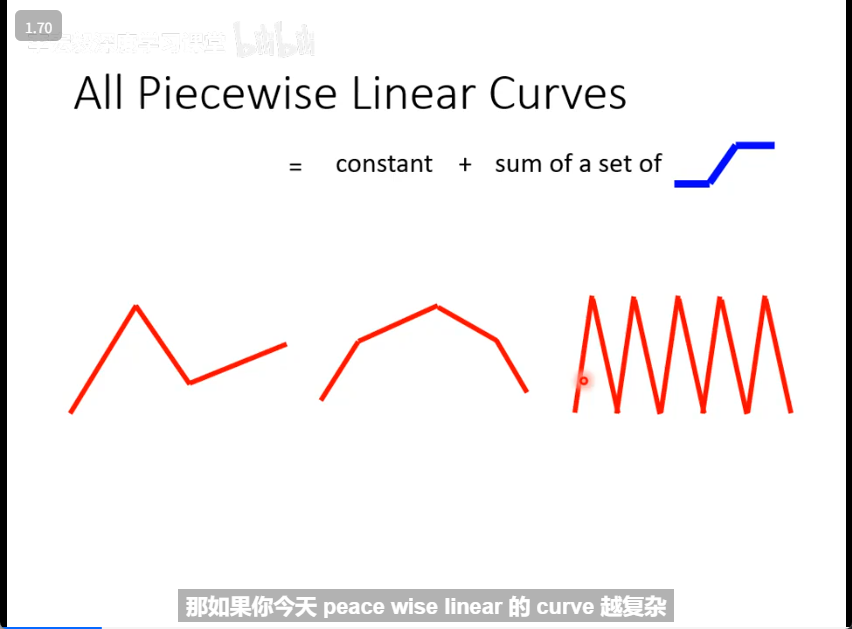
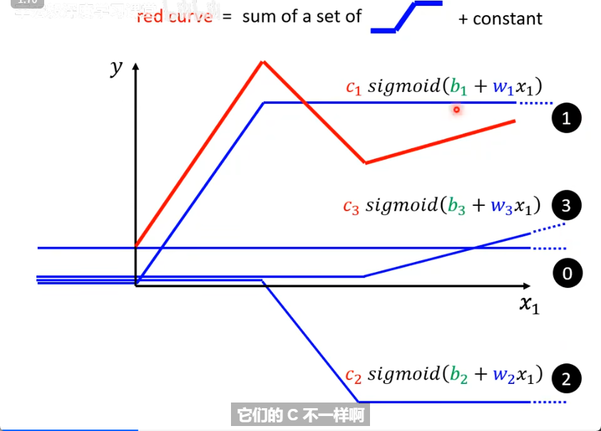
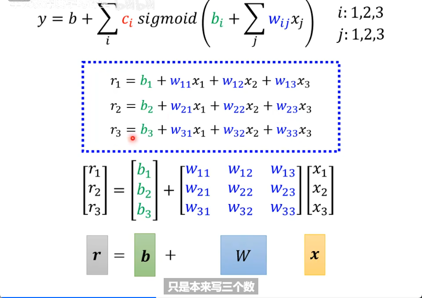
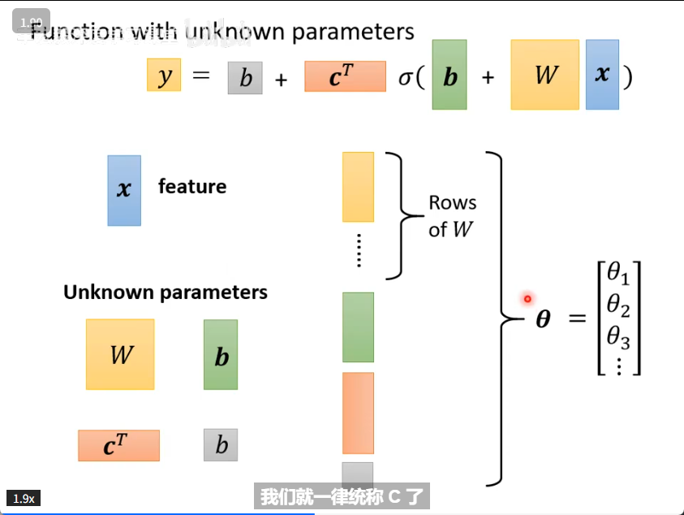

<!-- source: 深度学习/12.28.md -->

本文是[李宏毅机器学习深度学习系列课程](https://www.bilibili.com/video/BV1TAtwzTE1S?p=2)第一节课的笔记，从最简单的线性模型一路串到深度学习。原文是一份图片笔记，这里把每张图对应的内容用文字重新描述，方便脱离图片也能读。

## 第一节课 基本概念

### 1. 最简单的模型：线性模型

我们要预测的值记为 `y`，最简单的预测方式是假设它和某个特征 `x` 成线性关系：

```
y = b + w * x
```

- `b`：偏置（bias）
- `w`：权重（weight）
- `x`：输入特征（下标 `x_1` 表示第一个特征）

### 2. Loss：衡量一组参数好不好

有了模型，还需要一个标准来评判当前的 `w` 和 `b` 好不好，这个标准就是 **Loss（损失函数）**。

- **label**：正确的值（真实标签）。
- **计算误差的方式**：把模型预测值和 label 做差，累加起来（例如 MAE：`e = |ŷ - y|`）。


Loss 越小，说明这组 `w`、`b` 越好。**要找到最小的 Loss，就是找到最优的 `w` 和 `b`，方法是梯度下降（Gradient Descent）。**

### 3. 梯度下降：怎么更新参数


梯度下降的核心思路：算出 Loss 对每个参数的梯度（偏导），然后让参数**沿着梯度的反方向**走一小步，Loss 就会下降一点。反复迭代，直到 Loss 不再明显下降。上图展示的就是这个"更新参数"的过程。

### 4. 用更复杂的模型拟合真实数据

线性模型（一条直线）往往不足以描述真实数据。结合真实情况，需要改进模型，让它具备表达非线性关系的能力。


这就引出了下面要讲的 **linear model 的扩展**。

### 5. Linear Model 的扩展：用蓝色折线拼出红色曲线

模型名仍叫 **linear model**，但思路变了：





核心想法是：**用多段蓝色的折线（分段线性函数）组合起来，逼近任意形状的红色曲线**。


这种蓝色折线段的数学名字叫 **Hard Sigmoid**——形状像一个拉长的 S。

### 6. Hard Sigmoid 与激活函数


Hard Sigmoid 可以用一个连续函数 **Sigmoid** 来近似：



于是每一小段蓝色曲线可以写成：

```
y = c / (1 + exp(-(b + w * x)))
    = c * sigmoid(b + w * x)
```


#### 疑问：为什么这里 `c` 要转置？

> 这是笔记里的自问自答：公式里的 `c`（以及 `b`、`w`）在多个特征/多段曲线堆叠时会变成向量/矩阵，写成 `c^T` 是为了**把行向量转置成列向量**，方便和后面的未知向量做矩阵乘法、合并起来。



> 这一步是在**合并未知向量**：把多段曲线的参数统一写成一个矩阵运算 `y = b + c^T * sigmoid(b + w * x)`，形式更紧凑，也便于后续推广到多层网络。

### 7. 多段曲线堆叠：还是用梯度下降更新参数

把多个 Hard Sigmoid 加起来后，未知参数变多了（每段都有自己的 `c`、`b`、`w`），但**更新方法不变**——还是梯度下降，只是参数更多。


### 8. Batch 与 Epoch：分段处理数据

把一整份训练数据**分成多段（batch）逐段计算并更新参数**。相关的两个概念：

- **batch**：一次取一小批样本算梯度、更新一次参数。
- **epoch**：把所有训练样本都过一遍叫一个 epoch。

> 这个概念在 YOLO 等模型的训练里也会用到，是深度学习训练的通用约定。


### 9. 两种激活函数

除了 Sigmoid，还有另一种常用的激活函数。课程里对比了两种：


（Sigmoid 和 ReLU，后者在现代网络里更常用，因为计算简单、收敛快。）

### 10. 把结构叠多层：Neural Network → Deep Learning

上面这种"输入 → 一组激活函数 → 输出"的结构可以**多次重复堆叠（layers）**：


- 单个这种计算单元叫 **neuron（神经元）**。
- 把很多 neuron 组织起来就叫 **neural network（神经网络）**。
- 当层数很多时，换了个名字：**Many layers means Deep → Deep Learning（深度学习）**。

## 小结

这节课从 `y = b + w*x` 出发，一步步展示了：怎么用 Loss 衡量模型好坏、怎么用梯度下降找最优参数、怎么用 Hard Sigmoid/Sigmoid 把线性模型扩展成能拟合复杂曲线的模型，最后通过堆叠 layers 自然引出了神经网络和深度学习。后续课程会在这个基础上讲网络结构、反向传播和具体任务。
