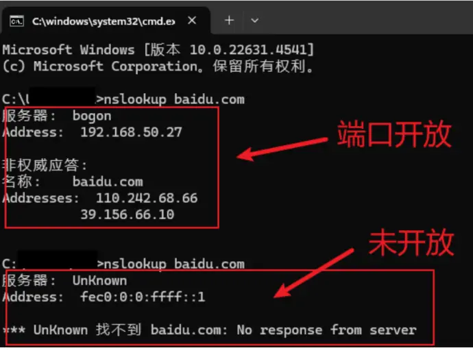
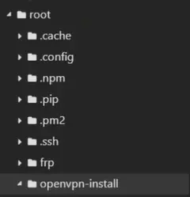

<!-- source: 博客备选笔记/校园网/11.27.md -->
#### **判断校园网端口是否开放**

nslookup baidu.com

 

#### **Openvpn安装**

切换root用户

su root

apt-get update

apt install git -y

git clone https://github.com/angristan/openvpn-install

cd openvpn-install

chmod +x openvpn-install.sh

./openvpn-install.sh

出现[1-3]选2

端口选 67

选udp

名字随便起

 

#### **修改配置**

nano /etc/openvpn/server.conf

push "mssfix 1200"

push "dhcp-option DNS 114.114.114.114"

push "dhcp-option DNS 223.5.5.5"

Ctrl + O 写入

Ctrl + x 保存

#### **Windows电脑配置**

之后在root目录下找到.ovpn文件下载下来

访问官网下载openvpn

https://openvpn.net/community/

将下载下来的文件拖到openvpn中,然后连接校园网之后,连接openvpn

#### **基础命令**

重启openvpn服务:

sudo systemctl restart openvpn@server

查看服务状态

systemctl status openvpn@server

- ❌ 不需要安装 Git：官方推荐直接用 curl 下载脚本
- ❌ 不要用 apt-get：openEuler 用 dnf
- ❌ 端口不要选 67：易与 DHCP 服务冲突
- ❌ 不需要手动修改配置：脚本支持安装时直接指定 DNS、端口等参数
- ✅ 必须开放防火墙端口：原教程完全没提，这是最容易踩的坑

评论
xdm可以整个阿里云的学生认证，现在可以30来块钱买1年的共享200m带宽香港服务器，不少时候都是不卡的，完全够刷视频看直播，不仅可以干这个还可以当做科学上网工具，就是内存太小，以前送的无条件卷买的配置高点还可以部署点东西玩，用这种方式嫖了两年校园网了

利用67端口免认证连接校园网，核心是借助该端口对应服务的放行规则，通过流量伪装与隧道转发绕过校园网认证拦截，具体原理如下：

1. 端口的特殊放行属性：67端口是UDP协议下DHCP服务的服务器端端口，负责给接入校园网的设备分配内网IP。校园网网关为保障设备能正常获取IP以完成后续认证流程，会默认放行该端口的DHCP协议数据包，不会像拦截80、443等常用上网端口那样对其拦截。
2. 流量伪装与隧道搭建：用户可在公网搭建一台代理服务器，通过相关工具搭建数据隧道，把自身的上网流量封装成67端口对应的DHCP协议数据包格式。
3. 数据中转实现免认证上网：封装后的流量会通过校园网放行的67端口发送至公网代理服务器，服务器接收后解析出原始上网请求并转发到互联网，再将返回的数据按同样方式封装，经67端口回传至用户设备。这样就绕开了校园网的Web认证拦截，实现免认证上网。
