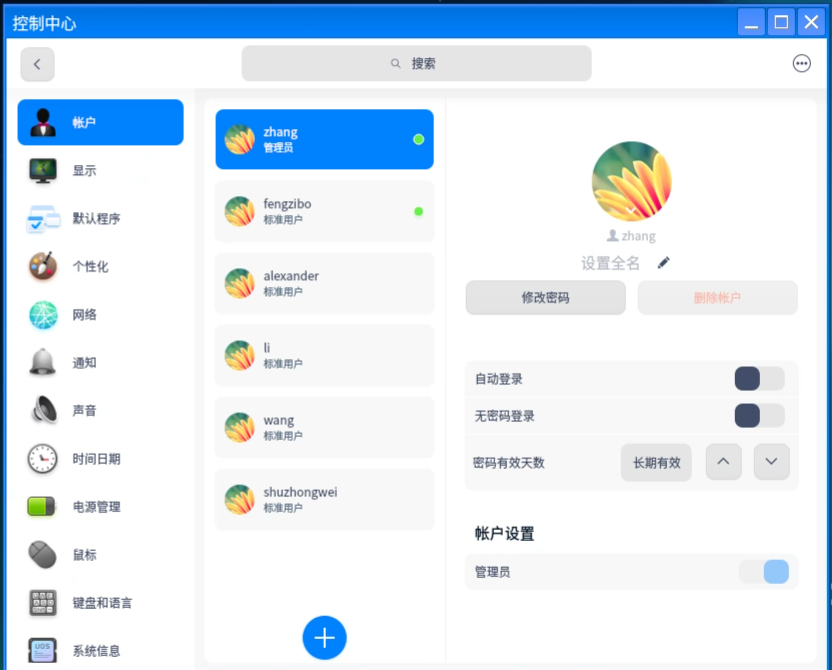

<!-- source: 博客备选笔记/记一次linux root密码忘记改密码的过程.md -->
之前我在做创建用户组的过程中不知道按了什么键，一次性粘进了很多内容，之后转头就忘了，没检查，当虚拟机关机后，几天后我想再打开发现ssh连不上了，之后怎么尝试密码都不对。
我网上查什么按e进入boot什么都没用，突然想起我之前创建了其他的用户，有几个能登上去(不知道为什么有些又不能，明明我都设的是一个密码)
发现有管理员账户，直接登上去```
```
sudo -i

passwd root
```
解决
2026年4月21日14:10:13·
!QA2ws3ed
