<!-- source: blog/笔记/13.事务管理.md -->

这篇笔记整理 Spring 中事务管理的使用场景和基础写法。核心问题是：当一个业务操作包含多次数据库写入时，如何保证它们要么全部成功，要么全部失败。

## 本文要点

- 事务用于保证一组业务操作的数据一致性。
- `@Transactional` 可以交给 Spring 管理事务开启、提交和回滚。
- 异常类型、传播行为和回滚规则会影响事务是否生效。
- 事务一般放在业务层，而不是控制器或数据访问层。

1. ### Spring事务管理

1. #### 分析

在上述实现的新增员工的功能中，一旦在保存员工基本信息后出现异常。 我们就会发现，员工信息保存成功，但是工作经历信息保存失败，造成了数据的不完整不一致。

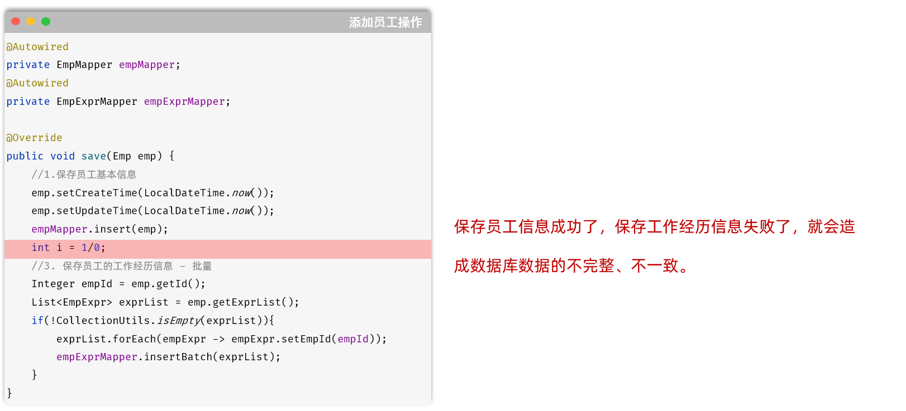

产生原因：

- 先执行新增员工的操作，这步执行完毕，就已经往员工表 `emp` 插入了数据。
- 执行 1/0 操作，抛出异常
- 抛出异常之前，下面所有的代码都不会执行了，批量保存工作经历信息，这个操作也不会执行 。

此时就出现问题了，员工基本信息保存了，员工的工作经历信息未保存，业务操作前后数据不一致。 

而要想保证操作前后，数据的一致性，就需要让新增员工中涉及到的两个业务操作，要么全部成功，要么全部失败 。 那我们如何，让这两个操作要么全部成功，要么全部失败呢 ？

那就可以通过事务来实现，因为一个事务中的多个业务操作，要么全部成功，要么全部失败。

此时，我们就需要在新增员工功能中添加事务。

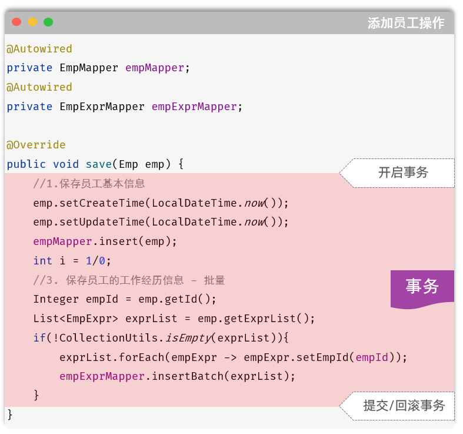

在方法运行之前，开启事务，如果方法成功执行，就提交事务，如果方法执行的过程当中出现异常了，就回滚事务。

**思考：**开发中所有的业务操作，一旦我们要进行控制事务，是不是都是这样的套路？

**答案：**是的。

所以在spring框架当中就已经把事务控制的代码都已经封装好了，并不需要我们手动实现。我们使用了spring框架，我们只需要通过一个简单的注解@Transactional就搞定了。

1. #### Transactional注解

**注解：**@Transactional

**作用：**就是在当前这个方法执行开始之前来开启事务，方法执行完毕之后提交事务。如果在这个方法执行的过程当中出现了异常，就会进行事务的回滚操作。

**位置：**业务层的方法上、类上、接口上

- 方法上：当前方法交给spring进行事务管理
- 类上：当前类中所有的方法都交由spring进行事务管理 
- 接口上：接口下所有的实现类当中所有的方法都交给spring 进行事务管理

接下来，我们就可以在业务方法save上加上 `@Transactional` 来控制事务 。

```Java
@Transactional
@Override
public void save(Emp emp) {
    //1.补全基础属性
    emp.setCreateTime(LocalDateTime.now());
    emp.setUpdateTime(LocalDateTime.now());
    //2.保存员工基本信息
    empMapper.insert(emp);

    int i = 1/0;

    //3. 保存员工的工作经历信息 - 批量
    Integer empId = emp.getId();
    List<EmpExpr> exprList = emp.getExprList();
    if(!CollectionUtils.isEmpty(exprList)){
        exprList.forEach(empExpr -> empExpr.setEmpId(empId));
        empExprMapper.insertBatch(exprList);
    }
}
```

@Transactional注解：我们一般会在业务层当中来控制事务，因为在业务层当中，一个业务功能可能会包含多个数据访问的操作。在业务层来控制事务，我们就可以将多个数据访问操作控制在一个事务范围内。

说明：可以在`application.yml`配置文件中开启事务管理日志，这样就可以在控制看到和事务相关的日志信息了

```YAML
#spring事务管理日志
logging: 
  level: 
    org.springframework.jdbc.support.JdbcTransactionManager: debug
```

接下来，我们再次添加员工，看看控制台输出的日志信息。

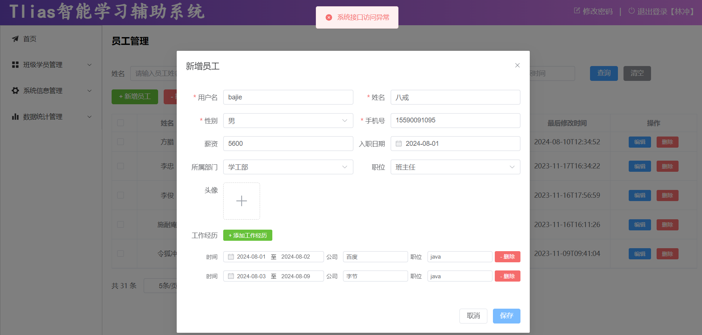

添加Spring事务管理后，由于服务端程序引发了异常，所以事务进行回滚。

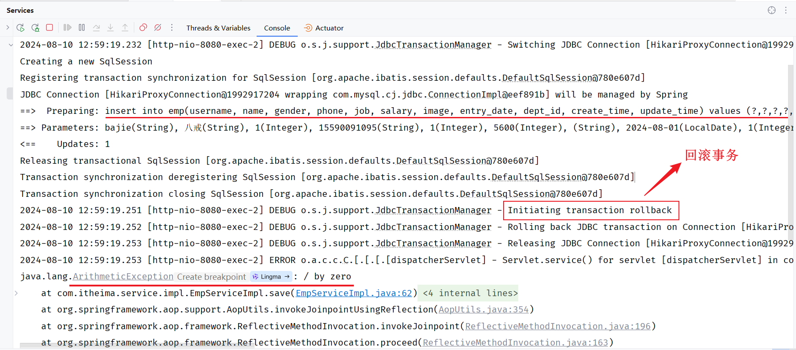

打开数据库，我们会看到 `emp` 表 与 `emp_expr` 表中都没有对应的数据信息，保证了数据的一致性、完整性。

1. #### 事务进阶

前面我们通过spring事务管理注解@Transactional已经控制了业务层方法的事务。接下来我们要来详细的介绍一下@Transactional事务管理注解的使用细节。我们这里主要介绍@Transactional注解当中的两个常见的属性：

- 异常回滚的属性：`rollbackFor `
- 事务传播行为：`propagation`

我们先来学习下rollbackFor属性。

1. ##### rollbackFor

我们在之前编写的业务方法上添加了@Transactional注解，来实现事务管理。

```Java
@Transactional
@Override
public void save(Emp emp) {
    //1.补全基础属性
    emp.setCreateTime(LocalDateTime.now());
    emp.setUpdateTime(LocalDateTime.now());
    //2.保存员工基本信息
    empMapper.insert(emp);
        
    int i = 1/0;
        
    //3. 保存员工的工作经历信息 - 批量
    Integer empId = emp.getId();
    List<EmpExpr> exprList = emp.getExprList();
    if(!CollectionUtils.isEmpty(exprList)){
        exprList.forEach(empExpr -> empExpr.setEmpId(empId));
        empExprMapper.insertBatch(exprList);
    }
}
```

以上业务功能save方法在运行时，会引发除0的算术运算异常(运行时异常)，出现异常之后，由于我们在方法上加了`@Transactional`注解进行事务管理，所以发生异常会执行rollback回滚操作，从而保证事务操作前后数据是一致的。

下面我们在做一个测试，我们修改业务功能代码，在模拟异常的位置上直接抛出Exception异常（编译时异常）

```Java
@Transactional
@Override
public void save(Emp emp) {
    //1.补全基础属性
    emp.setCreateTime(LocalDateTime.now());
    emp.setUpdateTime(LocalDateTime.now());
    //2.保存员工基本信息
    empMapper.insert(emp);
        
    //模拟：异常发生
    if(true){
        throw new Exception("出现异常了~~~");
    }
        
    //3. 保存员工的工作经历信息 - 批量
    Integer empId = emp.getId();
    List<EmpExpr> exprList = emp.getExprList();
    if(!CollectionUtils.isEmpty(exprList)){
        exprList.forEach(empExpr -> empExpr.setEmpId(empId));
        empExprMapper.insertBatch(exprList);
    }
}
```

> 说明：在service中向上抛出一个Exception编译时异常之后，由于是controller调用service，所以在controller中要有异常处理代码，此时我们选择在controller中继续把异常向上抛。

重新启动服务后，打开Apifox进行测试，请求添加员工的接口：

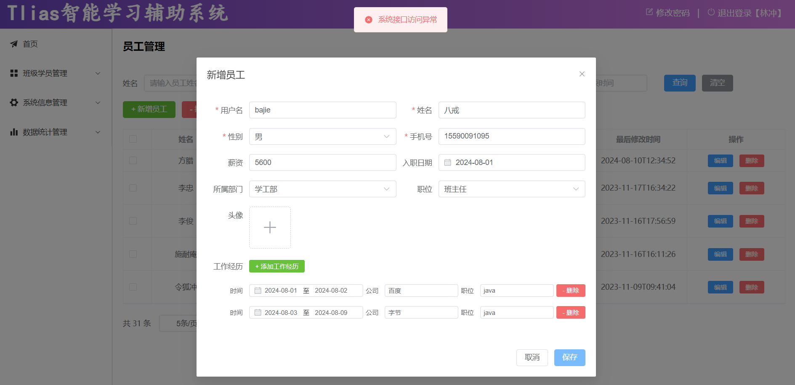

通过Apifox返回的结果，我们看到抛出异常了。然后我们在回到IDEA的控制台来看一下。

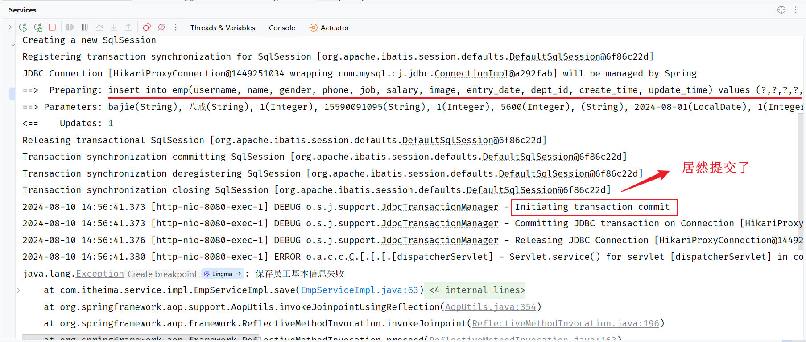

我们看到数据库的事务居然提交了，并没有进行回滚。

通过以上测试可以得出一个结论：**默认情况下，只有出现RuntimeException(运行时异常)才会回滚事务。**

假如我们想让所有的异常都回滚，需要来配置@Transactional注解当中的rollbackFor属性，通过rollbackFor这个属性可以指定出现何种异常类型回滚事务。

```Java
@Transactional(rollbackFor = Exception.class)
@Override
public void save(Emp emp) throws Exception {
    //1.补全基础属性
    emp.setCreateTime(LocalDateTime.now());
    emp.setUpdateTime(LocalDateTime.now());
    //2.保存员工基本信息
    empMapper.insert(emp);
        
    //int i = 1/0;
    if(true){
        throw new Exception("出异常啦....");
    }
        
    //3. 保存员工的工作经历信息 - 批量
    Integer empId = emp.getId();
    List<EmpExpr> exprList = emp.getExprList();
    if(!CollectionUtils.isEmpty(exprList)){
        exprList.forEach(empExpr -> empExpr.setEmpId(empId));
        empExprMapper.insertBatch(exprList);
    }
}
```

接下来我们重新启动服务，测试新增员工的操作：

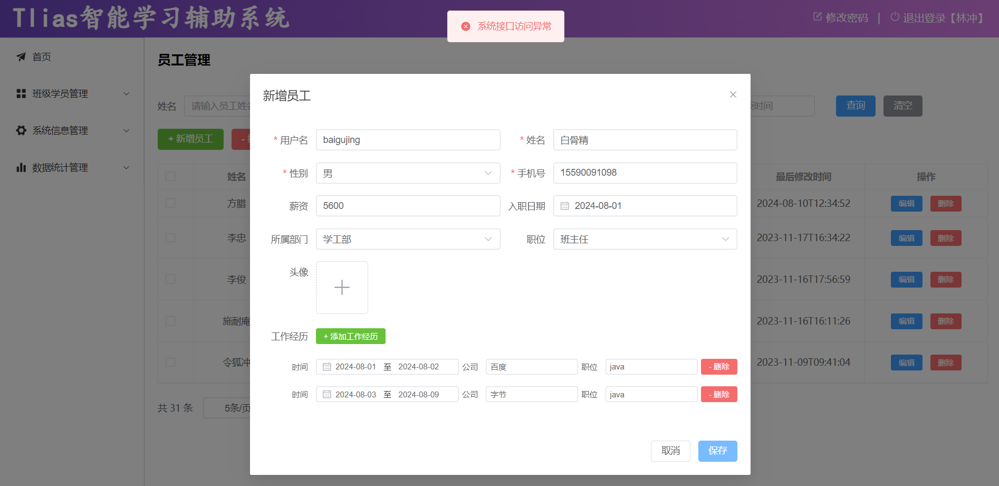

控制台日志，可以看到因为出现了异常又进行了事务回滚。

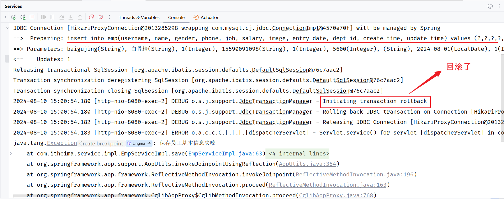

**结论：**

- 在Spring的事务管理中，默认只有运行时异常 RuntimeException才会回滚。
- 如果还需要回滚指定类型的异常，可以通过rollbackFor属性来指定。

1. ##### propagation

1. ###### 介绍

我们接着继续学习@Transactional注解当中的第二个属性propagation，这个属性是用来配置事务的传播行为的。

什么是事务的传播行为呢？

- 就是当一个事务方法被另一个事务方法调用时，这个事务方法应该如何进行事务控制。

例如：两个事务方法，一个A方法，一个B方法。在这两个方法上都添加了@Transactional注解，就代表这两个方法都具有事务，而在A方法当中又去调用了B方法。

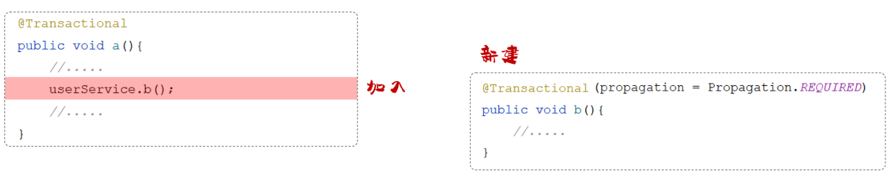

所谓事务的传播行为，指的就是在A方法运行的时候，首先会开启一个事务，在A方法当中又调用了B方法， B方法自身也具有事务，那么B方法在运行的时候，到底是加入到A方法的事务当中来，还是B方法在运行的时候新建一个事务？这个就涉及到了事务的传播行为。

我们要想控制事务的传播行为，在@Transactional注解的后面指定一个属性propagation，通过 propagation 属性来指定传播行为。接下来我们就来介绍一下常见的事务传播行为。

| 属性值        | 含义                                                         |
| ------------- | ------------------------------------------------------------ |
| REQUIRED      | 【默认值】需要事务，有则加入，无则创建新事务                 |
| REQUIRES_NEW  | 需要新事务，无论有无，总是创建新事务                         |
| SUPPORTS      | 支持事务，有则加入，无则在无事务状态中运行                   |
| NOT_SUPPORTED | 不支持事务，在无事务状态下运行,如果当前存在已有事务,则挂起当前事务 |
| MANDATORY     | 必须有事务，否则抛异常                                       |
| NEVER         | 必须没事务，否则抛异常                                       |
| …             |                                                              |

> 对于这些事务传播行为，我们只需要关注以下两个就可以了：
>
> 1. REQUIRED（默认值）
> 2. REQUIRES_NEW

1. ###### 案例

接下来我们就通过一个案例来演示下事务传播行为propagation属性的使用。

**需求：**在新增员工信息时，无论是成功还是失败，都要记录操作日志。

**步骤：**

1. 准备日志表 emp_log、实体类EmpLog、Mapper接口EmpLogMapper
2. 在新增员工时记录日志

**准备工作：**

1). 创建数据库表 `emp_log` 日志表

```SQL
-- 创建员工日志表
create table emp_log(
    id int unsigned primary key auto_increment comment 'ID, 主键',
    operate_time datetime comment '操作时间',
    info varchar(2000) comment '日志信息'
) comment '员工日志表';
```

2). 引入资料中提供的实体类：EmpLog

```Java
@Data
@NoArgsConstructor
@AllArgsConstructor
public class EmpLog {
    private Integer id; //ID
    private LocalDateTime operateTime; //操作时间
    private String info; //详细信息
}
```

3). 引入资料中提供的Mapper接口：EmpLogMapper

```Java
@Mapper
public interface EmpLogMapper {
        //插入日志
    @Insert("insert into emp_log (operate_time, info) values (#{operateTime}, #{info})")
    public void insert(EmpLog empLog);
}
```

4). 引入资料中提供的业务接口：EmpLogService

```Java
public interface EmpLogService {
        //记录新增员工日志
    public void insertLog(EmpLog empLog);
}
```

5). 引入资料中提供的业务实现类：EmpLogServiceImpl

```Java
@Service
public class EmpLogServiceImpl implements EmpLogService {

    @Autowired
    private EmpLogMapper empLogMapper;

    @Transactional
    @Override
    public void insertLog(EmpLog empLog) {
        empLogMapper.insert(empLog);
    }
}
```

**代码实现:**

业务实现类：EmpServiceImpl

```Java
@Autowired
private EmpMapper empMapper;
@Autowired
private EmpExprMapper empExprMapper;
@Autowired
private EmpLogService empLogService;

@Transactional(rollbackFor = {Exception.class})
@Override
public void save(Emp emp) {
    try {
        //1.补全基础属性
        emp.setCreateTime(LocalDateTime.now());
        emp.setUpdateTime(LocalDateTime.now());

        //2.保存员工基本信息
        empMapper.insert(emp);

        int i = 1/0;

        //3. 保存员工的工作经历信息 - 批量
        Integer empId = emp.getId();
        List<EmpExpr> exprList = emp.getExprList();
        if(!CollectionUtils.isEmpty(exprList)){
            exprList.forEach(empExpr -> empExpr.setEmpId(empId));
            empExprMapper.insertBatch(exprList);
        }
    } finally {
        //记录操作日志
        EmpLog empLog = new EmpLog(null, LocalDateTime.now(), emp.toString());
        empLogService.insertLog(empLog);
    }

}
```

**测试:**

重新启动SpringBoot服务，测试新增员工操作 。我们可以看到控制台中输出的日志：

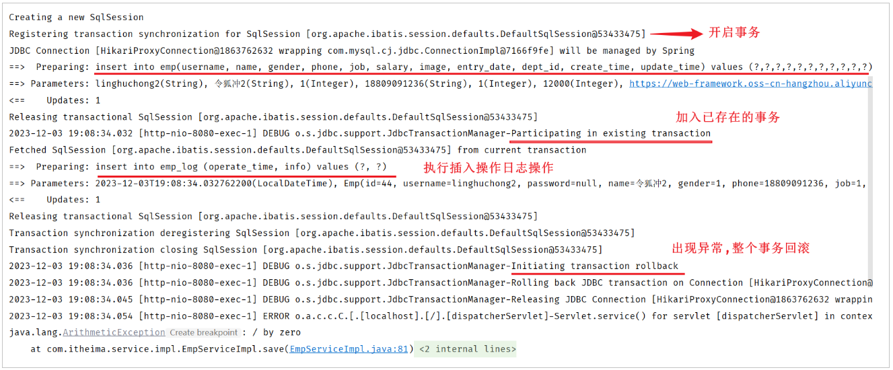

从日志中我们可以看到：

- 执行了插入员工数据的操作
- 执行了插入日志操作
- 程序发生Exception异常
- 执行事务回滚（保存员工数据、插入操作日志 因为在一个事务范围内，两个操作都会被回滚）

然后在 `emp_log` 表中没有记录日志数据 。

**原因分析:**

接下来我们就需要来分析一下具体是什么原因导致的日志没有成功的记录。

- 在执行 `save` 方法时开启了一个事务
- 当执行 `empLogService.insertLog` 操作时，`insertLog`设置的事务传播行是默认值REQUIRED，表示有事务就加入，没有则新建事务
- 此时：`save` 和 `insertLog` 操作使用了同一个事务，同一个事务中的多个操作，要么同时成功，要么同时失败，所以当异常发生时进行事务回滚，就会回滚 `save` 和  `insertLog` 操作

**解决方案：**

在`EmpLogServiceImpl`类中insertLog方法上，添加 `@Transactional(propagation = Propagation.REQUIRES_NEW)`

Propagation.REQUIRES_NEW  ：不论是否有事务，都创建新事务  ，运行在一个独立的事务中。

```Java
@Service
public class EmpLogServiceImpl implements EmpLogService {

    @Autowired
    private EmpLogMapper empLogMapper;

    @Transactional(propagation = Propagation.REQUIRES_NEW)
    @Override
    public void insertLog(EmpLog empLog) {
        empLogMapper.insert(empLog);
    }
}
```

重启SpringBoot服务，再次测试 新增员工的操作 ，会看到具体的日志如下：

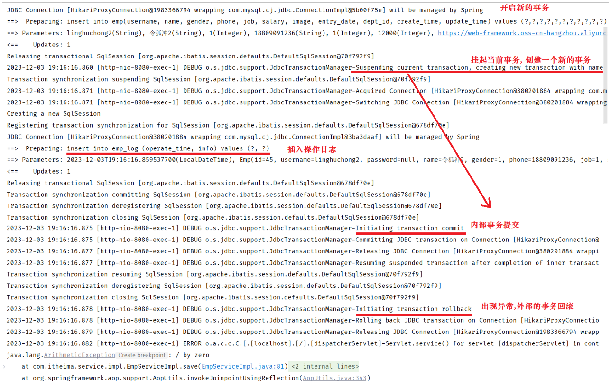

那此时，`EmpServiceImpl` 中的 `save` 方法运行时，会开启一个事务。 当调用  `empLogService.insertLog(empLog)`  时，也会创建一个新的事务，那此时，当 `insertLog` 方法运行完毕之后，事务就已经提交了。 即使外部的事务出现异常，内部已经提交的事务，也不会回滚了，因为是两个独立的事务。

到此事务传播行为已演示完成，事务的传播行为我们只需要掌握两个：REQUIRED、REQUIRES_NEW。

- **REQUIRED：**大部分情况下都是用该传播行为即可。
- **REQUIRES_NEW：**当我们不希望事务之间相互影响时，可以使用该传播行为。比如：下订单前需要记录日志，不论订单保存成功与否，都需要保证日志记录能够记录成功。

1. ### 事务四大特性

面试题：事务有哪些特性？

- 原子性（Atomicity）：事务是不可分割的最小单元，要么全部成功，要么全部失败。
- 一致性（Consistency）：事务完成时，必须使所有的数据都保持一致状态。
- 隔离性（Isolation）：数据库系统提供的隔离机制，保证事务在不受外部并发操作影响的独立环境下运行。
- 持久性（Durability）：事务一旦提交或回滚，它对数据库中的数据的改变就是永久的。

事务的四大特性简称为：ACID

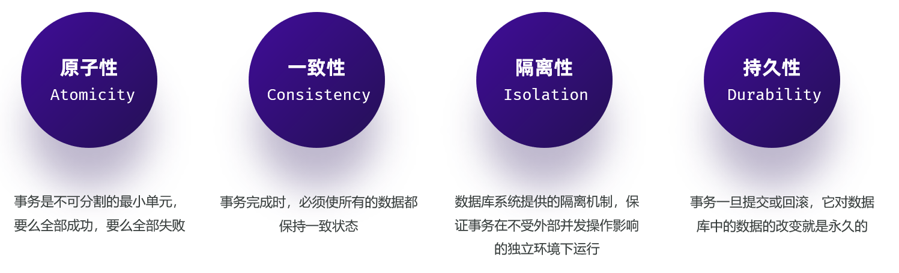

- **原子性（Atomicity）** ：原子性是指事务包装的一组sql是一个不可分割的工作单元，事务中的操作要么全部成功，要么全部失败。
- **一致性（Consistency）**：一个事务完成之后数据都必须处于一致性状态。
	- 如果事务成功的完成，那么数据库的所有变化将生效。
	- 如果事务执行出现错误，那么数据库的所有变化将会被回滚(撤销)，返回到原始状态。
- **隔离性（Isolation）**：多个用户并发的访问数据库时，一个用户的事务不能被其他用户的事务干扰，多个并发的事务之间要相互隔离。
	- 一个事务的成功或者失败对于其他的事务是没有影响。
- **持久性（Durability）**：一个事务一旦被提交或回滚，它对数据库的改变将是永久性的，哪怕数据库发生异常，重启之后数据亦然存在。

## 小结

事务管理解决的是业务操作和数据库状态一致的问题。学习 Spring 事务时，除了会用 `@Transactional`，还要理解异常、回滚和 ACID 特性之间的关系。
