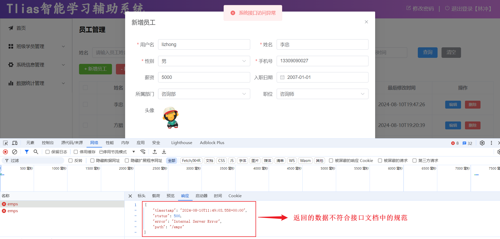
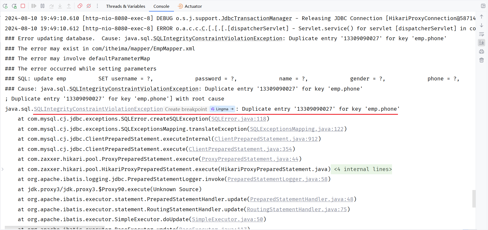
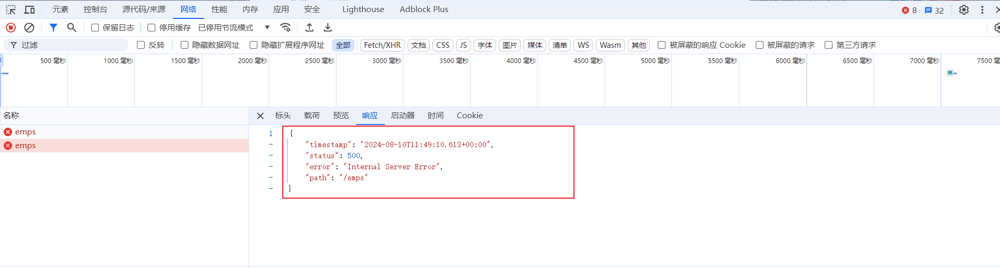
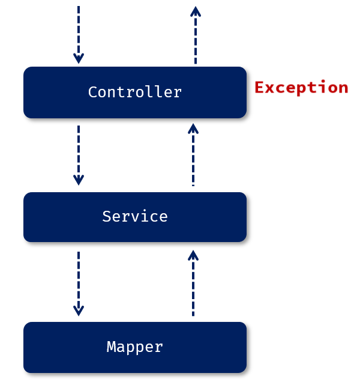
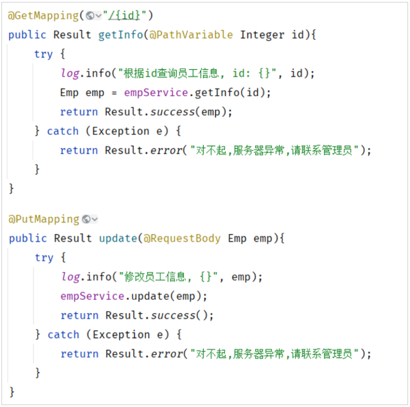
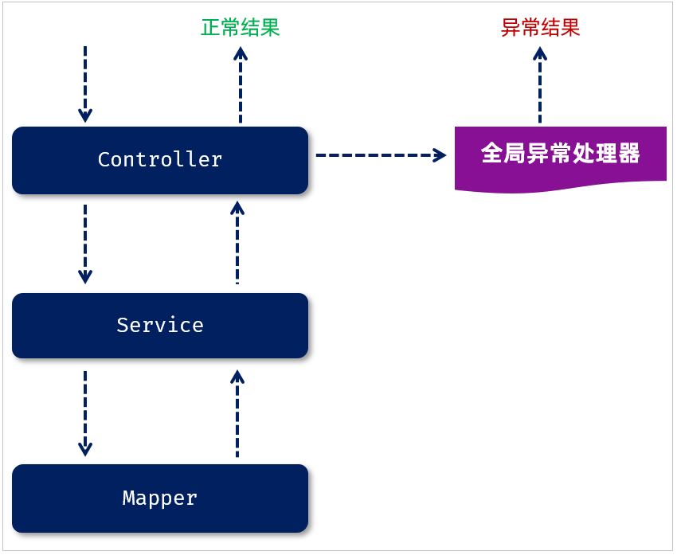
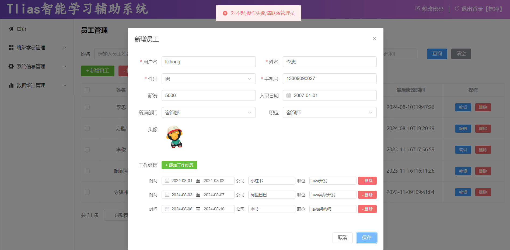

<!-- source: blog/笔记/14.文件上传&异常处理.md -->

这篇笔记记录文件上传和后端异常处理的课程内容。正文里有手机号示例和云服务上下文，公开前需要再做一次人工脱敏复核。

## 本文要点

- 文件上传常见流程是后端接收文件，再上传到对象存储。
- 未处理异常时，框架默认响应可能不符合统一接口规范。
- 全局异常处理器可以集中处理 Controller 层抛出的异常。
- 统一响应结构有助于前端稳定解析错误信息。

文件上传使用阿里云oss，后端写好了，apifox通过

1. ## 异常处理

1. ### 问题分析

当我们在修改部门数据的时候，如果输入一个在数据库表中已经存在的手机号，点击保存按钮之后，前端提示了错误信息，但是返回的结果并不是统一的响应结果，而是框架默认返回的错误结果 。



状态码为500，表示服务器端异常，我们打开idea，来看一下，服务器端出了什么问题。



上述错误信息的含义是，`emp`员工表的`phone`手机号字段的值重复了，因为在数据库表`emp`中已经有了`13309090027`这个手机号了，我们之前设计这张表时，为`phone`字段建议了唯一约束，所以该字段的值是不能重复的。

而当我们再将该员工的手机号也设置为 `13309090027`，就违反了唯一约束，此时就会报错。

我们来看一下出现异常之后，最终服务端给前端响应回来的数据长什么样。



响应回来的数据是一个JSON格式的数据。但这种JSON格式的数据还是我们开发规范当中所提到的统一响应结果Result吗？显然并不是。由于返回的数据不符合开发规范，所以前端并不能解析出响应的JSON数据 。

接下来我们需要思考的是出现异常之后，当前案例项目的异常是怎么处理的？ 答案：没有做任何的异常处理



当我们没有做任何的异常处理时，我们三层架构处理异常的方案：

- Mapper接口在操作数据库的时候出错了，此时异常会往上抛(谁调用Mapper就抛给谁)，会抛给service。 
- service 中也存在异常了，会抛给controller。
- 而在controller当中，我们也没有做任何的异常处理，所以最终异常会再往上抛。最终抛给框架之后，框架就会返回一个JSON格式的数据，里面封装的就是错误的信息，但是框架返回的JSON格式的数据并不符合我们的开发规范。

1. ### 解决方案

那么在三层构架项目中，出现了异常，该如何处理? 

- **方案一：在所有Controller的所有方法中进行try…catch处理**

 缺点：代码臃肿（不推荐）



- **方案二：****全局异常处理器**

好处：简单、优雅（推荐）



1. ### 全局异常处理器

我们该怎么样定义全局异常处理器？

- 定义全局异常处理器非常简单，就是定义一个类，在类上加上一个注解@RestControllerAdvice，加上这个注解就代表我们定义了一个全局异常处理器。
- 在全局异常处理器当中，需要定义一个方法来捕获异常，在这个方法上需要加上注解@ExceptionHandler。通过@ExceptionHandler注解当中的value属性来指定我们要捕获的是哪一类型的异常。

```Java
@RestControllerAdvice
public class GlobalExceptionHandler {
    
    //处理异常
    @ExceptionHandler
    public Result ex(Exception e){//方法形参中指定能够处理的异常类型
        e.printStackTrace();//打印堆栈中的异常信息
        //捕获到异常之后，响应一个标准的Result
        return Result.error("对不起,操作失败,请联系管理员");
    }
    
}
```

@RestControllerAdvice = @ControllerAdvice + @ResponseBody

处理异常的方法返回值会转换为json后再响应给前端

重新启动SpringBoot服务，打开浏览器，再来测试一下 修改员工 这个操作，我们依然设置已存在的 `13309090027`这个手机号：



此时，我们可以看到，出现异常之后，异常已经被全局异常处理器捕获了。然后返回的错误信息，被前端程序正常解析，然后提示出了对应的错误提示信息。

以上就是全局异常处理器的使用，主要涉及到两个注解：

- @RestControllerAdvice  //表示当前类为全局异常处理器
- @ExceptionHandler  //指定可以捕获哪种类型的异常进行处理

## 小结

文件上传和异常处理都属于后端接口稳定性的一部分。前者关注资源如何接收与保存，后者关注错误如何以统一格式返回给前端。
