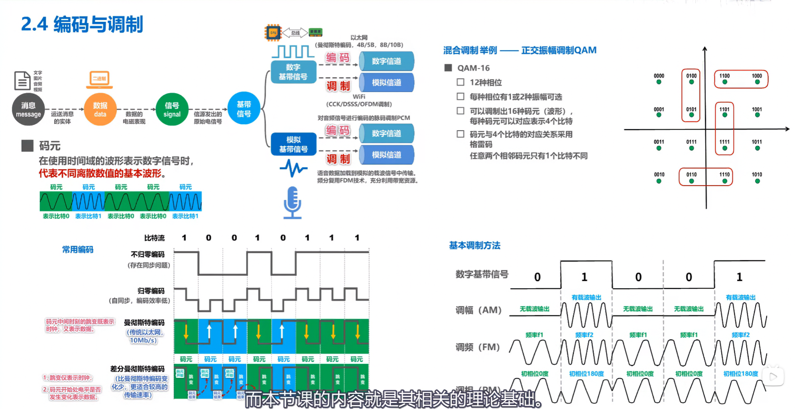
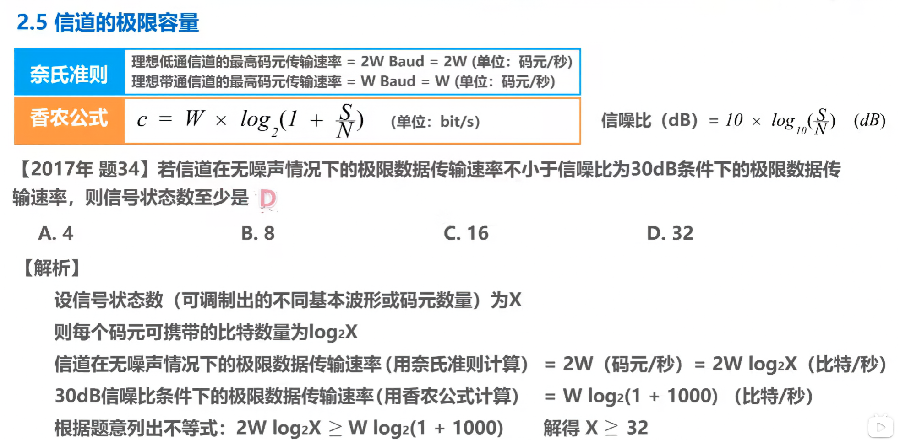
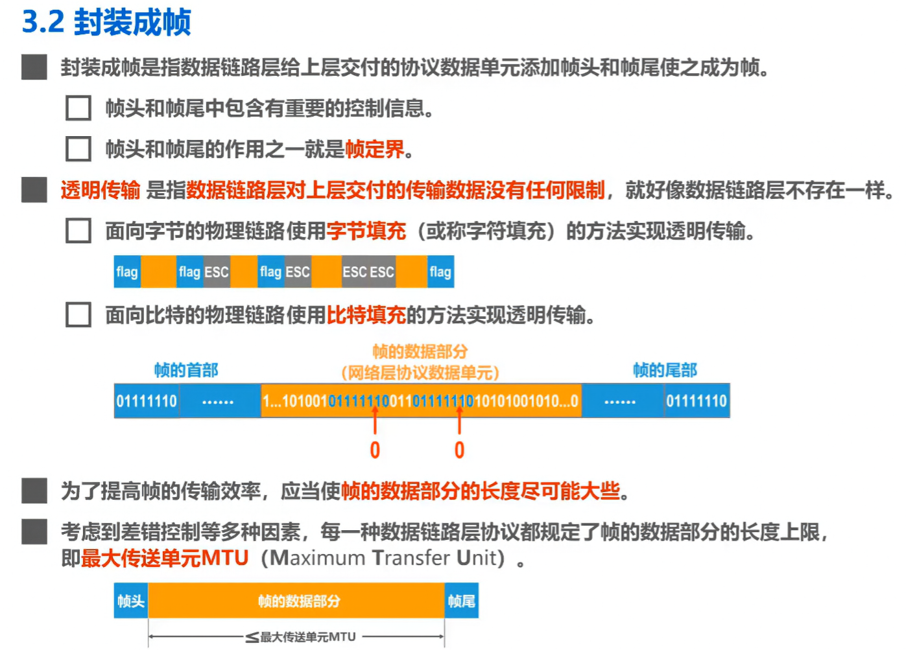

#### 计算机网络 物理层

好的，简单来说：

### 一句话核心区别
**管的频段位置不同**：一个管从零开始的**低频段**，一个管某个高频附近的**窄频段**。

---

### 比喻
*   **理想低通信道**：就像一条**从家门口开始的平坦大路**（从零频开始），专门走本地车辆（基带信号）。
*   **理想带通信道**：就像**高速公路上指定的一个车道**（比如固定在100MHz附近），专门走上了高速的车辆（已调信号）。

---

### 主要不同点
| 特点 | **理想低通信道** | **理想带通信道** |
| :--- | :--- | :--- |
| **管哪里** | 从零频到某个频率 | 某个中心频率两旁的一小段 |
| **传什么信号** | **原始信号**（如音频、数字脉冲） | **调制后的信号**（如电台、WiFi信号） |
| **像什么** | 一个完美的**低通滤波器** | 一个完美的**带通滤波器** |

---

### 相同点
1.  都是**理想化**的，现实中做不到。
2.  在它们“管辖”的频段内，信号都能**无失真**通过（不畸变、不延迟）。

**简单总结**：一个用于“本地”基础传输，一个用于“远程”无线或有线频带传输。它们是通信理论中的两个标尺，现实系统都在努力向它们靠近。

==如果题目没有特别指明信道是带通信道，也就是给出了信道频率的上下限，则信道属于低通信道==

还不彻底理解差分曼彻斯特编码，如何确定第一个是1还是0

#### 数据链路层

做的是异或运算
