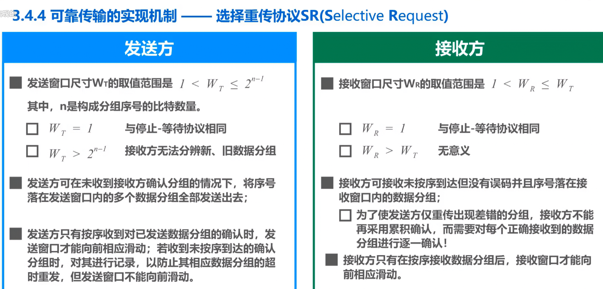
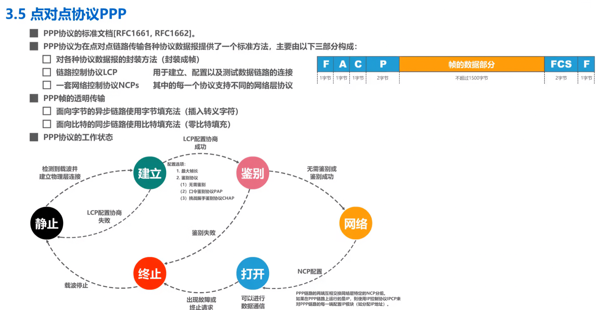
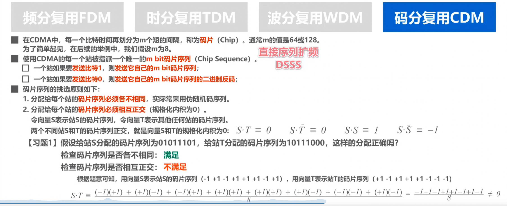
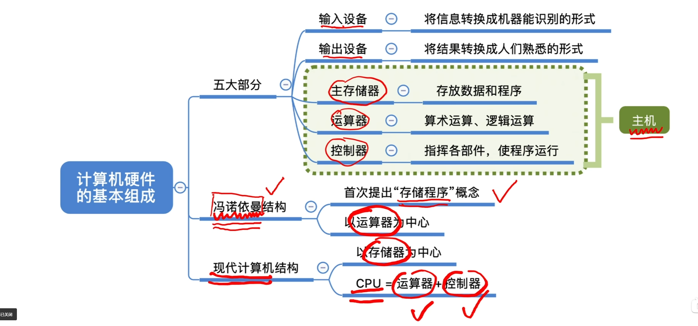

## 3.4.1可靠传输的基本概念

使用差错检测技术（例如循环余校验CRC），接收方的数据链路层就可检测出帧在传输过程中是否产生了误码（比特错误）。
一般情况下，有线链路的误码率比较低，为了减小开销，并不要求数据链路层向上提供可靠传输服务。即使出现了误码，可靠传输的问题由其上层处理。
无线链路易受干扰，误码率比较高，因此要求数据链路层必须向上层提供可靠传输服务。
比特差错只是传输差错中的一种
从整个计算机网络体系结构来看，传输差错还包括**分组丢失，分组失序以及分组重复**
可靠传输的实现比较复杂，开销也比较大，是否使用可靠传输取决于应用需求。

### 停止-等待协议SW

### 回退N帧协议GBN

### 选择重传协议SR

 

### PPP

完全没听懂

### 码分复用CDM（没太懂）（大概懂了，其他的是噪声，结果为0，所以不会干扰）

## 计算机组成原理

冯诺依曼结构以**运算器**为中心现代计算机结构以**存储器**为中心

