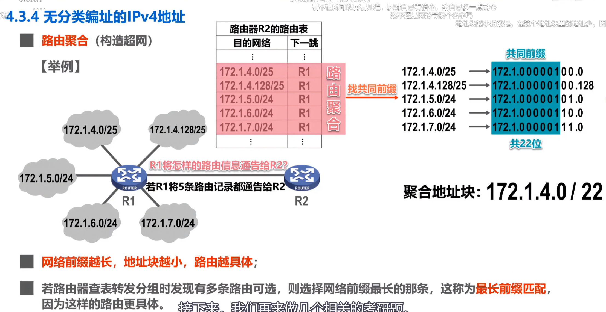
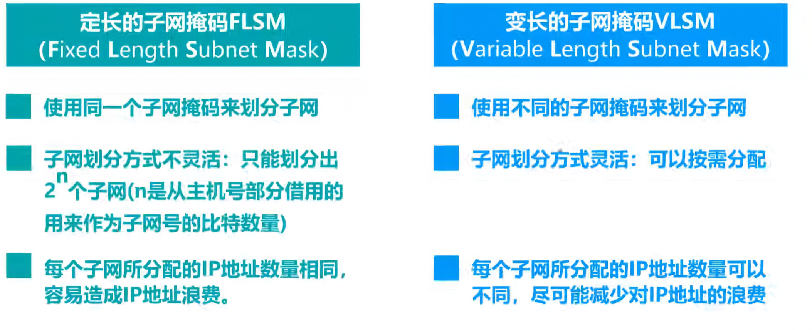
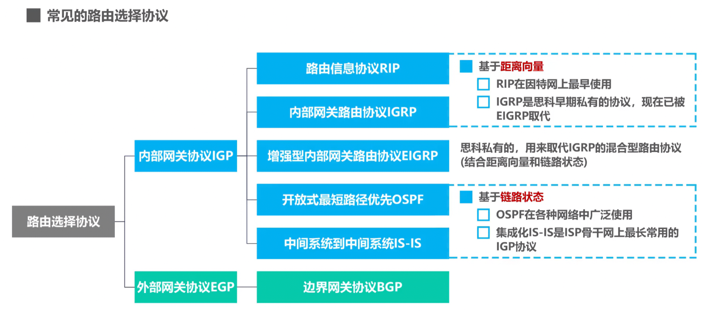

本文整理路由聚合、子网掩码以及常见路由选择协议的核心知识点。

<!-- more -->

## 1. 路由聚合（构造超网）

### 1.1 什么是路由聚合

**路由聚合**是将多条路由记录合并为一条的过程，目的是**减少路由表条目**，提高路由效率。

### 1.2 聚合过程详解

以 5 条路由记录为例：

| 原始路由 | 地址段 |
|---------|--------|
| 172.1.4.0/25 | 172.1.4.0 ~ 172.1.4.127 |
| 172.1.4.128/25 | 172.1.4.128 ~ 172.1.4.255 |
| 172.1.5.0/24 | 172.1.5.0 ~ 172.1.5.255 |
| 172.1.6.0/24 | 172.1.6.0 ~ 172.1.6.255 |
| 172.1.7.0/24 | 172.1.7.0 ~ 172.1.7.255 |

**聚合步骤**：

1. 找共同前缀：所有地址的前 22 位相同（172.1.4.0）
2. 计算聚合地址块：`172.1.4.0/22`
3. 5 条路由 → 1 条路由

### 1.3 最长前缀匹配原则

当路由器转发数据包时，如果存在多条匹配的路由，**选择前缀最长的那条**。

> 网络前缀越长，地址块越小，路由越具体。

**原因**：更精确的路由能确保数据包到达正确的目的地。

## 2. 子网掩码：FLSM vs VLSM

### 2.1 定长子网掩码（FLSM）

| 特点 | 说明 |
|------|------|
| 定义 | 使用**同一子网掩码**划分所有子网 |
| 划分方式 | 不灵活，只能划分 2^n 个子网 |
| IP 分配 | 每个子网 IP 数量相同 |
| 缺点 | 容易造成 IP 地址浪费 |

### 2.2 变长子网掩码（VLSM）

| 特点 | 说明 |
|------|------|
| 定义 | 使用**不同子网掩码**划分不同子网 |
| 划分方式 | 灵活，可按需分配 |
| IP 分配 | 每个子网 IP 数量可以不同 |
| 优势 | 减少 IP 地址浪费 |

### 2.3 对比总结

| 对比项 | FLSM | VLSM |
|--------|------|------|
| 子网掩码 | 统一 | 可变 |
| 灵活性 | 低 | 高 |
| IP 利用率 | 低 | 高 |
| 适用场景 | 简单网络 | 复杂网络 |

## 3. 常见路由选择协议

### 3.1 协议分类

路由选择协议分为两大类：

- **内部网关协议（IGP）**：用于自治系统内部
- **外部网关协议（EGP）**：用于自治系统之间

### 3.2 内部网关协议（IGP）

#### RIP（路由信息协议）

- 基于**距离向量**算法
- 因特网上**最早使用**的路由协议
- 简单但收敛慢，适用于小型网络

#### IGRP（内部网关路由协议）

- 思科**私有**协议
- 已被 EIGRP 替代

#### EIGRP（增强型内部网关路由协议）

- 思科**私有**的**混合型**协议
- 结合距离向量和链路状态的优点

#### OSPF（开放最短路径优先）

- 基于**链路状态**算法
- **广泛使用**的 IGP 协议
- 收敛快，支持大型网络

#### IS-IS（中间系统到中间系统）

- 基于链路状态算法
- **ISP 骨干网最常用**的 IGP 协议

### 3.3 外部网关协议（EGP）

#### BGP（边界网关协议）

- 自治系统间的**域间路由**协议
- 互联网骨干网的核心协议

## 4. 总结

| 概念 | 关键点 |
|------|--------|
| 路由聚合 | 合并多条路由为一条，减少路由表条目 |
| 最长前缀匹配 | 选择前缀最长的路由，更精确 |
| VLSM | 按需分配 IP，减少浪费 |
| OSPF | 链路状态协议，广泛使用 |
| BGP | 自治系统间路由协议 |

**学习建议**：
- 理解路由聚合的计算过程
- 掌握 VLSM 子网划分方法
- 熟悉常见协议的特点和适用场景
