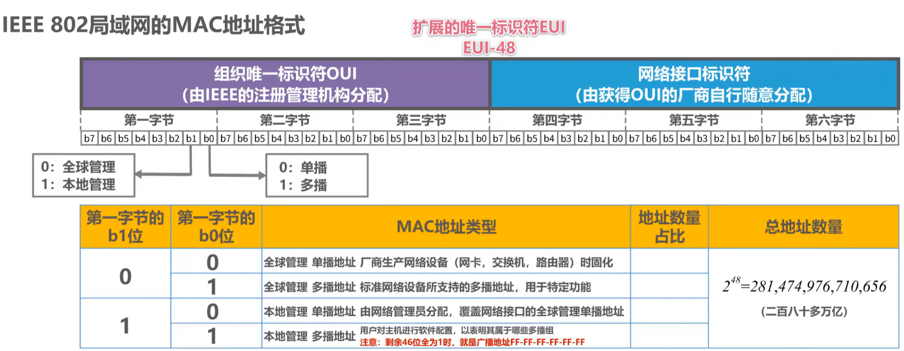
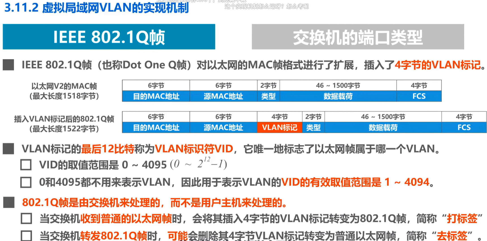
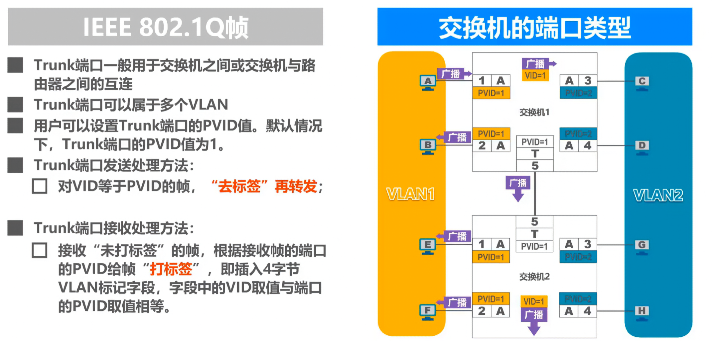
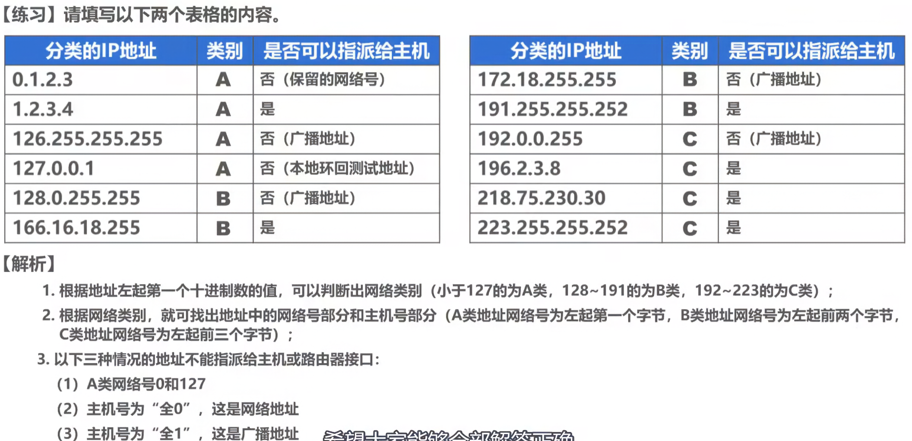
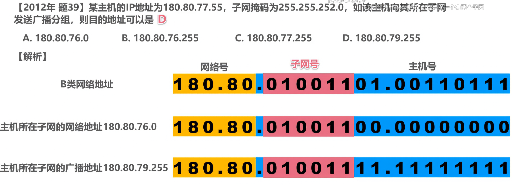
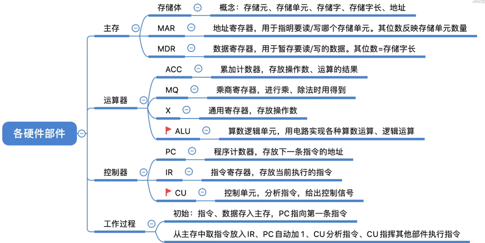

#### MAC多播

#### VLAN

交换机的端口类型有以下三种：
Access
Trunk
Hybrid
交换机各端口的缺省VLAN ID
在思科交换机上称为NativeVLAN，即本征VLAN。
在华为交换机上称为PortVLANID，即端口VLANID，简记为PVID。

Trunk

IPv4地址

环回测试通过“自发自收”的方式，隔离外部链路或设备，专注于验证本地系统的收发能力。

广播要主机号全为一

### 计组

读数

乘法

【王道计算机考研 计算机组成原理】 

https://www.bilibili.com/video/BV1ps4y1d73V/?p=5&share_source=copy_web&vd_source=6ac8ff202c2a1c489b84379f69691f28

 1.2.2_各个硬件的工作原理

