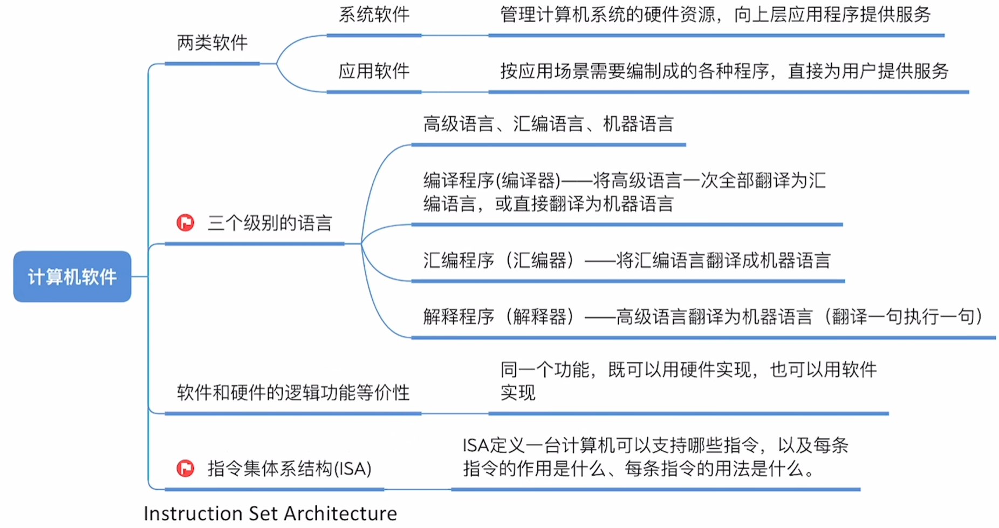
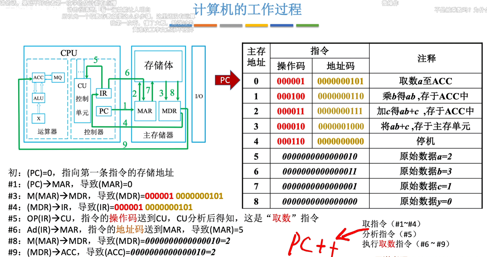
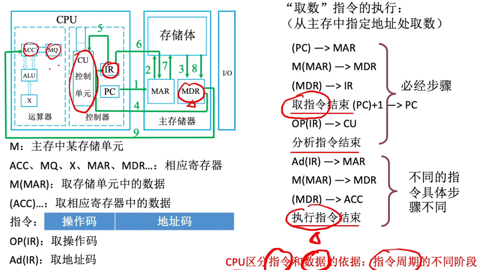
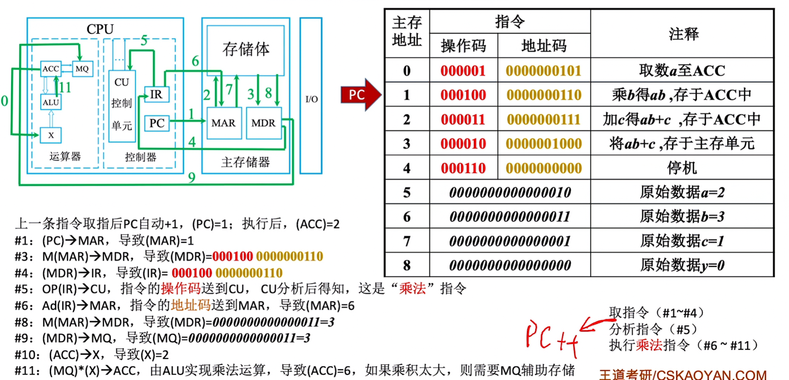

## 1. 计算机系统概述

### 1.1 冯·诺依曼架构特点


**核心思想**：存储程序，即将程序和数据存储在存储器中，CPU 按地址依次取出并执行。

**主要特点**：

1. **五大部件**：运算器、控制器、存储器、输入设备、输出设备
2. **以存储器为中心**：早期冯·诺依曼机以运算器为中心，现代计算机以存储器为中心
3. **指令和数据均用二进制表示**
4. **指令和数据存储在同一存储器中**（区别于哈佛架构）

### 1.2 软件与硬件的逻辑等价性



**软件分类**：
- **系统软件**：管理计算机系统硬件资源，向上层应用提供服务（如操作系统、编译器）
- **应用软件**：根据用户需求编制的各种程序，直接为用户提供服务

**三个级别的语言**：

| 语言类型 | 特点 | 翻译工具 |
|---------|------|---------|
| 高级语言 | 接近自然语言，如 C、Python | 编译程序（编译器） |
| 汇编语言 | 用助记符表示指令 | 汇编程序（汇编器） |
| 机器语言 | 二进制代码，CPU 直接执行 | 无需翻译 |

**重要概念**：
- **编译程序**：将高级语言一次性全部翻译成汇编语言或机器语言
- **解释程序**：将高级语言翻译成机器语言（翻译一句执行一句）
- **ISA（指令集体系结构）**：定义一台计算机可以支持的指令，以及每条指令的作用

---

## 2. 数据表示与运算

### 2.1 原码、反码、补码

**定点整数的编码方式**：

| 编码方式 | 正数 | 负数 | 特点 |
|---------|------|------|------|
| 原码 | 符号位0 + 真值绝对值 | 符号位1 + 真值绝对值 | 有+0和-0 |
| 反码 | 与原码相同 | 符号位不变，数值位取反 | 有+0和-0 |
| 补码 | 与原码相同 | 反码+1 | 只有一个0，范围更大 |

**补码的优势**：
1. **消除正负零**：原码和反码中+0和-0表示不同，补码中只有一个0
2. **加减法统一**：减法可以转化为加法运算
3. **表示范围扩大**：8位补码可表示 -128 ~ +127

**符号扩展**：
- 正数扩展：高位补0
- 负数扩展：高位补1

### 2.2 溢出判断

**溢出检测方法**：
- **单符号位法**：操作数符号相同，结果符号相反则溢出
- **双符号位法**：结果的两个符号位不同则溢出

---

## 3. CPU 组成与功能


### 3.1 运算器

| 部件 | 全称 | 功能 |
|------|------|------|
| ACC | 累加计数器 | 存放操作数、运算结果 |
| MQ | 乘商寄存器 | 乘法运算时存放乘数，除法时存放商 |
| X | 通用寄存器 | 存放操作数 |
| ALU | 算术逻辑单元 | 实现各种算术运算、逻辑运算 |

### 3.2 控制器

| 部件 | 全称 | 功能 |
|------|------|------|
| PC | 程序计数器 | 存放下一条指令的地址 |
| IR | 指令寄存器 | 存放当前正在执行的指令 |
| CU | 控制单元 | 分析指令，给出控制信号 |

**重要说明**：
- **PC** 自动指向下一条指令的地址（取指后 PC+1）
- **IR** 保存当前正在执行的指令
- **CU** 是控制器的核心，负责分析指令并产生控制信号

---

## 4. 主存储器


### 4.1 基本组成

**存储体**：数据在存储体内按地址存储

**关键寄存器**：
- **MAR（主存地址寄存器）**：用于存放要访问的存储单元的地址，位数反映存储单元的个数
- **MDR（主存数据寄存器）**：用于暂存从存储体读出或写入的数据，位数 = 存储字长

**基本概念**：

| 概念 | 定义 |
|------|------|
| 存储单元 | 每个存储单元存放一串二进制代码 |
| 存储字 | 存储单元中二进制代码的组合 |
| 存储字长 | 存储单元中二进制代码的位数 |
| 存储元 | 存储二进制的电子元件，每个存储元可存 1bit |

**示例**：
- MAR = 4位 → 共有 2^4 = 16 个存储单元
- MDR = 16位 → 每个存储单元可存放 16bit
- 1个字（word）= 16bit
- 1字节（Byte）= 8bit，1B = 1Byte，1b = 1bit

---

## 5. 指令系统

### 5.1 指令格式

指令由**操作码**和**地址码**组成：

| 字段 | 内容 |
|------|------|
| 操作码（OP） | 指明指令的操作类型（如加法、传送） |
| 地址码（Ad） | 指明操作数的地址或下一条指令的地址 |

**地址码的结构**：
```
| 操作码 | 地址码1 | 地址码2 | 地址码3 | 地址码4 |
```

### 5.2 寻址方式

| 寻址方式 | 说明 | 优点 | 缺点 |
|---------|------|------|------|
| 立即寻址 | 地址码即为操作数 | 速度快 | 地址码位数限制操作数范围 |
| 直接寻址 | 地址码给出操作数的内存地址 | 简单 | 地址码位数限制寻址范围 |
| 间接寻址 | 地址码给出的内存地址中存放的是操作数的地址 | 寻址范围大 | 访存次数多，速度慢 |
| 寄存器寻址 | 地址码给出寄存器编号 | 速度快 | 寄存器数量有限 |
| 寄存器间接寻址 | 地址码给出的寄存器中存放的是操作数的地址 | 寻址范围大 | 需要访存 |

---

## 6. CPU 工作过程

### 6.1 指令执行流程



**指令执行的基本步骤**：

1. **取指周期**：
   - (PC) → MAR：将程序计数器的内容送到主存地址寄存器
   - M(MAR) → MDR：从存储体读取指令到主存数据寄存器
   - (MDR) → IR：将指令送到指令寄存器
   - OP(IR) → CU：将操作码送到控制单元分析

2. **执行周期**（以取数指令为例）：
   - Ad(IR) → MAR：将地址码送到主存地址寄存器
   - M(MAR) → MDR：从存储体读取数据
   - (MDR) → ACC：将数据送到累加器

### 6.2 取数指令详解



**"取数"指令的执行**（从主存指定地址处取数）：

```
取指周期（必经步骤）：
    (PC) → MAR
    M(MAR) → MDR
    (MDR) → IR
    (PC) + 1 → PC
    OP(IR) → CU

执行周期（不同指令具体步骤不同）：
    Ad(IR) → MAR
    M(MAR) → MDR
    (MDR) → ACC
```

**重要说明**：
- **取指周期**：所有指令都必须经历的阶段
- **执行周期**：根据指令类型不同，具体操作不同
- **PC+1**：在取指周期结束时自动执行，指向下一条指令

### 6.3 乘法指令执行



**乘法指令的执行过程**：

```
取指周期：
    (PC) → MAR → MDR → IR → CU

执行周期：
    Ad(IR) → MAR → MDR → MQ    # 取乘数到MQ
    (ACC) × (MQ) → ACC          # 乘法运算
    结果存入主存单元
```

**注意**：乘法运算结果可能超出 ACC 的位数，需要 MQ 辅助存储。

### 6.4 指令周期

**CPU 区分指令和数据的依据**：指令周期的不同阶段

| 阶段 | 取出的内容 | 用途 |
|------|----------|------|
| 取指周期 | 指令 | 送到 IR 分析 |
| 执行周期 | 数据 | 送到 ACC 或其他寄存器 |

**指令周期的组成**：
- **取指周期**：从存储器取出指令
- **间址周期**（可选）：如果指令使用间接寻址
- **执行周期**：执行指令的操作
- **中断周期**（可选）：处理中断请求

---

## 7. 典型例题分析

### 例题1：取数指令分析

**题目**：分析以下指令的执行过程

```
初始状态：(PC) = 0，指向第一条指令的存储地址

#1: (PC) → MAR，导致 (MAR) = 0
#3: (M(MAR)) → MDR，导致 (MDR) = 000001 0000001010
#4: (MDR) → IR，导致 (IR) = 000001 0000001010
#5: OP(IR) → CU，指令的操作码送到 CU，CU 分析得知：这是"取数"指令
#6: Ad(IR) → MAR，指令的地址码送到 MAR，导致 (MAR) = 5
#7: M(MAR) → MDR，导致 (MDR) = 0000000000000101 = 5
#8: (MDR) → ACC，导致 (ACC) = 0000000000000101 = 5
```

### 例题2：补码运算

**题目**：计算 5 + (-3) 的补码运算

```
5 的补码：0000 0101
-3 的补码：1111 1101

  0000 0101
+ 1111 1101
-----------
  0000 0010  (结果为 2，正确)
```

---

## 8. 总结

### 8.1 核心知识点

1. **冯·诺依曼架构**：存储程序，五大部件，以存储器为中心
2. **CPU 组成**：运算器（ACC、MQ、X、ALU）+ 控制器（PC、IR、CU）
3. **存储系统**：MAR（地址）、MDR（数据）、存储体
4. **指令系统**：操作码 + 地址码，多种寻址方式
5. **指令周期**：取指周期 → 执行周期，PC 自动+1

### 8.2 易错点

- **PC** 存放下一条指令的地址，不是当前指令的地址
- **IR** 保存当前正在执行的指令
- **MAR** 的位数决定存储单元的个数
- **MDR** 的位数等于存储字长
- 取指周期取出的是**指令**，执行周期取出的是**数据**
