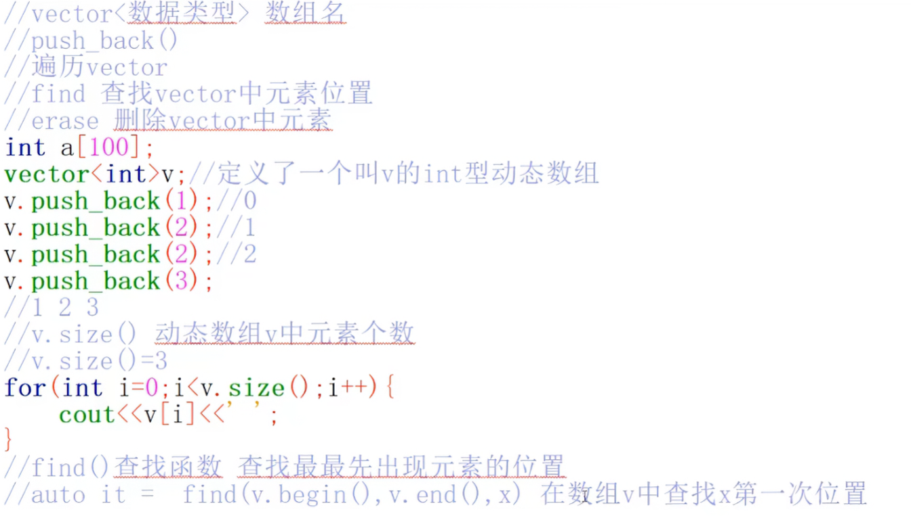

<!-- source: 码蹄杯/注意.md -->
## **sort(first, last)**：

- `first`：指向排序范围的起始位置（包含）。

- `last`：指向排序范围的**末尾的下一个位置**（不包含）。

- 因此，`sort(sum, sum + 5)` 排序的是 `sum[0]` 到 `sum[4]`。

- - 如果要降序排序，可以使用：

		方法 1：greater<int>()

		```cpp
		sort(a, a + 4, greater<int>());  // 结果：{9, 5, 2, 1}
		```

		方法 2：Lambda 表达式（C++11）

		```cpp
		sort(a, a + 4, [](int x, int y) { return x > y; });
		```


ISCC{chrIsauioleetalydoluwIy}

## **max(res, nums[i])**

在 C++ 中，`res = max(res, nums[i]);` 是用于更新变量 `res` 为当前最大值的一种常见写法。它的作用是：**比较 `res` 和 `nums[i]`，并将较大的值赋给 `res`**

## **s.length()和s.size()区别**

  **不同点**

**1. `length()` 主要用于字符串，`size()` 更通用**

- `length()` 是 `std::string` 的成员函数，**不适用于 STL 容器**（如 `vector`、`list`）。
- `size()` 是 STL 容器的通用接口，**适用于 `string` 和所有 STL 容器**。

## **判断质数的函数**

```cpp
bool fun(int x) {
    if (x <= 1)
        return false;
    if (x == 2)
        return true;
    for (int i = 2; i * i <= x; i++)
        if (x % i == 0)
            return false;
    return true;
}
```

## **getline(cin, s)**

在 C++ 中，`getline(cin, s)` 用于从标准输入（键盘）读取**一行字符串**，并存储到 `std::string` 变量 `s` 中。它比 `cin >> s` 更强大，可以读取包含空格的字符串。

###  **混合 `cin >>` 和 `getline` 时要注意缓冲区**

如果先 `cin >>` 再 `getline`，`cin` 会留下 `\n` 在缓冲区，导致 `getline` 直接读取空行

**解决方法：**

- 在 `cin >>` 后加 `cin.ignore()` 清除缓冲区：

###  **`getline` 可以指定分隔符（默认 `\n`）**

```cpp
string data;
getline(cin, data, ',');  // 读取直到遇到逗号
```

## **1. 按位与（`&`）按位或（`|`）**

- 对两个数的二进制表示逐位比较，**只有两个位都为 1 时，结果的该位才为 1**，否则为 0。

```cpp
int a = 5;    // 二进制: 0101
int b = 3;    // 二进制: 0011
int c = a & b; // 结果:  0001 (十进制 1)
cout << c;    // 输出 1
```

- 对两个数的二进制表示逐位比较，**只要有一个位为 1，结果的该位就为 1**，否则为 0。

```cpp
int a = 5;    // 二进制: 0101
int b = 3;    // 二进制: 0011
int c = a | b; // 结果:  0111 (十进制 7)
cout << c;    // 输出 7
```

## vector



push_back（）用于在容器的**末尾**添加一个新元素。
