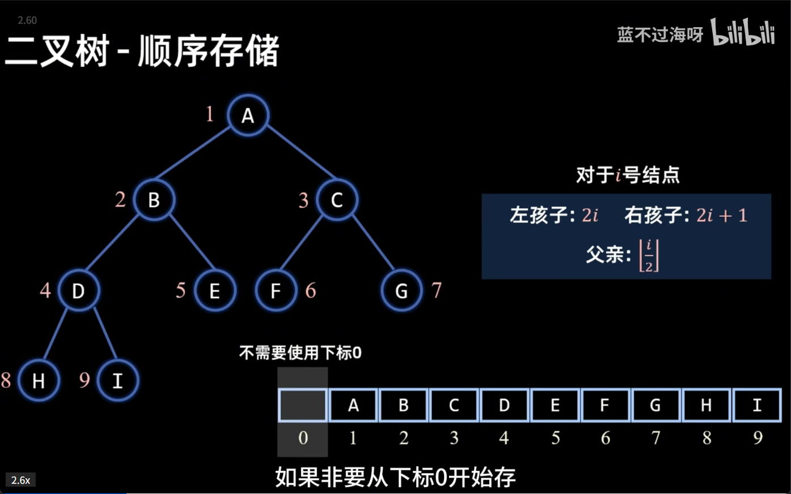
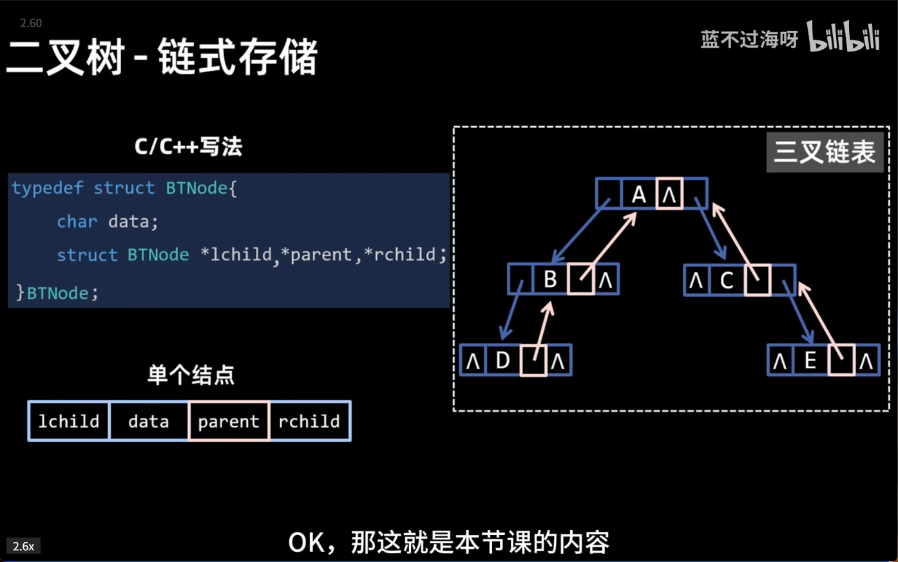
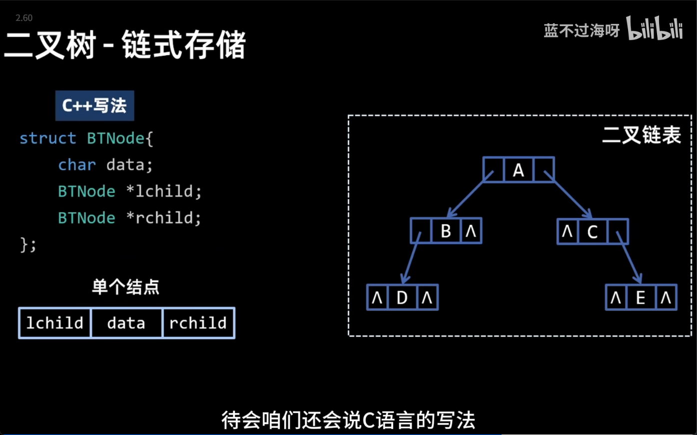
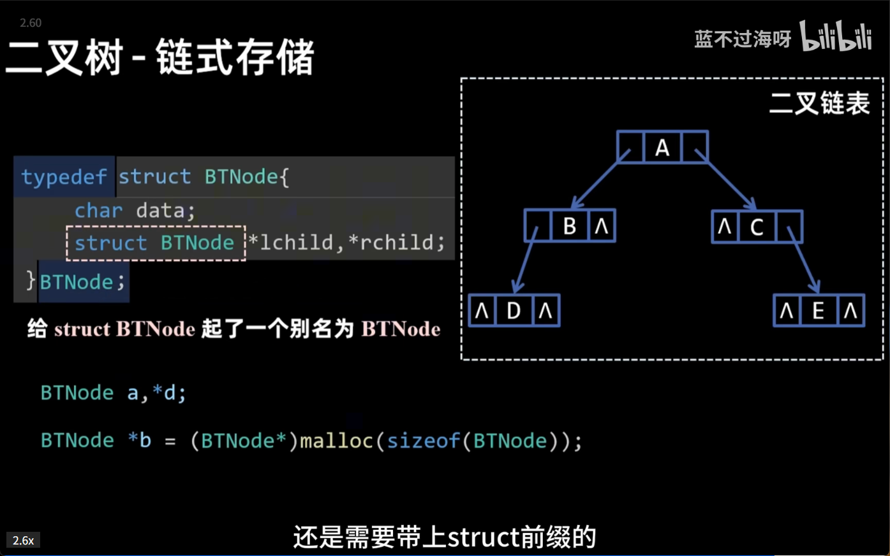
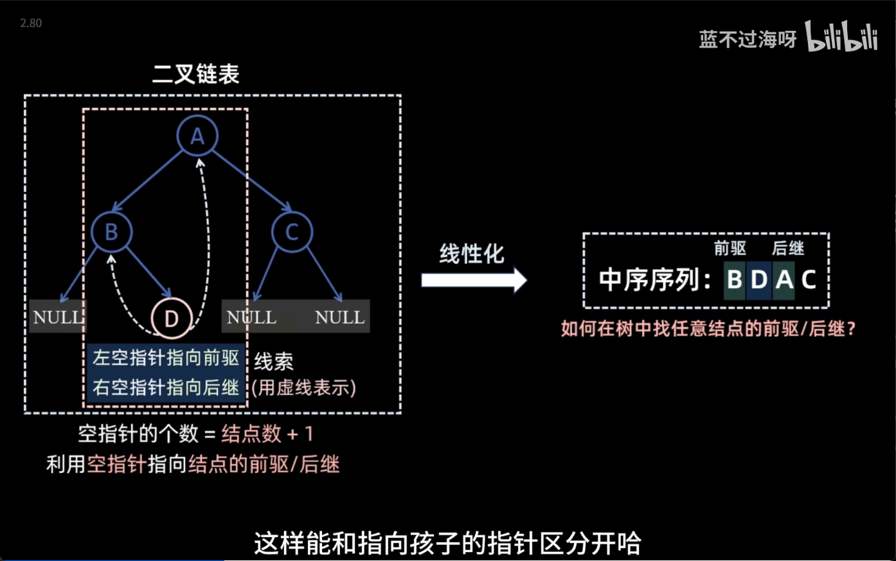
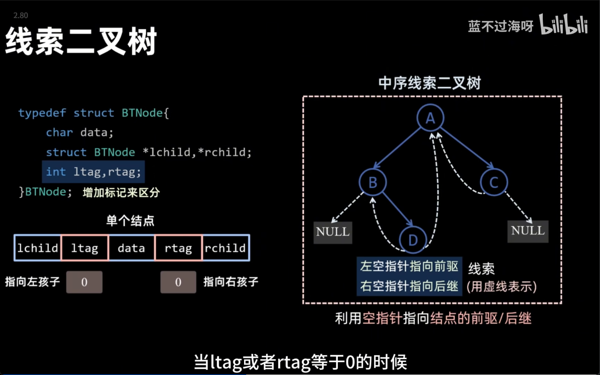
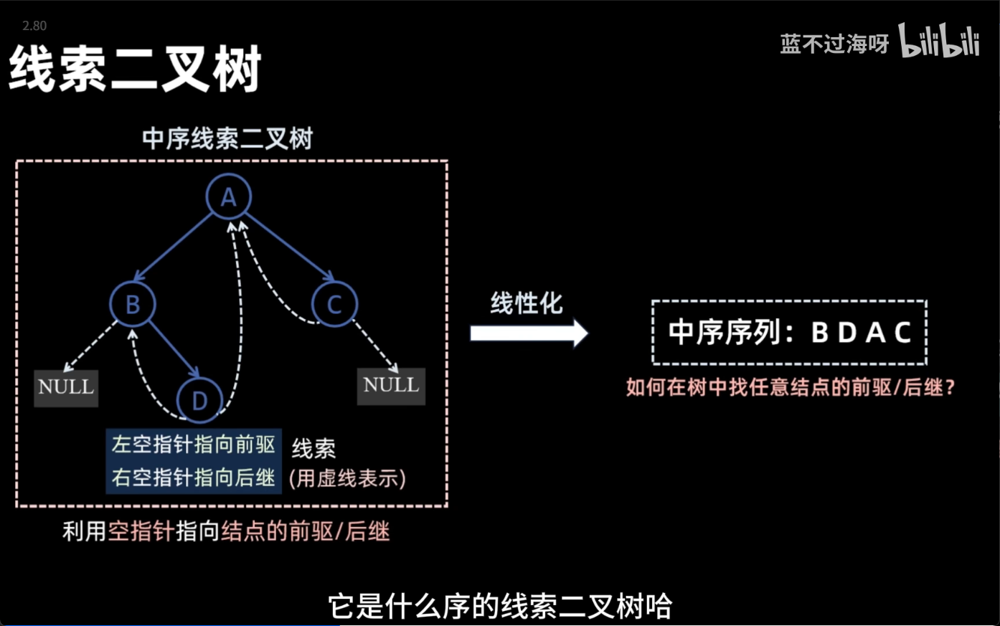

本文整理二叉树的存储方式和线索二叉树的核心知识点。

<!-- more -->

## 1. 二叉树的存储

### 1.1 顺序存储

顺序存储使用**数组**存放完全二叉树，通过下标表示结点关系。



**编号规则**（从 1 开始）：

| 结点 | 公式 |
|------|------|
| 左孩子 | `2i` |
| 右孩子 | `2i + 1` |
| 父亲 | `⌊i/2⌋` |

**特点**：适合**完全二叉树**，空间利用率高；非完全二叉树会浪费空间。

### 1.2 链式存储（二叉链表）

链式存储使用**指针**连接结点，每个结点包含：
- `data`：数据域
- `lchild`：左孩子指针
- `rchild`：右孩子指针


**重要规律**：空指针个数 = 结点数 + 1

### 1.3 三叉链表

在二叉链表基础上增加 `parent` 指针，方便向上查找。



| 类型 | 指针 | 特点 |
|------|------|------|
| 二叉链表 | lchild, rchild | 只能向下查找 |
| 三叉链表 | lchild, rchild, parent | 可双向查找 |

## 2. 链式存储代码实现

### 2.1 C++ 写法

```cpp
struct BTNode {
    char data;
    BTNode *lchild;
    BTNode *rchild;
};
```



### 2.2 C 语言写法（typedef）

使用 `typedef` 给结构体起别名，简化声明：

```c
typedef struct BTNode {
    char data;
    struct BTNode *lchild, *rchild;
} BTNode;

// 使用时不需要加 struct 前缀
BTNode a, *d;
BTNode *b = (BTNode*)malloc(sizeof(BTNode));
```




## 3. 线索二叉树

### 3.1 为什么需要线索化

二叉链表中存在大量空指针（结点数+1 个），造成浪费。

**线索化**：利用空指针存储**前驱/后继**信息，提高遍历效率。



### 3.2 线索化规则

| 空指针 | 指向 |
|--------|------|
| 左空指针 | 前驱结点 |
| 右空指针 | 后继结点 |

### 3.3 线索标志位

如何区分指针指向的是**孩子**还是**线索**？增加 `ltag` 和 `rtag` 标志位：



| 标志位 | 值 | 含义 |
|--------|-----|------|
| ltag/rtag | 0 | 指向左/右孩子 |
| ltag/rtag | 1 | 指向前驱/后继（线索） |

**结点结构**：

```c
typedef struct BTNode {
    char data;
    struct BTNode *lchild, *rchild;
    int ltag, rtag;  // 线索标志
} BTNode;
```

### 3.4 中序线索二叉树示例



对二叉树进行中序线索化后：
- 中序序列：B → D → A → C
- 空指针被利用为前驱/后继线索

## 4. 总结

| 存储方式 | 优点 | 缺点 |
|----------|------|------|
| 顺序存储 | 访问简单，适合完全二叉树 | 非完全树浪费空间 |
| 二叉链表 | 灵活，节省空间 | 空指针浪费 |
| 三叉链表 | 可双向查找 | 多一个指针开销 |
| 线索二叉树 | 利用空指针，遍历高效 | 结构复杂 |

**关键点**：
- 空指针个数 = 结点数 + 1
- 线索化利用空指针存储前驱/后继
- ltag/rtag 用于区分孩子和线索
