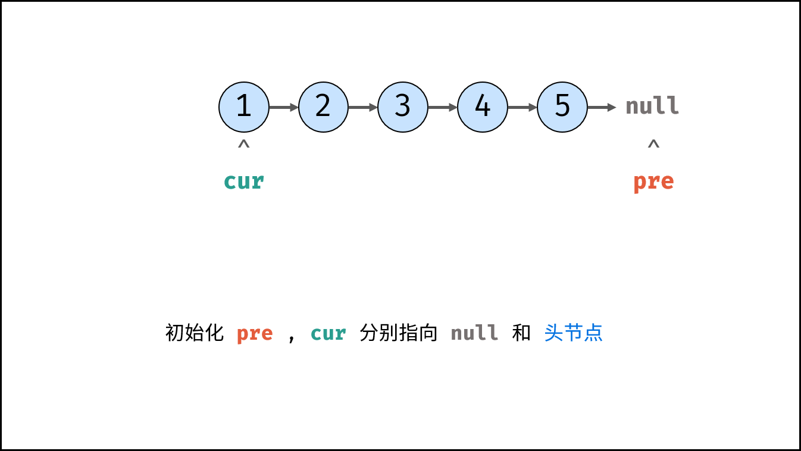
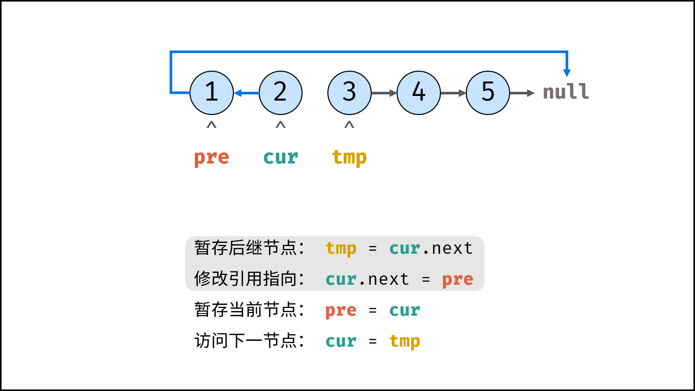
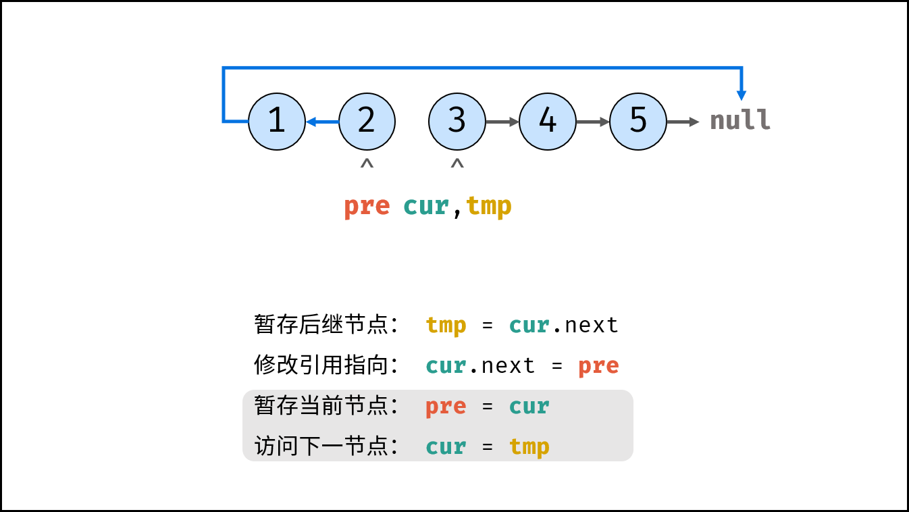
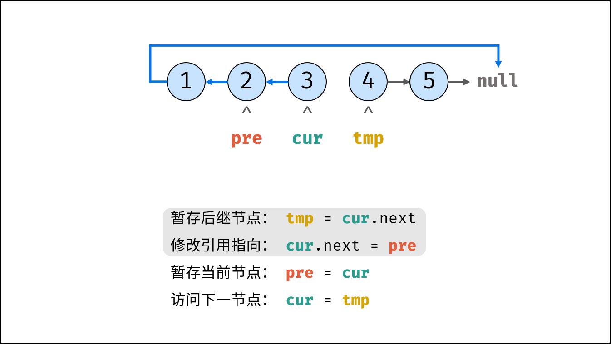
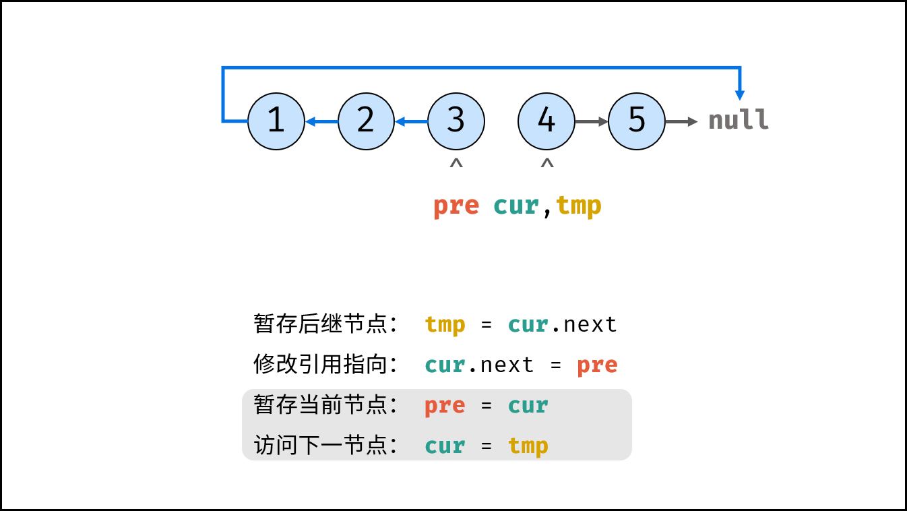
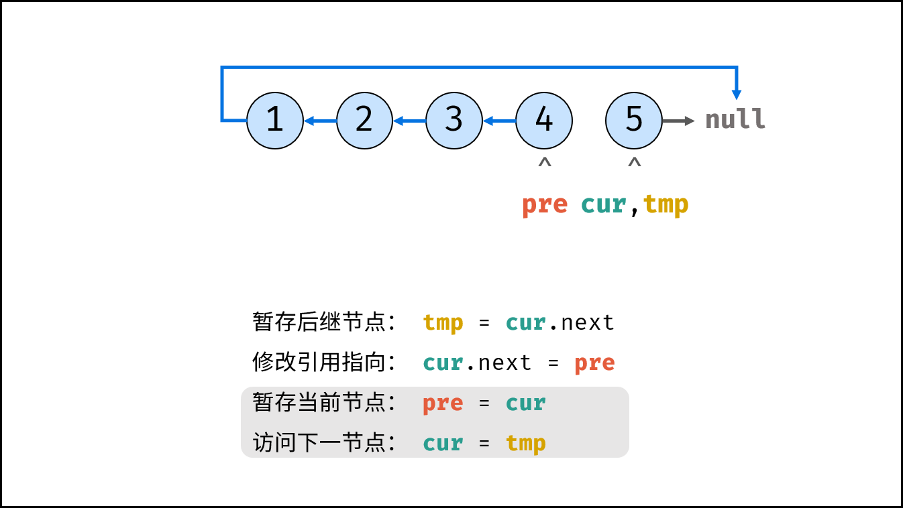
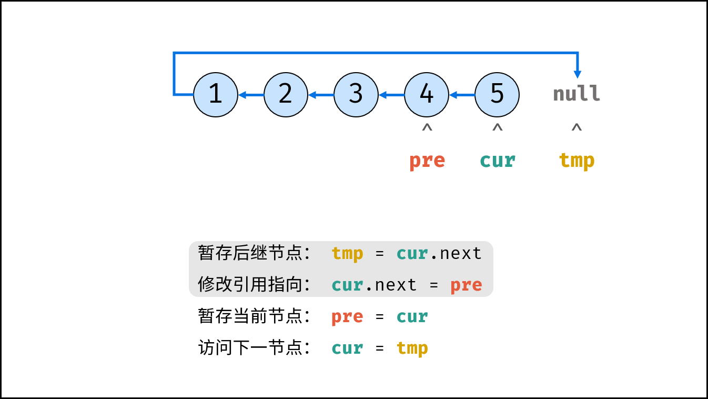
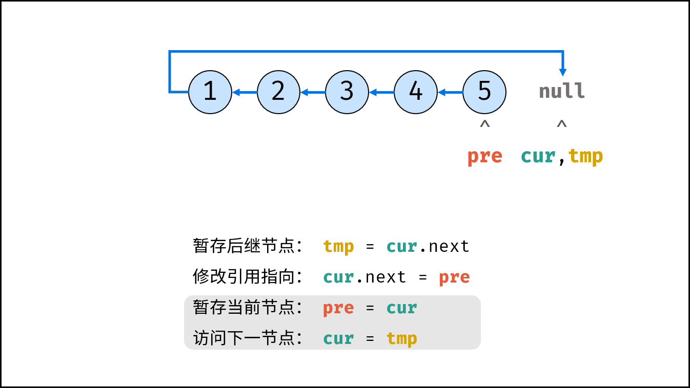
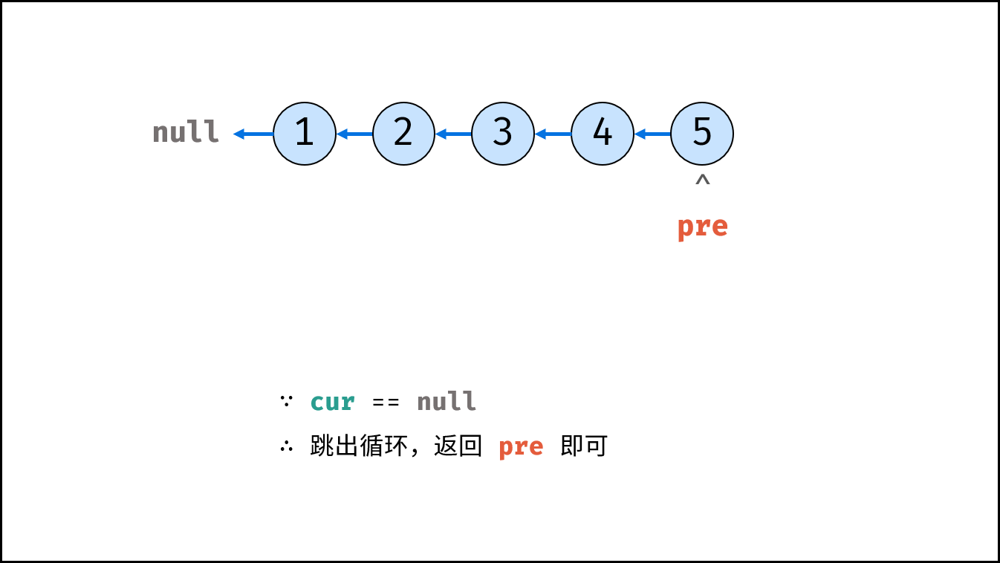
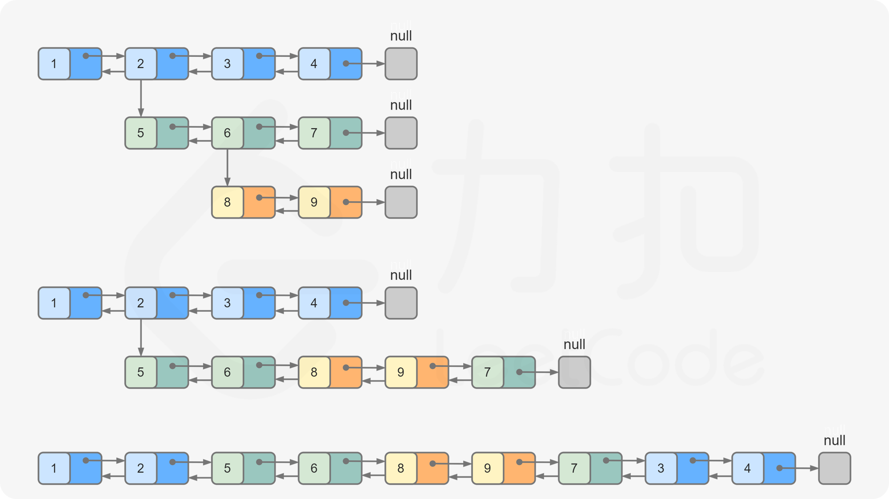

## 1. 链表概念

1. **与数组的区别**
	- 数组：连续内存空间，随机访问高效（O(1)），但插入/删除需移动元素（O(n)）
	- 链表：**节点离散存储**，通过指针连接（逻辑连续，物理非连续）
	- **访问效率**：链表只能顺序访问（O(n)），但插入/删除只需修改指针（O(1)）

2. **节点结构（C++实现）**

```cpp
struct ListNode {
    int val;         // 存储数据
    ListNode* next;  // 指向下一节点的指针
    ListNode(int x) : val(x), next(nullptr) {}
};
```

---

## 2. 链表底层机制

1. **内存分配原理**
	- 节点内存非连续 → **动态分配**（C++用`new`/`delete`）
	- 创建节点：`ListNode* node = new ListNode(10);`
	- 释放节点：`delete node;`（避免内存泄漏）
2. **指针操作图解**

```
初始： head → A → B → C → nullptr
删除B：
  1. 定位A: A->next = B->next
  2. 释放B: delete B
结果： head → A → C → nullptr
```

---

## 3. 链表五大基础操作（C++实现）

### **3.1. 遍历链表**

```cpp
void traverse(ListNode* head) {
    ListNode* cur = head;
    while (cur != nullptr) {
        cout << cur->val << " ";
        cur = cur->next;
    }
}
```

### **3.2. 插入节点**

- **头部插入**

	```cpp
	void insertAtHead(ListNode*& head, int val) {
	    ListNode* newNode = new ListNode(val);
	    newNode->next = head;
	    head = newNode;
	}
	```

- **尾部插入**

	```cpp
	void insertAtTail(ListNode*& head, int val) {
	    ListNode* newNode = new ListNode(val);
	    if (head == nullptr) {
	        head = newNode;
	        return;
	    }
	    ListNode* cur = head;
	    while (cur->next != nullptr) {
	        cur = cur->next;
	    }
	    cur->next = newNode;
	}
	```

- **中间插入（在pos节点后插入）**

	```cpp
	void insertAfter(ListNode* pos, int val) {
	    if (pos == nullptr) return;
	    ListNode* newNode = new ListNode(val);
	    newNode->next = pos->next;
	    pos->next = newNode;
	}
	```

### **3.3. 删除节点**

```cpp
void deleteNode(ListNode*& head, int val) {
    if (head == nullptr) return;

    if (head->val == val) {
        ListNode* temp = head;
        head = head->next;
        delete temp;
        return;
    }

    ListNode* cur = head;
    while (cur->next != nullptr && cur->next->val != val) {
        cur = cur->next;
    }

    if (cur->next != nullptr) {
        ListNode* temp = cur->next;
        cur->next = cur->next->next;
        delete temp;
    }
}
```

### **3.4. 修改节点值**

```cpp
void updateNode(ListNode* head, int oldVal, int newVal) {
    ListNode* cur = head;
    while (cur != nullptr) {
        if (cur->val == oldVal) {
            cur->val = newVal;
            return;
        }
        cur = cur->next;
    }
}
```

### **3.5. 查找节点**

```cpp
ListNode* searchNode(ListNode* head, int val) {
    ListNode* cur = head;
    while (cur != nullptr) {
        if (cur->val == val) {
            return cur;
        }
        cur = cur->next;
    }
    return nullptr;
}
```

---

## 4. 关键点

1. **头指针的特殊处理**
	- 头节点可能被修改 → 使用`ListNode*&`（指针引用）或二级指针
	- 空链表判断：`if (head == nullptr)`

2. **边界条件检查**
	- 插入/删除头节点
	- 操作空链表
	- 处理尾节点（`next`指向`nullptr`）

3. **内存管理要点**
	- 每次`new`后必须对应`delete`
	- 删除节点时需先保存下一节点指针

4. **哨兵节点技巧（简化操作）**

```cpp
ListNode* dummy = new ListNode(0);
dummy->next = head;
// ...执行操作...
head = dummy->next;
delete dummy;
```

---

## 5. 链表 vs 数组

| 特性 | 数组 | 链表 |
|---|---|---|
| 内存连续性 | 连续 | 非连续 |
| 访问方式 | O(1)随机访问 | O(n)顺序访问 |
| 插入/删除成本 | O(n)需要移动元素 | O(1)修改指针 |
| 扩容 | 需重新分配内存 | 动态增加节点 |
| 头部插入 | O(n) | O(1) |
| 局部性原理 | 优 | 差 |

---

## 6. LeetCode 练习

### 6.1. 删除链表中的节点（LeetCode 237）

**问题本质**：在只给定被删除节点（非尾节点）的情况下，实现节点删除

```cpp
void deleteNode(struct ListNode* node) {
    node->val = node->next->val;
    node->next = node->next->next;
}
```

**要点**：
- 无法访问前驱节点，因此采用"值替换+跳过"策略
- 时间复杂度 O(1)，空间复杂度 O(1)
- 特例处理：不能删除尾节点（题目保证）

### 6.2. 反转链表（LeetCode 206）

**迭代法**：



```cpp
class Solution {
public:
    ListNode* reverseList(ListNode* head) {
        ListNode *cur = head, *pre = nullptr;
        while(cur != nullptr) {
            ListNode* tmp = cur->next;
            cur->next = pre;
            pre = cur;
            cur = tmp;
        }
        return pre;
    }
};
```

**迭代步骤详解**（每轮循环的指针状态变化）：

| 步骤 | 状态描述 | 图示 |
|---|---|---|
| 1 | cur=1, tmp=2, pre=null，反转 1→null |  |
| 2 | pre=cur 进行中，准备进入下一步 |  |
| 3 | pre=1, cur=2, tmp=3，1→null 已反转 |  |
| 4 | pre=cur 进行中，准备进入下一步 |  |
| 5 | pre=2, cur=3, tmp=4，2→1→null |  |
| 6 | pre=cur 进行中，准备进入下一步 |  |
| 7 | pre=3, cur=4, tmp=5，3→2→1→null |  |
| 8 | pre=cur 进行中，准备进入下一步 |  |
| 9 | pre=4, cur=5, tmp=null，4→3→2→1→null |  |
| 10 | pre=cur 进行中，准备进入下一步 |  |
| 11 | 循环结束：5→4→3→2→1→null，返回 pre |  |

**递归法**：

```cpp
class Solution {
public:
    ListNode* reverseList(ListNode* head) {
        return recur(head, nullptr);
    }
private:
    ListNode* recur(ListNode* cur, ListNode* pre) {
        if (cur == nullptr) return pre;
        ListNode* res = recur(cur->next, cur);
        cur->next = pre;
        return res;
    }
};
```

| 方法 | 时间复杂度 | 空间复杂度 | 适用场景 |
|---|---|---|---|
| 迭代法 | O(n) | O(1) | 内存敏感场景 |
| 递归法 | O(n) | O(n) | 代码简洁要求场景 |

### 6.3. 设计链表（LeetCode 707）

**双向链表实现框架**：

```cpp
typedef struct MyLinkedListNode {
    int val;
    struct MyLinkedListNode *prev;
    struct MyLinkedListNode *next;
} Node;

typedef struct {
    Node *head;
    Node *tail;
    int size;
} MyLinkedList;
```

**设计原则**：
- 虚拟头尾节点：统一处理边界情况
- size维护：避免多余遍历
- 指针安全：每次操作前检查NULL

### 6.4. K 个一组翻转链表（LeetCode 25）

**问题描述**：给你链表的头节点 `head` ，每 `k` 个节点一组进行翻转，请你返回修改后的链表。如果节点总数不是 `k` 的整数倍，那么请将最后剩余的节点保持原有顺序。



```plaintext
原始链表：1 → 2 → 3 → 4 → 5 → 6 → 7 → 8 → 9
按 k=4 分组：
  组1: 1 → 2 → 3 → 4
  组2: 5 → 6 → 7 → 8 → 9 (剩余不足 4 个，保持原序)

翻转后：4 → 3 → 2 → 1 → 5 → 6 → 7 → 8 → 9
```

```cpp
class Solution {
public:
    // 翻转 [a, b) 区间内的链表节点（不包含 b）
    ListNode* reverse(ListNode* a, ListNode* b) {
        ListNode *pre = nullptr, *cur = a, *next;
        while (cur != b) {
            next = cur->next;
            cur->next = pre;
            pre = cur;
            cur = next;
        }
        return pre;  // 返回翻转后的新头
    }

    ListNode* reverseKGroup(ListNode* head, int k) {
        if (head == nullptr) return nullptr;

        ListNode *a = head, *b = head;
        // 前进 k 步，找到本组尾部
        for (int i = 0; i < k; i++) {
            if (b == nullptr) return head;  // 不足 k 个，保持原序
            b = b->next;
        }

        // 翻转前 k 个
        ListNode* newHead = reverse(a, b);
        // 递归处理后续链表
        a->next = reverseKGroup(b, k);
        return newHead;
    }
};
```

**关键点**：
- 使用 `[a, b)` 半开区间翻转，避免对尾节点做特殊处理
- 递归处理后续分组，每次处理 k 个节点
- 不足 k 个的剩余节点保持原序（不翻转）
- 时间复杂度 O(n)，空间复杂度 O(n/k) 的递归栈
