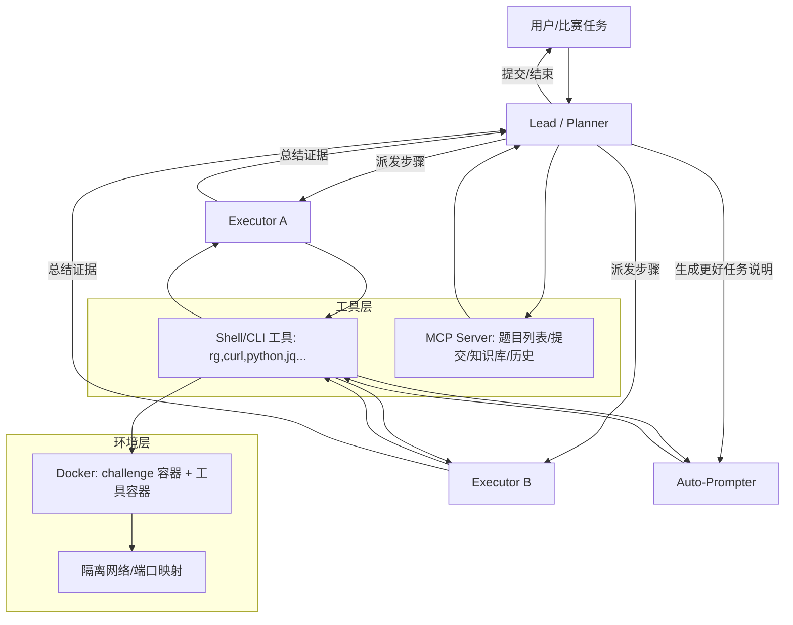
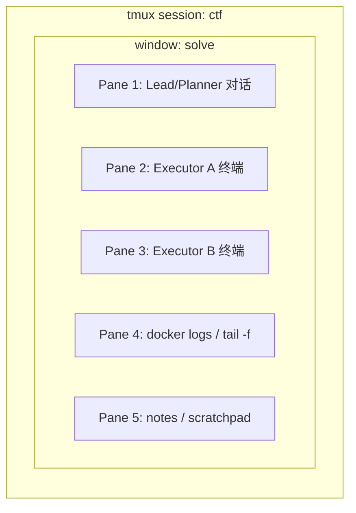

<!-- source: CTF/ctf的ai使用.md -->
# 复刻多 Agent CTF 工作流：tmux + AI CLI Agent + Docker 的资源地图与可操作清单

## 执行摘要

你看到的“满屏终端 + AI 自动跑题”，本质是一套可复用的工程化流水线：用 **Docker** 把题目与工具环境固定下来，用 **tmux/iTerm2 split panes** 把并行任务可视化，用 **AI CLI Agent（Codex/Claude Code/Kimi 等）** 执行“代理循环（agent loop）”来不断调用命令行工具、收集输出、调整计划并产出结果。citeturn17view0turn44view0turn16view3  
开源社区里已经出现了多种“CTF 专用/近似 CTF”的 Agent 框架：有以 **NYU CTF Bench + D‑CIPHER** 为代表的学术级复现链路（挑战全 Docker 化、可评测），也有面向国内平台与比赛训练的 **BUUCTF_Agent**、以及集成 **MCP + Kali 容器 + 守护进程自动解题** 的 **xbow-competition**。citeturn18view0turn40view0turn32view0turn13view4  
如果你只有十天冲刺，最务实的策略是：先复刻一个“能跑起来并能自我循环”的 CLI Agent（哪怕先做单题/小集），再补齐 tmux 自动布局、日志与并行跑法，最后再接入 Docker 化题库或比赛平台。citeturn45search0turn16view3turn36view0  
本报告只覆盖**学习/比赛授权环境**；若资源涉及敏感利用或自动化渗透，将明确标注“仅限学习与比赛环境”。

## 主流工作流拆解

### 代理循环与多 Agent 架构

“代理循环（agent loop）”是所有 AI CLI 工具的核心：模型推理 → 产生工具调用（如 shell 命令/文件编辑/MCP 工具）→ 执行并收集输出 → 把输出回填上下文 → 继续推理，直到输出最终答复或停止。citeturn17view0turn16view3  
在 CTF 场景，多 Agent 往往比单 Agent 更稳，常见的分工是：

- **Planner（规划）**：制定分步计划、把步骤派发给执行者，并根据执行反馈迭代计划。citeturn25view0  
- **Executor（执行）**：专注运行命令、写小脚本、分析输出；最后必须产出“本步骤总结”回传给 Planner。citeturn26view0turn26view4  
- **Auto‑Prompter（自动提示生成）**：先探索题目与附件，再为“主解题代理”生成更贴合题面的提示词/任务说明，降低上下文污染。citeturn25view2turn26view3  

NYU 的 D‑CIPHER 开源配置把这三类角色、轮数、模型、工具集（run_command/submit_flag/decompile 等）写成 YAML，可直接改模型与预算。citeturn23view0  

### 为什么本地需要 Docker

在“比赛靶机/远端服务”之外，本地 Docker 有三个关键价值：

- **复现题目与网络拓扑**：像 NYU CTF Bench 把题目按统一结构组织，每题带 `challenge.json`，需要服务的题目用 `docker-compose.yaml` 启动，Agent 通过容器网络与服务交互。citeturn40view0turn38view0  
- **隔离与可控**：AI CLI 可能会执行大量命令。把其运行限制在容器/沙箱（读写权限、网络范围）能降低误操作风险；Codex 的非交互模式也强调默认只读沙箱与最小权限原则。citeturn16view3turn17view0  
- **可重复评测与日志追踪**：同一题同一镜像同一脚本，输出可重放；适合十天冲刺里做“迭代式提分”。

### tmux 为什么是“多窗口”的关键

你截图那种“多列多行面板”通常来自两类机制：

- **tmux 本身的分屏与会话**：可随时 attach/detach，适合比赛断线重连与远程 SSH。  
- **AI 工具内建的 split‑pane 编排**：例如 Claude Code 的 Agent Teams 支持“in‑process（单终端切换队友视图）”与“split panes（每个队友一个 pane）”，split pane 需要 tmux 或 iTerm2，并提供 `teammateMode` 配置与 `claude --teammate-mode ...` 之类的控制入口，还包含“孤儿 tmux 会话”排查指引。citeturn44view0turn44view1  

如果你想“复刻满屏并行”，优先选 **自带 tmux 编排能力**的 CLI（如 Claude Code Agent Teams），或用 **tmuxp** 这类工具用 YAML 固化布局，一键拉起多个 pane 运行不同命令。citeturn36view0turn44view0  

## 资源对比表与优先检索来源

### 资源对比表（不少于十项）

评分解释：**实操价值**偏向“十天内能否落地复刻与形成工作流闭环”；“可运行示例”表示仓库/文档是否提供较明确的 run/quickstart（不代表你无需 API Key）。

| 资源名 | 类型 | URL | 实操价值(1-5) | 可直接运行示例(Y/N) |
|---|---|---:|---:|---|
| NYU CTF Agents（D‑CIPHER / Baseline） | 开源项目 | `https://github.com/NYU-LLM-CTF/nyuctf_agents` citeturn18view0 | 5 | Y |
| NYU CTF Bench | 开源项目 | `https://github.com/NYU-LLM-CTF/NYU_CTF_Bench` citeturn40view0 | 5 | Y |
| nyuctf（数据集加载器） | 官方工具/包 | `https://pypi.org/project/nyuctf/` citeturn38view0 | 4 | Y |
| D‑CIPHER 论文 | 论文 | `https://arxiv.org/abs/2405.17329` citeturn0search5 | 4 | N |
| NYU CTF Bench 论文（NeurIPS D&B Track） | 论文 | `https://arxiv.org/abs/2406.05590` citeturn37search11turn33search12 | 4 | N |
| xbow-competition（MCP + Kali 容器 + 守护进程） | 开源项目 | `https://github.com/m-sec-org/xbow-competition` citeturn13view4 | 5 | Y |
| BUUCTF_Agent（中文、可改 Prompt） | 开源项目 | `https://github.com/MuWinds/BUUCTF_Agent` citeturn32view0 | 4 | Y |
| Claude Code Agent Teams（tmux/iTerm2 分屏） | 官方文档 | `https://code.claude.com/docs/en/agent-teams` citeturn44view0 | 4 | Y |
| OpenAI Codex：非交互模式（JSONL 日志/脚本化） | 官方文档 | `https://developers.openai.com/codex/noninteractive` citeturn16view3 | 5 | Y |
| OpenAI：Unrolling the Codex agent loop | 官方工程博客 | `https://openai.com/index/unrolling-the-codex-agent-loop/` citeturn17view0 | 4 | N |
| openai/codex（Codex CLI 源码） | 开源项目 | `https://github.com/openai/codex` citeturn42view0 | 4 | Y |
| tmuxp（用 YAML 固化 tmux 布局） | 开源项目/教程 | `https://github.com/tmux-python/tmuxp` citeturn36view0turn4search17 | 4 | Y |
| CAI（Cybersecurity AI） | 开源项目/教程 | `https://github.com/aliasrobotics/CAI` citeturn41view0 | 3 | Y |
| Gemini CLI（ReAct 循环 + MCP） | 官方文档/开源 | `https://github.com/google-gemini/gemini-cli` citeturn3search10turn3search6 | 3 | Y |
| Aider（可脚本化的终端 Coding Agent） | 教程/工具 | `https://aider.chat/docs/scripting.html` citeturn45search0 | 3 | Y |

### 优先检索的站点与来源清单

按“可复刻价值/原始性”优先级整理（中文资源在可用时优先）：

- **GitHub**：优先原始仓库（README、docker-compose、agent 配置、示例脚本）。citeturn40view0turn18view0turn42view0  
- **arXiv / OpenReview / NeurIPS Proceedings**：找论文的“方法细节、评测协议、数据格式”。citeturn37search11turn33search12turn39search0  
- **比赛官网 / writeups 汇总页**：例如 CSAW 的 Agentic Automated CTF 页面会说明数据格式兼容性与接入方式。citeturn33search11  
- **官方工具文档**：Codex/Claude Code/Gemini CLI 的“权限、沙箱、JSONL 日志、tmux 模式、MCP”。citeturn16view3turn44view0turn3search6  
- **中文社区**：CSDN/博客园/掘金/知乎（更偏经验与踩坑）；若与官方文档冲突，以官方为准。  
- **Reddit / Medium**：常见“tmux 模式/多 Agent 使用体验”，但属于经验贴，需交叉验证。citeturn14search2turn14search6  

## 资源详解清单

以下每条都给出：类型、标题、作者/组织、发布时间、网址、摘要、为何有用、关键实现要点、难度。若涉及敏感利用，标注“仅限学习与比赛环境”。

### NYU CTF Agents（D‑CIPHER / Baseline）

- 类型：开源项目  
- 标题：NYU CTF Automation Framework（D‑CIPHER + Baseline）  
- 作者/组织：NYU‑LLM‑CTF  
- 发布时间：仓库近年更新（组织页显示更新至二零二五年秋）citeturn33search5  
- 网址：`https://github.com/NYU-LLM-CTF/nyuctf_agents` citeturn18view0  
- 摘要：提供多 Agent（Planner/Executor/Auto‑Prompter）与基线 Agent，并在 Docker 环境中与 CTF Challenge 容器交互，目标是自动化解题与评测。citeturn18view0turn23view0  
- 为何有用：它是目前最“成体系”的 CTF Agent 开源实现之一：既有可跑的脚本（`run_dcipher.py` 等），也有清晰的多角色 Prompt 与工具集配置，适合作为你十天内复刻工作流的“主骨架”。citeturn18view0turn23view0turn25view0  
- 关键实现要点：  
  - Docker：脚本会创建专用网络 `ctfnet` 并构建 `ctfenv:multiagent` 镜像。citeturn27view0  
  - 多 Agent 配置：`configs/dcipher/base_planner_executor.yaml` 定义 planner/executor/autoprompter 的轮数、模型、工具集。citeturn23view0  
  - Prompt：Planner/Executor/Auto‑Prompter 的 Prompt 位于 `configs/dcipher/prompts/`，可直接改成中文或加约束。citeturn24view0turn25view0turn26view4  
- 主要文件路径：`README.md`、`setup_dcipher.sh`、`run_dcipher.py`、`configs/`、`docker/`、`nyuctf_multiagent/`。citeturn18view0turn27view0  
- 适用难度：中级（需要你能跑 Python + Docker，并理解配置文件）。

### NYU CTF Bench（题库 Docker 化基准）

- 类型：开源项目  
- 标题：NYU CTF Bench  
- 作者/组织：NYU‑LLM‑CTF  
- 发布时间：仓库更新至二零二五年秋；并有版本发布信息。citeturn33search5turn40view0  
- 网址：`https://github.com/NYU-LLM-CTF/NYU_CTF_Bench` citeturn40view0  
- 摘要：包含测试集与开发集，按 `<year>/<event>/<category>/<challenge>` 组织；每题包含 `challenge.json`，需要服务的题目提供 `docker-compose.yaml` 以便直接 `docker compose up`。citeturn40view0  
- 为何有用：你想复刻“本地 Docker 化靶机 + Agent 自动交互”，它就是现成的可复现题库与标准格式；并且自带开发/测试划分，适合冲刺期做“可控训练”。citeturn40view0  
- 关键实现要点：  
  - 数据集 JSON：根目录可见 `development_dataset.json`、`test_dataset.json`。citeturn40view0  
  - Challenge 容器：题目目录中出现 `docker-compose.yaml` 时，按文档用 `docker compose up` 拉起服务。citeturn40view0  
- 主要文件路径：`development/`、`test/`、`python/`、`development_dataset.json`、`test_dataset.json`、`README.md`。citeturn40view0  
- 适用难度：入门到中级（跑 Docker 容器即可；深入改题/改网络属于中级）。

### nyuctf（NYU 数据集加载器）

- 类型：官方工具/教程（PyPI 包）  
- 标题：nyuctf — NYU CTF Dataset loader package  
- 作者/组织：NYU CTF  
- 发布时间：PyPI 显示版本发布时间（例如一版在二零二五年初发布）。citeturn38view0  
- 网址：`https://pypi.org/project/nyuctf/` citeturn38view0  
- 摘要：提供 `CTFDataset`/`CTFChallenge` 加载接口；首次实例化会自动克隆题库仓库，也可手动运行 `python3 -m nyuctf.download`。citeturn38view0turn40view0  
- 为何有用：十天冲刺里，很多时间浪费在“题库路径/格式不一致”。nyuctf 把挑战 ID（如 `2021f-rev-maze`）与基目录管理标准化，适合脚本化与批量运行。citeturn38view0turn40view0  
- 关键实现要点：  
  - 安装：`pip install nyuctf`。citeturn38view0  
  - 加载示例：`ds = CTFDataset(split="test")`，`CTFChallenge(ds.get("2021f-rev-maze"), ds.basedir)`。citeturn38view0turn40view0  
- 适用难度：入门。

### D‑CIPHER 论文

- 类型：论文  
- 标题：D‑CIPHER: Dynamic Collaborative Intelligent Agents with Planning and Heterogeneous Execution for Enhanced Reasoning in Offensive Security  
- 作者/组织：论文作者团队（见 arXiv）  
- 发布时间：arXiv 页面显示在二零二四年。citeturn0search5  
- 网址：`https://arxiv.org/abs/2405.17329` citeturn0search5  
- 摘要：讨论为什么单 Agent 的“单一推理‑行动”不足以解决复杂 CTF，并提出规划与异构执行协作的多 Agent 体系。citeturn0search5  
- 为何有用：当你要“复刻并改造工作流”时，论文能告诉你多 Agent 的关键设计动机、失败模式与评测指标，避免纯靠试错。  
- 关键实现要点：与 `nyuctf_agents` 的配置/Prompt 对照阅读最有效（Planner/Executor/Auto‑Prompter 的职责边界）。citeturn23view0turn25view0turn26view4  
- 适用难度：中级（读论文 + 对照实现）。

### NYU CTF Bench 论文

- 类型：论文  
- 标题：NYU CTF Bench: A Scalable Open‑Source Benchmark Dataset for Evaluating LLMs in Offensive Security  
- 作者/组织：论文作者团队（NeurIPS 数据集与基准赛道 / OpenReview）citeturn33search12turn37search11  
- 发布时间：OpenReview 页面显示在二零二四年秋提交；arXiv PDF 可获取。citeturn33search12turn37search11  
- 网址：`https://arxiv.org/abs/2406.05590` citeturn37search11  
- 摘要：提出可规模化的 CTF 基准数据集与自动化框架，并强调用 Docker 化挑战来评估 LLM agent 的交互式网络任务规划能力。citeturn33search8turn40view0  
- 为何有用：你复刻工作流时，会遇到“工具选择不当、平台支持不足、数据污染”等系统性问题，论文与附录类资料通常会点出这些坑。citeturn37search5turn39search3  
- 适用难度：中级。

### xbow-competition（MCP + Kali 容器 + 守护进程自动解题）

- 类型：开源项目（中文、偏平台赛/训练）  
- 标题：xbow-competition（包含 MCP Server + Kimi CLI Agent）  
- 作者/组织：m-sec-org 等  
- 发布时间：仓库页面显示更新在二零二五年末附近。citeturn11search14  
- 网址：`https://github.com/m-sec-org/xbow-competition` citeturn13view4  
- 摘要：项目由 MCP 服务器与定制 CLI Agent 组成：MCP 层抽象“列题/标记进行中/提示/提交/知识库/命令执行历史”，并提供“持久化 Kali 容器”执行安全工具；CLI 支持 daemon 自动解题、多实例并行与会话隔离。citeturn13view4turn13view1  
- 为何有用：这是很接近你想要的“CTF 全 agent 运行”的一条路径：**工具层（MCP）+ 执行层（Kali 容器）+ 决策层（CLI agent）** 分离，且 README 直接写了多实例并行、daemon 模式与故障排查。citeturn13view1turn13view4  
- 关键实现要点：  
  - Daemon 自动解题命令示例：`kimi -a security ... --daemon --verbose -c "..."`。citeturn13view1  
  - MCP 工具清单：`list_challenges / do_challenge / submit_answer / kail_terminal / get_terminal_history ...`。citeturn13view1turn13view4  
  - 项目结构（关键文件）：`Dockerfile`（Kali 容器）、`mcp.json`（MCP 配置示例）、`start.sh`（快速启动脚本）、`agents/`（Agent 配置）。citeturn13view4  
- 适用难度：高级（依赖 Go + uv + Docker + 模型 API；适合冲刺期后半段上强度）。  
- 安全标注：包含安全工具执行能力，仅限授权/比赛环境使用。citeturn13view4  

### BUUCTF_Agent（中文、可自定义 Prompt）

- 类型：开源项目  
- 标题：BUUCTF_Agent  
- 作者/组织：MuWinds  
- 发布时间：未在页面显式标注（以仓库提交历史为准）。citeturn32view0  
- 网址：`https://github.com/MuWinds/BUUCTF_Agent` citeturn32view0  
- 摘要：面向 CTF 设计的可扩展 Agent，支持自动解题与命令行交互；内置本地 Bash 执行、可自定义 Prompt 与模型配置，提供从克隆到配置 API Key 的完整步骤。citeturn32view0turn35view0  
- 为何有用：对新手最友好的一点是：它把“Prompt 模板（中文）→ 下一步工具调用规划 → 输出分析 → 结构化判断（是否终止/是否发现 flag）”写成可直接复用的 YAML。citeturn35view0  
- 关键实现要点：  
  - 部署步骤：克隆 → venv → `pip install -r requirements.txt` → `cp config_template.json config.json` 填入 key → `python main.py`。citeturn32view0  
  - Prompt：`prompt.yaml` 里包含 `problem_summary / think_next / step_analysis / reflection` 等模板，可直接改成你的“考试版规则”。citeturn35view0  
  - Docker：仓库根目录有 `Dockerfile`，可用于把工具环境容器化（建议仅在授权环境）。citeturn32view0  
- 适用难度：入门到中级。  
- 安全标注：用于 CTF 与靶场环境；不要对未授权目标使用。

### Claude Code Agent Teams（tmux/iTerm2 分屏并行）

- 类型：官方文档  
- 标题：Orchestrate teams of Claude Code sessions  
- 作者/组织：Anthropic  
- 发布时间：持续更新；文档要求 Claude Code 版本不低于特定版本，并通过环境变量启用。citeturn43view0turn44view0  
- 网址：`https://code.claude.com/docs/en/agent-teams` citeturn44view0  
- 摘要：支持把多个 Claude Code 会话编排成“团队”：lead 负责协调任务与综合结果，teammates 独立上下文并可互发消息；显示模式支持 in‑process 与 split panes。citeturn43view0turn44view0  
- 为何有用：这是“复刻满屏并行”的最快路径之一：split panes 模式明确写了依赖 tmux 或 iTerm2，并给出 `teammateMode` 配置、`claude --teammate-mode in-process` 以及 tmux 孤儿会话清理。citeturn44view0turn44view1  
- 关键实现要点：  
  - 启用：设置 `CLAUDE_CODE_EXPERIMENTAL_AGENT_TEAMS=1`（settings.json 或环境变量）。citeturn43view0turn44view0  
  - 分屏：split panes 需要 tmux 或 iTerm2，并说明默认 `"auto"` 行为与 `~/.claude.json` 的 `teammateMode` 配置。citeturn44view0turn44view1  
- 适用难度：中级（对 CTF 不“专用”，但对并行工作流非常强）。

### OpenAI Codex 非交互模式（脚本化与日志收集）

- 类型：官方文档  
- 标题：Non-interactive mode（`codex exec`）  
- 作者/组织：OpenAI  
- 发布时间：持续更新  
- 网址：`https://developers.openai.com/codex/noninteractive` citeturn16view3  
- 摘要：`codex exec` 支持把任务作为参数/标准输入传入；运行中把进度流到 stderr、最终消息到 stdout，便于管道与重定向；支持 `--json` 输出 JSONL 事件流（包含 command/tool/file change 等事件）。citeturn16view3turn16view4  
- 为何有用：这是构建“全自动 CTF 代理流水线”的关键拼图：你可以把每一步命令输出管道喂给 agent，再把 agent 的 JSONL 事件写入日志，用脚本做并行与回放。citeturn16view3turn16view4  
- 关键实现要点：  
  - 管道喂输入：文档给出 `curl ... | codex exec "..."> file` 之类的模式。citeturn16view3  
  - 机器可读日志：`codex exec --json ... | jq`，并列举 `thread.started/turn.completed/item.*` 等事件类型。citeturn16view3turn16view4  
  - 权限：默认只读沙箱；自动化场景要最小权限，危险权限仅限隔离环境。citeturn16view3  
- 适用难度：中级。

### Unrolling the Codex agent loop（理解“Agent Loop”）

- 类型：官方工程博客  
- 标题：Unrolling the Codex agent loop  
- 作者/组织：OpenAI（Michael Bolin）  
- 发布时间：二零二六年一月（文中标注）citeturn17view0  
- 网址：`https://openai.com/index/unrolling-the-codex-agent-loop/` citeturn17view0  
- 摘要：从工程实现角度解释 agent loop、工具调用回填、上下文膨胀与压缩等关键机制，并说明 Codex CLI 的 prompt/instructions/tools 是如何构建与管理的。citeturn17view0  
- 为何有用：你要“复刻工作流”，最怕只会跑命令不会调参。读它能把“为何需要日志、为何要分角色、为何要沙箱与权限”串成因果链。citeturn17view0turn16view3  
- 适用难度：中级到高级。

### openai/codex（Codex CLI 源码与配置入口）

- 类型：开源项目  
- 标题：Lightweight coding agent that runs in your terminal  
- 作者/组织：OpenAI  
- 发布时间：仓库持续高频发布（页面显示最新发布在二零二六年四月）。citeturn42view0  
- 网址：`https://github.com/openai/codex` citeturn42view0  
- 摘要：包含 Codex CLI、Rust 核心与 SDK、文档与脚本等；README 提供安装方式（npm / brew / release binary）与登录方式（ChatGPT 计划或 API key）。citeturn42view0  
- 为何有用：如果你要做“自定义工具/自定义规则/自定义 MCP”，源码是最可靠的答案来源；而且仓库目录里直接暴露 `AGENTS.md`、`.codex/skills`、`sdk/` 等可扩展点。citeturn42view0  
- 关键实现要点：  
  - 安装：`npm install -g @openai/codex` 或 `brew install --cask codex`。citeturn42view0  
  - 目录结构：`codex-cli/`、`sdk/`、`.codex/skills`、`docs/`。citeturn42view0  
- 适用难度：中级到高级。  
- 付费/授权标注：可用 ChatGPT 计划登录或 API key（README 写明两种方式）。citeturn42view0  

### tmuxp（tmux 布局一键复刻）

- 类型：开源项目/教程  
- 标题：tmuxp（session manager）  
- 作者/组织：tmux-python  
- 发布时间：持续更新  
- 网址：`https://github.com/tmux-python/tmuxp` citeturn4search17turn36view0  
- 摘要：用 YAML/JSON 描述 tmux session、window、pane 与启动命令；仓库提供示例 `3-pane.yaml`。citeturn36view0  
- 为何有用：比赛/考试最怕临时手动分屏。tmuxp 让你“复制别人工作区”变成一次命令；也便于把多 Agent、日志 tail、docker logs 放进固定 pane。citeturn36view0  
- 关键实现要点：YAML 示例包含 `session_name`、`layout`、`panes` 与 `shell_command_before`。citeturn36view0  
- 适用难度：入门到中级。

### CAI（Cybersecurity AI）

- 类型：开源项目/教程（含 CTF 相关章节与 dockerized 方案）  
- 标题：Cybersecurity AI (CAI), the framework for AI Security  
- 作者/组织：aliasrobotics  
- 发布时间：持续更新；README 给出跨平台安装与 WSL 指引。citeturn41view0turn41view1  
- 网址：`https://github.com/aliasrobotics/CAI` citeturn41view0  
- 摘要：提供 `cai-framework` 与 `cai` 命令，支持用 `.env` 配置多家模型 key；Windows 推荐 WSL；并指出 Ubuntu 上工具缺失时可用 `dockerized` 目录的 docker compose 方案。citeturn41view0turn41view2  
- 为何有用：它把“CTF/安全工具环境不齐导致 agent 翻车”的痛点写进 README，并直接给出 docker compose 替代路线；适合你补齐“工具层容器化”的经验。citeturn41view0turn41view2  
- 关键实现要点：  
  - 安装：`pip install cai-framework`，然后 `cai` 启动；通过 `.env` 放 key。citeturn41view0turn41view2  
  - dockerized：`docker compose build && docker compose up -d`，再 `docker compose exec cai cai`。citeturn41view0turn41view2  
- 适用难度：中级。  
- 安全标注：提供安全工具执行能力，仅限授权/比赛环境。

### Gemini CLI（ReAct + MCP 的通用 CLI Agent）

- 类型：官方文档 + 开源项目  
- 标题：Gemini CLI  
- 作者/组织：Google  
- 发布时间：持续更新  
- 网址：`https://github.com/google-gemini/gemini-cli` citeturn3search10  
- 摘要：官方文档描述其采用 ReAct 循环，并提供内建工具与本地/远程 MCP server 支持。citeturn3search6turn3search10  
- 为何有用：如果你把“CTF 特化 agent”当作中长期目标，Gemini CLI 这类通用 Agent + MCP 框架能帮助你先把“工具编排/权限/日志/并行”练熟。  
- 适用难度：中级。

### Aider（可脚本化的终端 Agent）

- 类型：教程/工具  
- 标题：Scripting aider  
- 作者/组织：Aider-AI  
- 发布时间：持续更新  
- 网址：`https://aider.chat/docs/scripting.html` citeturn45search0  
- 摘要：文档明确支持用 `--message` 做“一次性任务后退出”，并建议用 shell 脚本批量处理文件；另有选项与配置文档。citeturn45search0turn45search1  
- 为何有用：CTF 自动化里常见“写脚本/改 payload/修复解题脚本”的循环；aider 的“可脚本化接口 + 模式切换”可用于搭建你自己的 agent loop 外壳（例如把日志喂给 aider 生成下一步脚本）。citeturn45search0turn45search4  
- 适用难度：入门到中级。

## 最小可运行示例

下面给出三套“可直接克隆并跑起来”的最小示例。它们的共同目标不是“保证十天拿奖”，而是让你迅速复刻 **全自动循环 + 工具调用 + 可观测日志** 的骨架；真正提分靠你后续调 Prompt/工具/题库。

### 示例一：BUUCTF_Agent（最快形成闭环，中文 Prompt 可直改）

- 仓库：`https://github.com/MuWinds/BUUCTF_Agent` citeturn32view0  
- 所需凭证：OpenAI 或 OpenAI 兼容接口 API key（填入 `config.json`）。citeturn32view0  
- 逐行命令：

```bash
git clone https://github.com/MuWinds/BUUCTF_Agent.git
cd BUUCTF_Agent

python3 -m venv .venv
source .venv/bin/activate

pip install -r requirements.txt

cp config_template.json config.json
# 用编辑器打开 config.json，填入你的 model/api_key/api_base（仓库 README 给了示例结构）

python main.py
```

- 预期输出：程序启动进入命令行交互模式（会读取你的 `config.json`），等待你输入题面/选择模式等。citeturn32view0  
- 如何验证成功：  
  - 能正常启动且无鉴权报错；  
  - 修改 `prompt.yaml` 中 `think_next/step_analysis` 后再次运行，行为发生可观测变化（证明 Prompt 管线生效）。citeturn35view0  

### 示例二：NYU D‑CIPHER + NYU CTF Bench（学术级标准格式 + Docker 化题库）

- 仓库：`https://github.com/NYU-LLM-CTF/nyuctf_agents` citeturn18view0  
- 依赖：Docker、Python（仓库说明至少测试过 3.10+）；并需要题库（通过 `nyuctf` 自动克隆/下载）。citeturn18view0turn27view0turn38view0  
- 所需凭证：模型 API key（配置里示例 backend 为 openai；一般使用环境变量或你本机 OpenAI SDK 习惯方式）。citeturn21view0turn23view0  
- 逐行命令（建议在 tmux pane 中跑）：

```bash
git clone https://github.com/NYU-LLM-CTF/nyuctf_agents.git
cd nyuctf_agents

python3 -m venv .venv
source .venv/bin/activate

# 构建容器镜像 + 创建 docker network + 安装 python 包（脚本内包含 docker build 与 pip install -e）
chmod +x setup_dcipher.sh
./setup_dcipher.sh

# 安装并拉取题库（首次会克隆题库仓库）
pip install nyuctf
python3 -m nyuctf.download

# 设置你的 API key（示例名仅为习惯做法；以你实际 SDK/后端为准）
export OPENAI_API_KEY="YOUR_KEY"

# 跑一个 challenge id（nyuctf 文档示例用 2021f-rev-maze）
python3 run_dcipher.py --split development --challenge 2021f-rev-maze
```

- 预期输出：  
  - `setup_dcipher.sh` 会创建 docker network `ctfnet` 并构建 `ctfenv:multiagent` 镜像；citeturn27view0  
  - D‑CIPHER 运行时会按 planner/executor/autoprompter 配置循环调用工具（run_command 等）。citeturn23view0turn25view0turn26view4  
- 如何验证成功：  
  - `docker network ls` 能看到 `ctfnet`（脚本逻辑如此）；citeturn27view0  
  - 能在本地拉起/连接 challenge 环境并开始执行命令（不要求一定解出）；  
  - 你改 `configs/dcipher/base_planner_executor.yaml` 的 `max_cost/max_rounds/model` 后，下一次运行确实改变行为。citeturn23view0  

### 示例三：xbow-competition（MCP 工具层 + Kali 容器执行层 + CLI 守护进程）

- 仓库：`https://github.com/m-sec-org/xbow-competition` citeturn13view4  
- 依赖：Go、Docker（buildx）、Python、uv；README 给出版本要求与快速开始。citeturn13view4  
- 所需凭证：模型 API（示例选择 DeepSeek/通义等 OpenAI 兼容服务；按项目要求配置）。citeturn13view4turn13view1  
- 逐行命令（按 README 的最小路线）：

```bash
git clone https://github.com/m-sec-org/xbow-competition.git
cd xbow-competition

# 构建 MCP Server
cd ez-xbow-platform-mcp
go build -o xbow-mcp ./cmd/main.go
cd ..

# 安装 Kimi CLI（也可源码 uv run；此处按 README 的 uv tool install）
curl -LsSf https://astral.sh/uv/install.sh | sh
uv tool install --python 3.13 kimi-cli

# 验证
kimi --help

# 进入 daemon 自动解题（示例 prompt 来自 README，可先跑 mock-challenges/ 的模拟题）
kimi -a security -m deepseek-chat --daemon --verbose -c "优先尝试没有做过的题目..."
```

- 预期输出：  
  - CLI 进入守护模式，持续调用 MCP 工具（如 `list_challenges/do_challenge/submit_answer/kail_terminal`）；citeturn13view1turn13view4  
  - Kali 容器执行命令并写入历史（README 提供执行日志目录参数）。citeturn13view3turn13view4  
- 如何验证成功：  
  - CLI 日志中出现 MCP 工具调用与返回（`--verbose` 会打印更多）；citeturn13view1  
  - `.kimi` 目录存在并能 `--continue` 恢复 session（README 描述 session 隔离与持久化）。citeturn13view1  

> 安全提示：该项目强调在隔离 Kali 容器中运行安全工具，仅限授权/比赛/本地模拟环境使用。citeturn13view4  

## Prompt 模板库

这里给出五个可直接复制的中文 Prompt 模板（分别来自/改写自上面高质量仓库或官方文档的 Prompt 结构）。每个模板都附用途与注意事项。

### 题面关键信息提取（来自 BUUCTF_Agent 的 problem_summary）

用途：把题面、附件路径、目标地址等信息压缩成“Planner 输入”，减少上下文噪声。citeturn35view0  

```text
你是专业的 CTF 安全专家。请从题目中总结并提取关键信息，务必保留：
- 附件/文件路径与文件名
- 服务地址/端口/协议（如有）
- flag 格式（如有）
输出要尽可能简洁，不要加入无证据的猜测。

题目内容: {question}
```

注意事项：只做“抽取与压缩”，不要直接进入攻击细节；方便后续 Planner 统一派发任务。

### 下一步工具调用规划（来自 BUUCTF_Agent 的 think_next）

用途：强制 agent 输出“下一步最合适的操作 + 可并行工具调用序列 + 顺序依赖”。citeturn35view0  

```text
你是 CTF 选手。基于题面与执行历史摘要，规划接下来最合适的操作。
要求：
1) 操作必须有明确目标（要验证什么假设/要获取什么信息）
2) 允许一次规划多个工具调用，但必须有逻辑关联与顺序依赖
3) 若之前无进展，需反思并换路径
4) 不迷信自动化工具结果，以题面线索为主
5) 优先最直接、最简单路径

题目内容：{question}
执行历史摘要：{history_summary}

请输出：
- 下一步目标
- 工具调用序列（按顺序）
- 预期从每步得到的关键信号
```

注意事项：把“预期信号”写出来，后面才能自动判断是否偏航。

### 命令输出审计与结构化判定（来自 BUUCTF_Agent 的 step_analysis）

用途：任何命令/脚本输出都走一遍结构化分析，决定继续/终止/是否发现 flag。citeturn35view0  

```text
你是 CTF 安全专家，正在分析命令输出。
任务：
1) 输出是否包含解题线索或错误
2) 工具调用是否达到预期
3) 当前步骤目标是否完成
4) 是否建议终止当前路线
5) 是否包含 flag（若包含请直接给出）

题目：{question}
执行思路：{solution_plan}
当前步骤：{content}
命令输出：{output}

请严格输出 JSON：
{
  "analysis": "...",
  "terminate": true/false,
  "recommendations": "...",
  "flag_found": true/false,
  "flag": "..." 
}
```

注意事项：这会显著提升“自动 debug 循环”的可控性：terminate=true 就回滚计划或切换分支。

### 多 Agent 角色提示（改写自 D‑CIPHER Planner/Executor Prompt）

用途：把“规划/执行”职责切开，避免一个 agent 同时做决策与操作导致上下文污染；适合 Claude Code Agent Teams 或你自己实现 delegate。citeturn25view0turn26view4  

Planner（给 lead）：

```text
你是 Planner。目标是解决 CTF 并找到 flag。
流程：
- 先用少量步骤探索题目与附件
- 生成分步计划（每步一个明确任务）
- 将每步任务派发给 Executor，并要求其返回“步骤总结 + 关键证据”
- 你根据总结更新计划
- 只有你可以提交最终 flag（Executor 只回传）

禁止：向用户提问（无人会回答）。
```

Executor（给 worker）：

```text
你是 Executor。你只接收 Planner 派发的单个任务并完成它。
要求：
- 必须通过命令/脚本获取证据
- 完成后输出“步骤总结”，必要时包含关键输出片段或文件名
- 若遇到交互式工具（如 gdb/r2），写脚本驱动，不要进入交互界面
- 即使未完成，也必须汇报当前进展与下一步建议
```

注意事项：严格“一次任务一个目标”，否则很容易陷入无限循环或重复试错。

### 守护进程自动跑题的初始指令（来自 xbow-competition 的 daemon 模式示例）

用途：让 CLI agent 进入无人值守模式，并规定“做题选择策略与禁止事项”。citeturn13view1  

```text
优先尝试没有做过的题目。
已经解决的题目禁止再次尝试或验证。
每道题最多尝试 N 次；超过则记录失败要点并换题。
如果 list_challenges 没有题目就说明完成任务了。
日志必须记录：题目名、尝试次数、关键命令、关键输出、结论。
```

注意事项：这是把“比赛策略”写成 Prompt；尤其要写清“尝试次数上限/换题条件/记录格式”。

## 可视化 mermaid 图

### 典型多 Agent 工作流图



关联来源：D‑CIPHER 的 Planner/Executor/Auto‑Prompter 分工与工具集配置。citeturn23view0turn25view0turn26view4  

### tmux 布局示意图（复刻“满屏 pane”）



关联来源：Claude Code 文档描述 split panes 模式需要 tmux/iTerm2，并提供 teammateMode 与清理 tmux 会话指南；tmuxp 提供 YAML 描述 pane 的例子。citeturn44view0turn36view0  

### 示例命令执行时间线（冲刺期单题循环）

```mermaid
gantt
  title 单题自动化循环（示例）
  dateFormat  HH:mm
  axisFormat  %H:%M

  section 环境
  启动 challenge docker-compose :a1, 09:00, 10m
  初始化日志目录/JSONL :a2, after a1, 5m

  section 探索
  基础信息收集（文件/服务探测）:b1, 09:15, 20m
  生成/更新计划（Planner）:b2, after b1, 5m

  section 执行与迭代
  执行步骤1（Executor）:c1, 09:40, 25m
  输出审计（结构化 JSON）:c2, after c1, 5m
  执行步骤2（换假设/换工具）:c3, 10:10, 30m

  section 收敛
  提交/验证（仅授权环境）:d1, 10:45, 5m
  归档：命令历史/关键输出/复盘 :d2, after d1, 10m
```



关联来源：Codex 非交互模式支持把输出管道喂给 agent，并用 `--json` 记录事件流；Claude Code 强调并行调试与监控。citeturn16view3turn44view0  

## 冲刺部署清单与常见故障排查

### 冲刺期的最小“可操作”部署清单

你要复刻的是“工作流”，不是一次性解题技巧。建议按以下顺序（每一步都能独立验收）：

- 选一个 CLI agent 跑通：BUUCTF_Agent（最快闭环）或 Codex/Claude Code（成熟 CLI + 日志/分屏能力）。citeturn32view0turn16view3turn44view0  
- 固化 tmux 布局：用 tmuxp 写一个 YAML（至少包含：Lead、Executor、docker logs、notes）。citeturn36view0  
- 上 Docker 题库：优先用 NYU CTF Bench（有标准格式与 docker-compose）；用 nyuctf 加载 challenge id，避免路径地狱。citeturn40view0turn38view0  
- 做日志与可观测：  
  - Codex：用 `codex exec --json ... | tee run.jsonl` 记录事件流；citeturn16view3turn16view4  
  - 通用：把关键命令输出都 tee 到文件，并在另一个 pane `tail -f`。  
- 并行策略：  
  - Claude Code Agent Teams：in‑process 或 split panes；split panes 需要 tmux/iTerm2，并注意 tmux 孤儿会话清理。citeturn44view0turn44view1  
  - xbow-competition：README 给出“多实例并行 + session 隔离（按工作目录）”。citeturn13view1  

### 常见故障与解决建议

- Docker 环境/工具缺失导致 agent “找不到命令”：CAI README 明确指出 Ubuntu 上有些 agent 假设自己在 Kali，找不到工具时可改用 `dockerized` 的 docker compose 方案。citeturn41view0turn41view2  
- tmux 分屏/队友不出现：Claude Code 文档说明 split panes 需要 tmux/iTerm2，并建议检查 `which tmux`；也给出 `teammateMode` 覆盖方式。citeturn44view0turn44view1  
- “无限循环、疯狂跑命令”：  
  - 用 BUUCTF_Agent 的 `terminate` 结构化判定强制刹车；citeturn35view0  
  - 用 xbow 的 daemon 模式指令写明“最大尝试次数/换题规则”，并开启 `--verbose` 留痕。citeturn13view1  
- 日志不可用、无法复盘：Codex 的 `--json` 会把每个事件（命令、工具调用、变更）输出成 JSONL，适合后处理与统计。citeturn16view3turn16view4  
- Windows 环境不稳定：CAI 文档给出 Windows 推荐 WSL 的安装路线，并提醒 WSL 访问宿主 Ollama 时需用宿主 IP。citeturn41view0turn41view1  

## 原始链接清单

```text
https://github.com/NYU-LLM-CTF/nyuctf_agents
https://github.com/NYU-LLM-CTF/NYU_CTF_Bench
https://pypi.org/project/nyuctf/
https://arxiv.org/abs/2405.17329
https://arxiv.org/abs/2406.05590
https://github.com/m-sec-org/xbow-competition
https://github.com/MuWinds/BUUCTF_Agent
https://github.com/aliasrobotics/CAI
https://code.claude.com/docs/en/agent-teams
https://developers.openai.com/codex/noninteractive
https://openai.com/index/unrolling-the-codex-agent-loop/
https://github.com/openai/codex
https://github.com/tmux-python/tmuxp
https://github.com/tmux-python/tmuxp/blob/master/examples/3-pane.yaml
https://github.com/google-gemini/gemini-cli
https://cloud.google.com/gemini/docs/cli
https://aider.chat/docs/scripting.html
https://aider.chat/docs/config/options.html
```
