<!-- source: 深度学习/12.28.md -->
## 第一节课 基本概念 [李宏毅机器学习深度学习系列课程](https://www.bilibili.com/video/BV1TAtwzTE1S?p=2)

### 重要的概念

Model y = b + wx~1~

Loss: how good a set of values is.
label:正确的值

计算误差的方式：

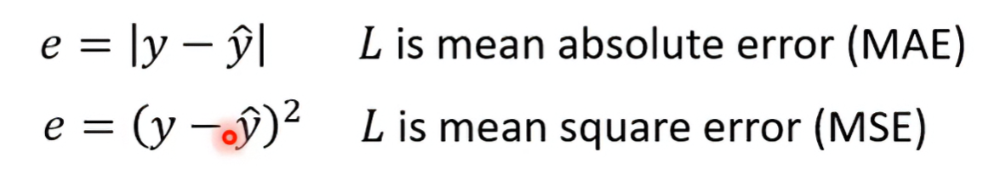

要找到最小的loss就是找到最优的w&b：用Gradient Descent

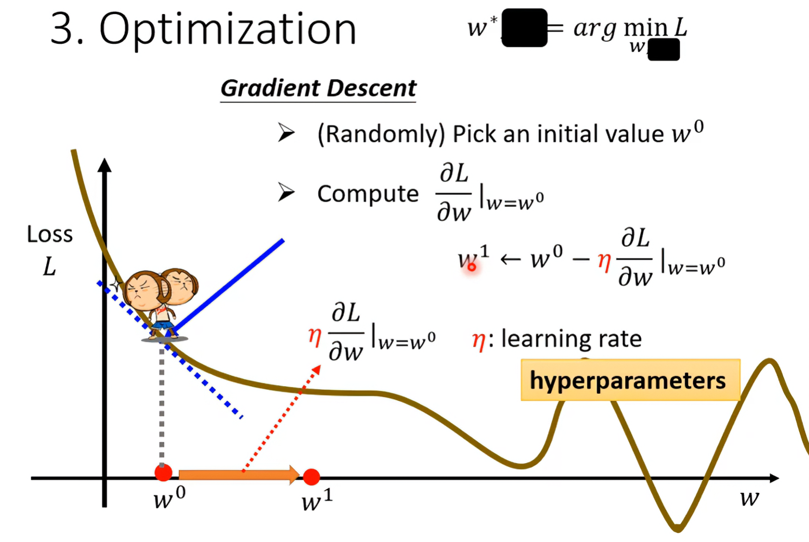

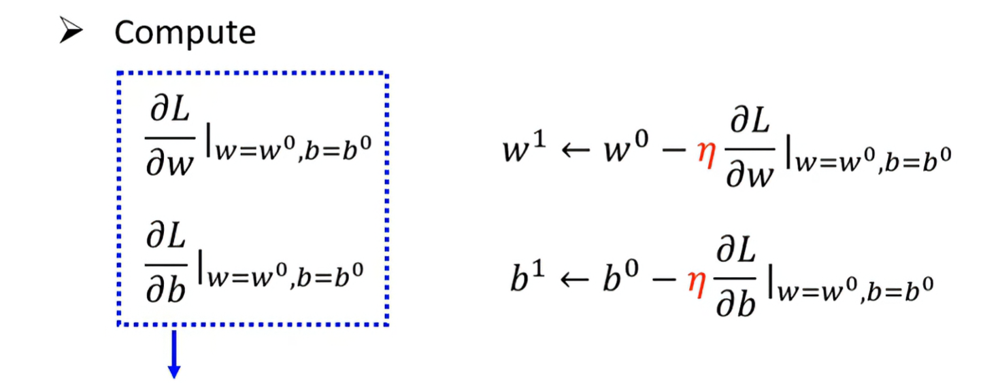

上图就是更新参数的过程

结合真实情况改进模型

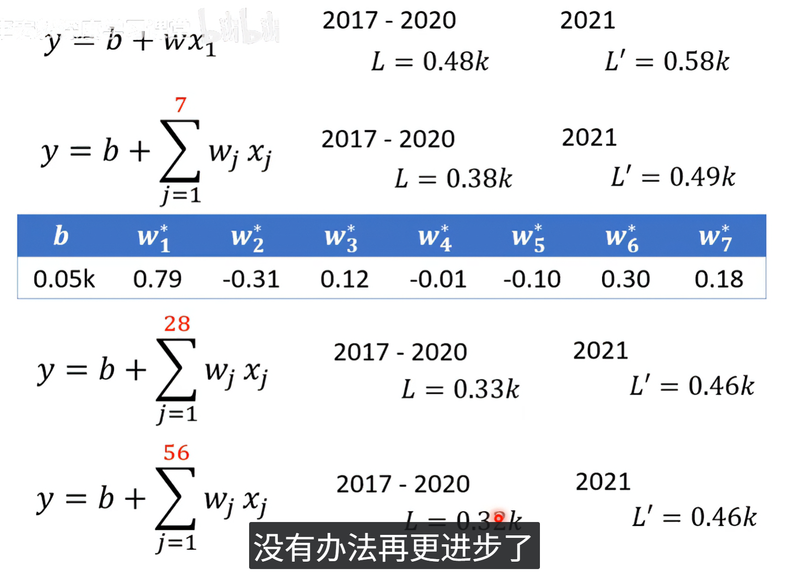

模型名：linear model

用蓝色的线组合实现红色的效果

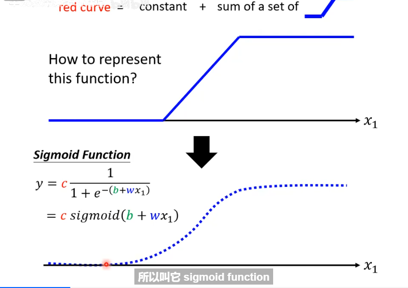

蓝色的叫Hard Sigmoid

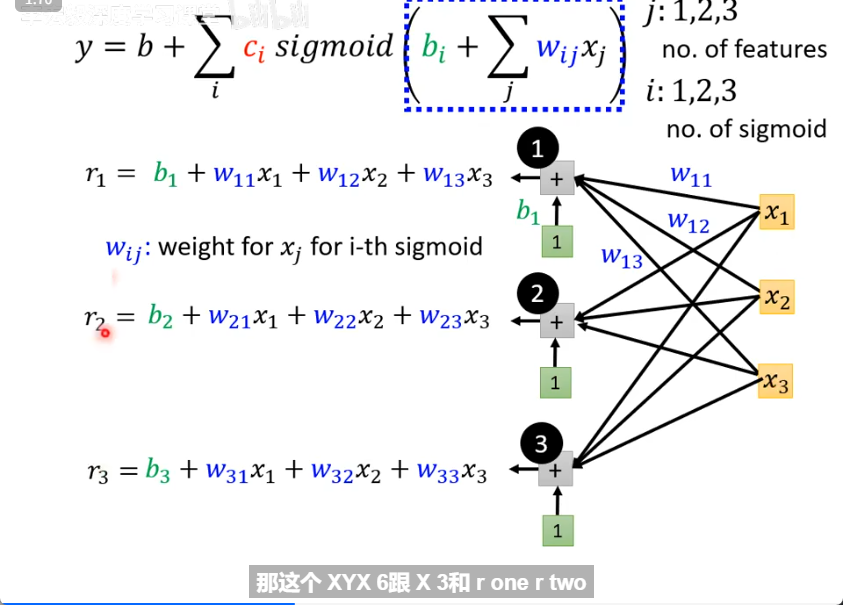

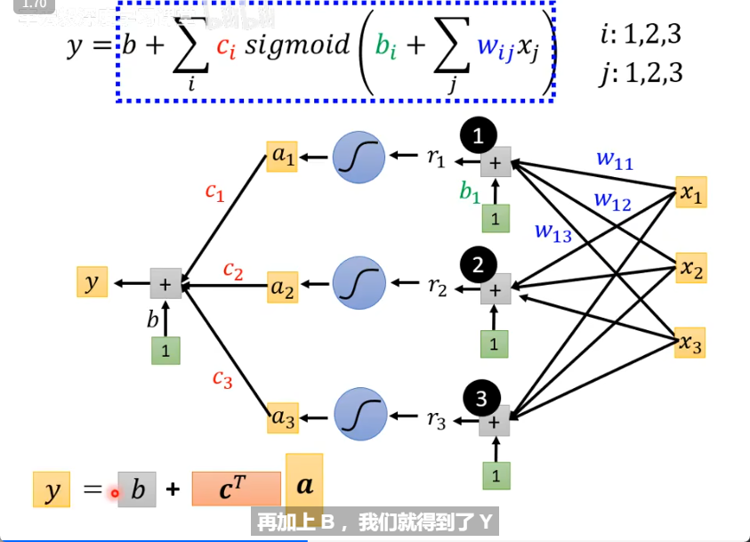

为什么这里c要转置

这是在合并未知向量

同上，更新参数

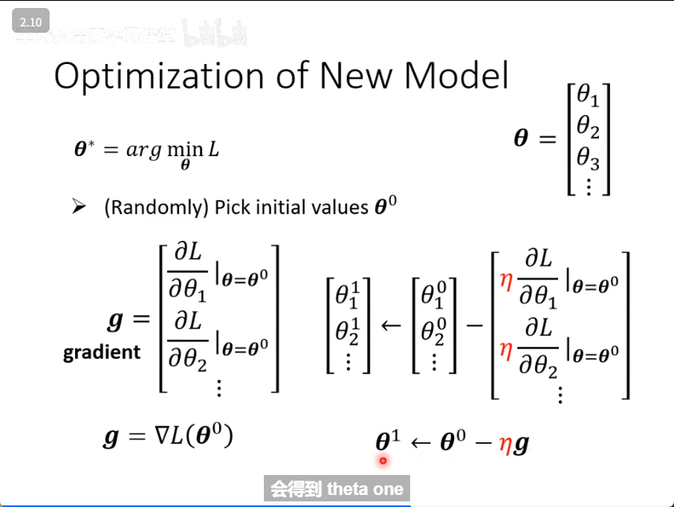

把一个数据分段进行计算并更新，这些参数yolo训练时也有。如：batch epoch

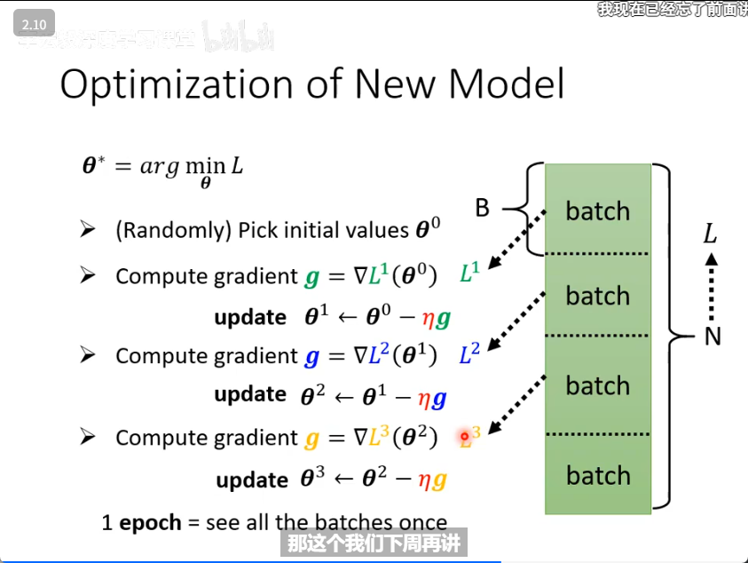

2种激活函数

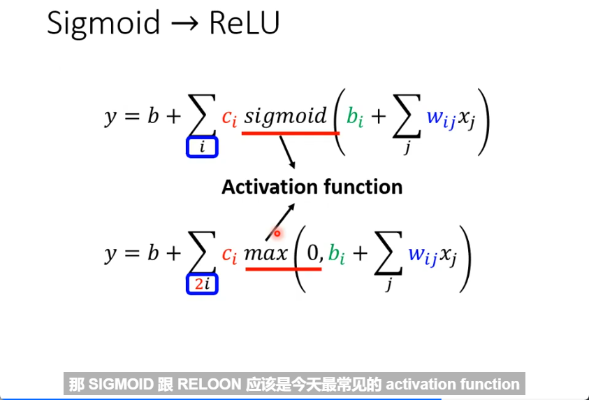

可多次重复  layers

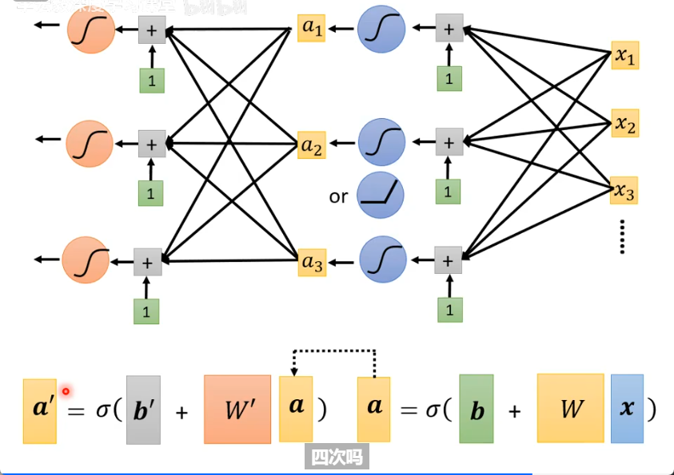

单一个是neuron 整个就是neural network    现在换了个名字Many layers means Deep    -->Deep Learning
