<!-- source: blog/笔记/17..md -->
所以我们目前基本都是采用的前后台分离开发方式，如下图所示：

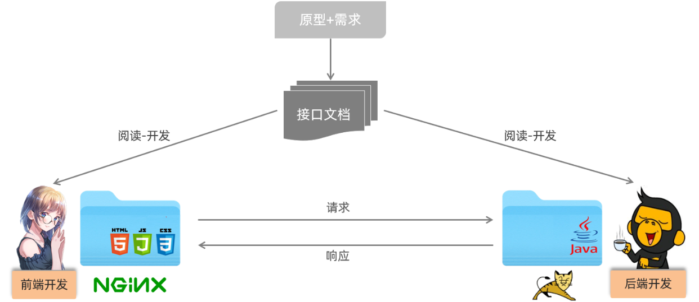

我们将原先的工程分为前端工程和后端工程这2个工程，然后前端工程交给专业的前端人员开发，后端工程交给专业的后端人员开发。

前端页面需要数据，可以通过发送异步请求，从后台工程获取。但是，我们前后台是分开来开发的，那么前端人员怎么知道后台返回数据的格式呢？后端人员开发，怎么知道前端人员需要的数据格式呢？

所以针对这个问题，我们前后台统一制定一套规范！我们前后台开发人员都需要遵循这套规范开发，这就是我们的 **接口文档**。接口文档有离线版和在线版本，接口文档示可以查询今天提供 **资料/接口文档** 里面的资料。

那么接口文档的内容怎么来的呢？是我们后台开发者根据产品经理提供的产品原型和需求文档所撰写出来的，产品原型示例可以参考今天提供**资料/页面原型** 里面的资料。

那么基于前后台分离开发的模式下，我们后台开发者开发一个功能的具体流程如何呢？如下图所示：


1. 需求分析：首先我们需要阅读需求文档，分析需求，理解需求。
2. 接口定义：查询接口文档中关于需求的接口的定义，包括地址，参数，响应数据类型等等
3. 前后台并行开发：各自按照接口文档进行开发，实现需求
4. 测试：前后台开发完了，各自按照接口文档进行测试
5. 前后段联调测试：前段工程请求后端工程，测试功能

1. ## VueRouter

1. ### 介绍

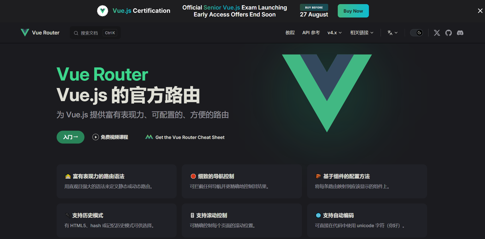

- Vue Router：Vue的官方路由。 为Vue提供富有表现力、可配置的、方便的路由。
- Vue中的路由，主要定义的是路径与组件之间的对应关系。

比如，我们打开一个网站，点击左侧菜单，地址栏的地址发生变化。 地址栏地址一旦发生变化，在主区域显示对应的页面组件。 

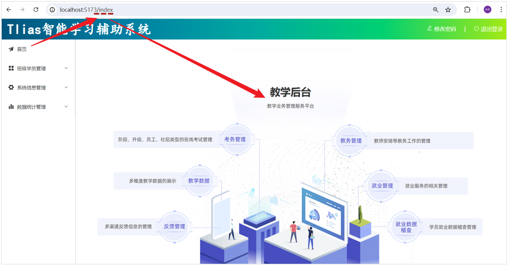

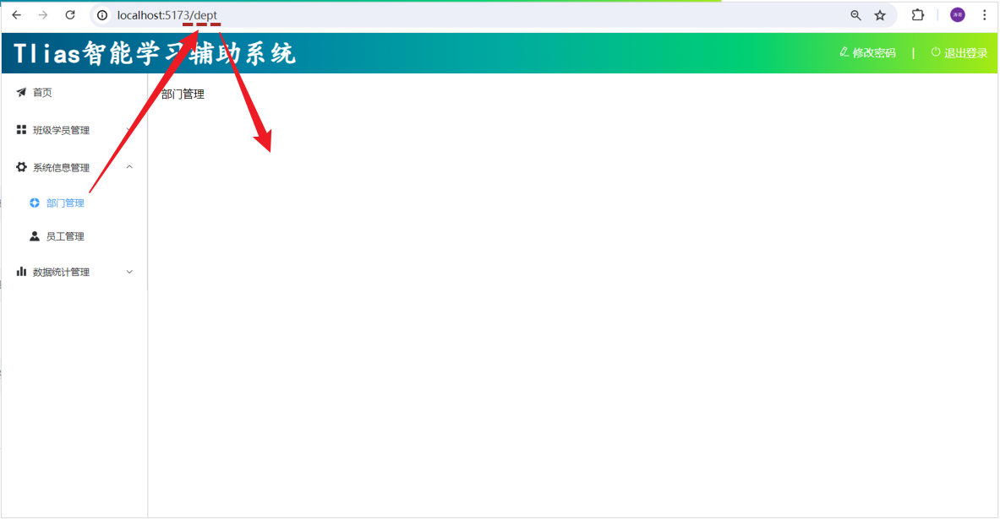

VueRouter主要由以下三个部分组成，如下所示：

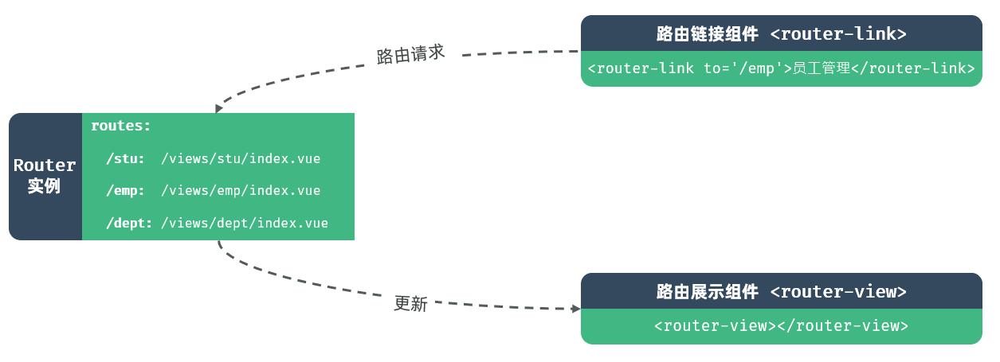

- VueRouter：路由器类，根据路由请求在路由视图中动态渲染选中的组件
- <router-link>：请求链接组件，浏览器会解析成<a>
- <router-view>：动态视图组件，用来渲染展示与路由路径对应的组件

1. ### 基础路由配置

**1). 在** **`views/layout/index.vue`** **中，调整代码，具体调整位置如下：** 

- 在左侧菜单栏的 `<el-menu>` 标签上添加 `router` 属性，这会让 Element Plus 的 `<el-menu>` 组件自动根据路由来激活对应的菜单项。
- 使用 `<router-view>` 组件来渲染根据路由动态变化的内容。
- 确保每个 `<el-menu-item>` 的 `index` 属性值与你想要导航到的路径相匹配。

- 

```HTML
<script setup>
// 无需额外导入，因为我们只是使用了 Element Plus 和 Vue Router 的基本功能
</script>

<template>
  <div class="common-layout">
    <el-container>
      <!-- Header 区域 -->
      <el-header class="header">
        <span class="title">Tlias智能学习辅助系统</span>
        <span class="right_tool">
          <a href="">
            <el-icon><EditPen /></el-icon> 修改密码 &nbsp;&nbsp;&nbsp; |  &nbsp;&nbsp;&nbsp;
          </a>
          <a href="">
            <el-icon><SwitchButton /></el-icon> 退出登录
          </a>
        </span>
      </el-header>
      
      <el-container>
        <!-- 左侧菜单 -->
        <el-aside width="200px" class="aside">

          <el-menu router>
            <!-- 首页菜单 -->
            <el-menu-item index="/index">
              <el-icon><Promotion /></el-icon> 首页
            </el-menu-item>
            
            <!-- 班级管理菜单 -->
            <el-sub-menu index="/manage">
              <template #title>
                <el-icon><Menu /></el-icon> 班级学员管理
              </template>
              <el-menu-item index="/clazz">
                <el-icon><HomeFilled /></el-icon>班级管理
              </el-menu-item>
              <el-menu-item index="/stu">
                <el-icon><UserFilled /></el-icon>学员管理
              </el-menu-item>
            </el-sub-menu>
            
            <!-- 系统信息管理 -->
            <el-sub-menu index="/system">
              <template #title>
                <el-icon><Tools /></el-icon>系统信息管理
              </template>
              <el-menu-item index="/dept">
                <el-icon><HelpFilled /></el-icon>部门管理
              </el-menu-item>
              <el-menu-item index="/emp">
                <el-icon><Avatar /></el-icon>员工管理
              </el-menu-item>
            </el-sub-menu>

            <!-- 数据统计管理 -->
            <el-sub-menu index="/report">
              <template #title>
                <el-icon><Histogram /></el-icon>数据统计管理
              </template>
              <el-menu-item index="/report/emp">
                <el-icon><InfoFilled /></el-icon>员工信息统计
              </el-menu-item>
              <el-menu-item index="/report/stu">
                <el-icon><Share /></el-icon>学员信息统计
              </el-menu-item>
              <el-menu-item index="/log">
                <el-icon><Document /></el-icon>日志信息统计
              </el-menu-item>
            </el-sub-menu>
          </el-menu>
        </el-aside>
        
        <!-- 主展示区域 -->
        <el-main>
          <router-view></router-view>
        </el-main>
      </el-container>
    </el-container>
  </div>
</template>

<style scoped>
.header {
  background-image: linear-gradient(to right, #00547d, #007fa4, #00aaa0, #00d072, #a8eb12);
}

.title {
  color: white;
  font-size: 40px;
  font-family: 楷体;
  line-height: 60px;
  font-weight: bolder;
}

.right_tool{
  float: right;
  line-height: 60px;
}

a {
  color: white;
  text-decoration: none;
}

.aside {
  width: 220px;
  border-right: 1px solid #ccc;
  height: 730px;
}
</style>
```

**2). 在 router/index.js 中配置请求路径与组件之间的关系。**

```JavaScript
import { createRouter, createWebHistory} from 'vue-router';

import IndexView from '@/views/index/index.vue';
import ClazzView from '@/views/clazz/index.vue';
import StuView from '@/views/stu/index.vue';
import DeptView from '@/views/dept/index.vue';
import EmpView from '@/views/emp/index.vue';
import EmpReportView from '@/views/report/emp/index.vue';
import StuReportView from '@/views/report/stu/index.vue';
import LogView from '@/views/log/index.vue';
import LoginView from '@/views/login/index.vue';

const routes = [
  { path: '/index', component: IndexView },
  { path: '/clazz', component: ClazzView },
  { path: '/stu', component: StuView },
  { path: '/dept', component: DeptView },
  { path: '/emp', component: EmpView },
  { path: '/report/emp', component: EmpReportView },
  { path: '/report/stu', component: StuReportView },
  { path: '/log', component: LogView },
  { path: '/login', component: LoginView },
];

const router = createRouter({
  history: createWebHistory(),
  routes,
});

export default router;
```

经过这么两步操作之后，我们就可以看到，在页面上，点击左侧菜单，右侧主展示区域，就会显示出对应的页面了。 

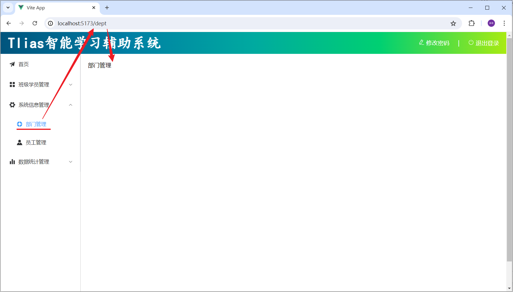

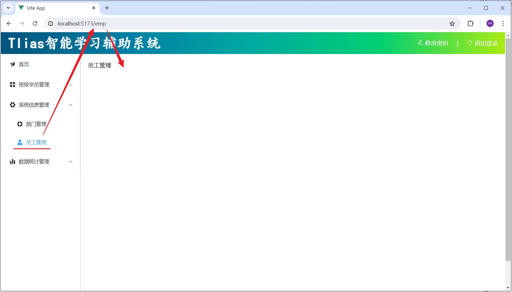

那要完成这个功能效果，我们就需要用到Vue生态中的路由 **`Vue-Router`**。

1. ### 完善路由配置

上述我们只是完成了最基本的路由配置。 并经过测试我们发现，如果我们访问 /login 路径，会发现，登录页面是在layout页面中嵌套展示的，这肯定是不合适的。

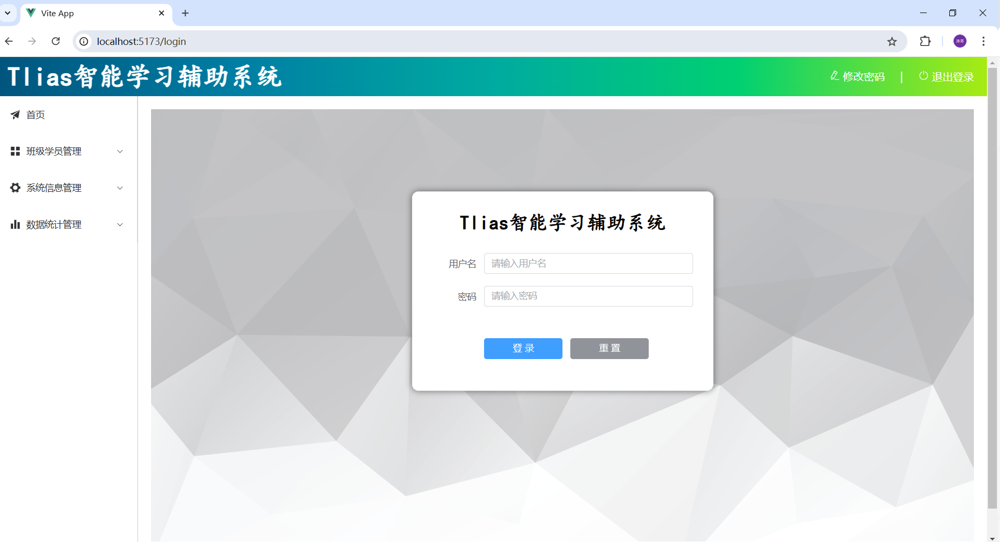

那接下来，我们就来优化一下路由的配置。最终配置形式如下，在 `router/index.js` 中做如下配置：

```JavaScript
import { createRouter, createWebHistory } from 'vue-router'

import IndexView from '@/views/index/index.vue'
import ClazzView from '@/views/clazz/index.vue'
import DeptView from '@/views/dept/index.vue'
import EmpView from '@/views/emp/index.vue'
import LogView from '@/views/log/index.vue'
import StuView from '@/views/stu/index.vue'
import EmpReportView from '@/views/report/emp/index.vue'
import StuReportView from '@/views/report/stu/index.vue'
import LayoutView from '@/views/layout/index.vue'
import LoginView from '@/views/login/index.vue'

const router = createRouter({
  history: createWebHistory(import.meta.env.BASE_URL),
  routes: [
    {
     path: '/', 
     name: '',
     component: LayoutView,
     redirect: '/index', //重定向
     children: [
      {path: 'index', name: 'index', component: IndexView},
      {path: 'clazz', name: 'clazz', component: ClazzView},
      {path: 'stu', name: 'stu', component: StuView},
      {path: 'dept', name: 'dept', component: DeptView},
      {path: 'emp', name: 'emp', component: EmpView},
      {path: 'log', name: 'log', component: LogView},
      {path: 'empReport', name: 'empReport', component: EmpReportView},
      {path: 'stuReport', name: 'stuReport', component: StuReportView},
     ]
    },
    {path: '/login', name: 'login', component: LoginView}
  ]
})

export default router
```

具体的执行访问流程如下:

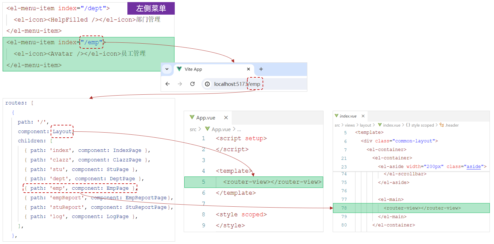

1. 当点击左侧菜单栏的员工管理菜单时，最终地址栏会访问路径 `/emp `。
2. 此时VueRouter，会自动的到所配置的路由表（`router/index.js`）中，查找与该路径对应的组件，并展示在路由展示组件`<router-view>` 对应的位置中。


**思考：直接在Vue组件中，基于axios发送异步请求，存在什么问题？**

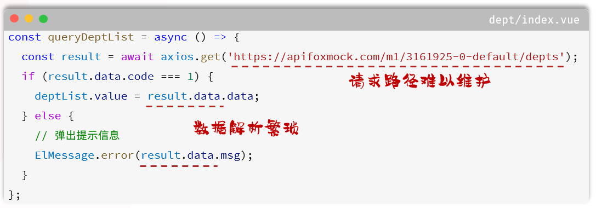

我们刚才在完成部门列表查询时，是直接基于axios发送异步请求，直接将接口的请求地址放在组件文件 `.vue` 中。 而如果开发一个大型的项目，组件文件可能会很多很多很多，如果前端开发完毕，进行前后端联调测试了，需要修改请求地址，那么此时，就需要找到每一个 `.vue` 文件，然后挨个修改。 所以上述的代码，虽然实现了动态加载数据的功能。 但是存在以下问题：

- 请求路径难以维护
- 数据解析繁琐

1. #### 程序优化

1). 为了解决上述问题，我们在前端项目开发时，通常会定义一个请求处理的工具类  - `src/utils/request.js` 。 在这个工具类中，对axios进行了封装。 具体代码如下：

```JavaScript
import axios from 'axios'

//创建axios实例对象
const request = axios.create({
  baseURL: '/api',
  timeout: 600000
})

//axios的响应 response 拦截器
request.interceptors.response.use(
  (response) => { //成功回调
    return response.data
  },
  (error) => { //失败回调
    return Promise.reject(error)
  }
)

export default request
```

2). 而与服务端进行异步交互的逻辑，通常会按模块，封装在一个单独的API中，如：`src/api/dept.js`

```JavaScript
import request from "@/utils/request"

//列表查询
export const queryAllApi = () => request.get('/depts')
```

3). 修改 `src/views/dept/index.vue` 中的代码

现在就不需要每次直接调用axios发送异步请求了，只需要将我们定义的对应模块的API导入进来，就可以直接使用了。

```JavaScript
<script setup>
import {ref, onMounted} from 'vue'
import {queryAllApi} from '@/api/dept'

//声明列表展示数据
let deptList= ref([])

//动态加载数据-查询部门
const queryAll = async () => {
  const result = await queryAllApi()
  deptList.value = result.data
}

//钩子函数
onMounted(() => {
  queryAll()
})

// 编辑部门 - 根据ID查询回显数据
const handleEdit = (id) => {
  console.log(`Edit item with ID ${id}`);
  // 在这里实现编辑功能
};

// 删除部门 - 根据ID删除部门
const handleDelete = (id) => {
  console.log(`Delete item with ID ${id}`);
  // 在这里实现删除功能
};
</script>
```

做完上面这三步之后，我们打开浏览器发现，并不能访问到接口数据。原因是因为，目前请求路径不对。

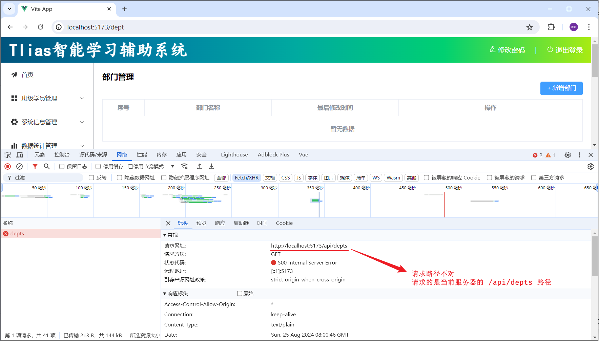

4). 在 `vite.config.js` 中配置前端请求服务器的信息

在服务器中配置代理proxy的信息，并在配置代理时，执行目标服务器。 以及url路径重写的规则。

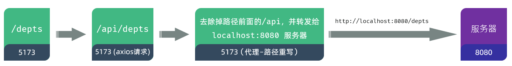

```JavaScript
import { fileURLToPath, URL } from 'node:url'

import { defineConfig } from 'vite'
import vue from '@vitejs/plugin-vue'
import vueJsx from '@vitejs/plugin-vue-jsx'

// https://vitejs.dev/config/
export default defineConfig({
  plugins: [
    vue(),
    vueJsx(),
  ],
  resolve: {
    alias: {
      '@': fileURLToPath(new URL('./src', import.meta.url))
    }
  },
  server: {
    proxy: {
      '/api': {
        target: 'http://localhost:8080',
        secure: false,
        changeOrigin: true,
        rewrite: (path) => path.replace(/^\/api/, ''),
      }
    }
  }
})
```

添加内容为，绿色阴影部分的代码。

然后，我们就可以启动服务器端的程序（将之前开发的服务端程序启动起来测试一下 ），进行测试了（【**注意：测试时, 记得将令牌校验的过滤器及拦截器, 以及记录日志的AOP程序 全部注释**】）。

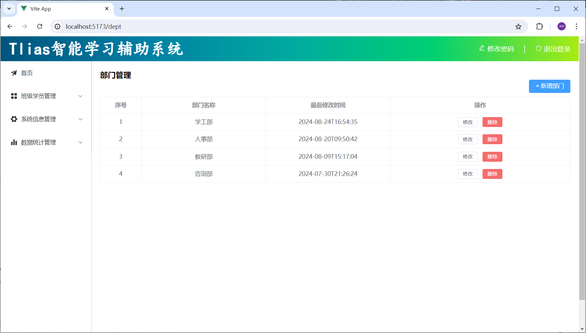
