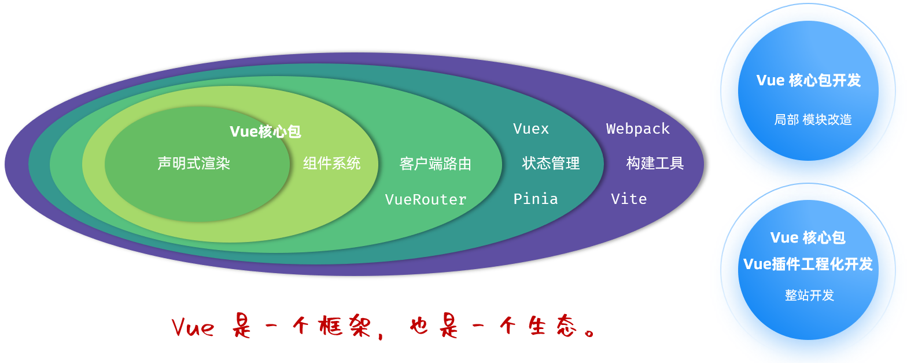
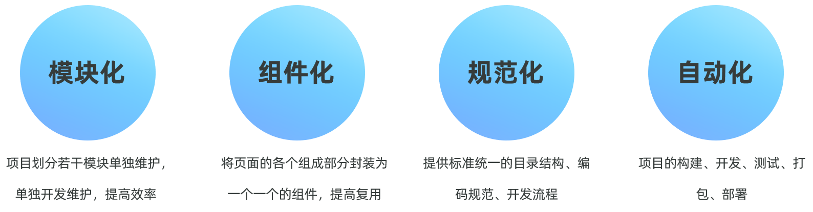
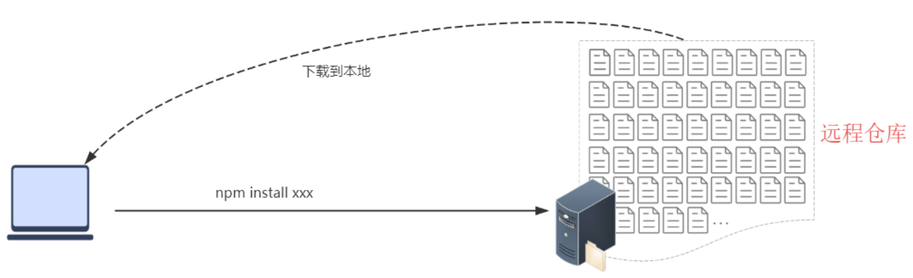
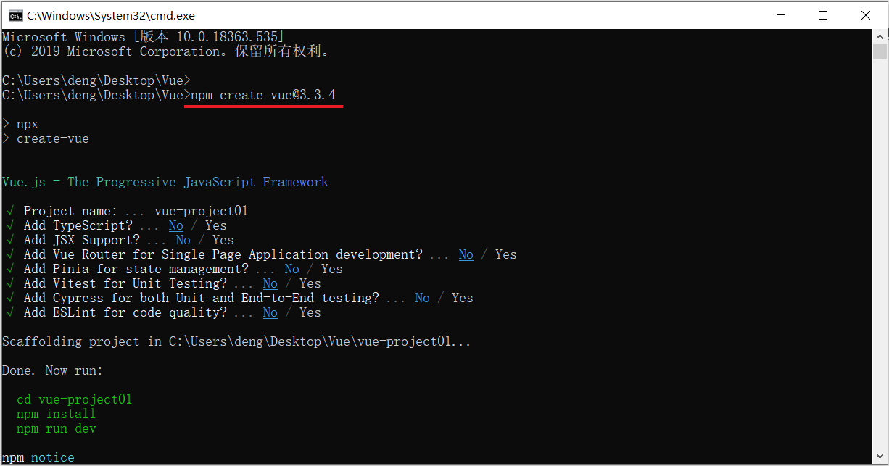
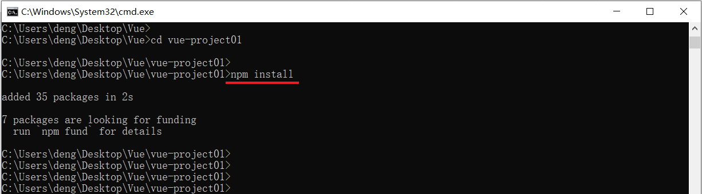
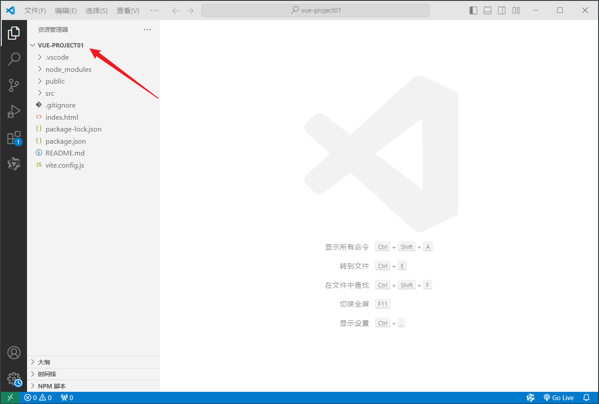
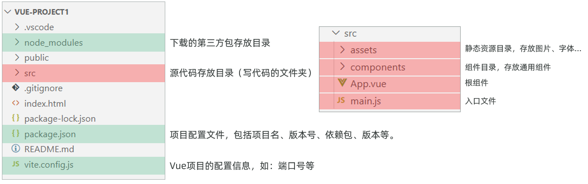
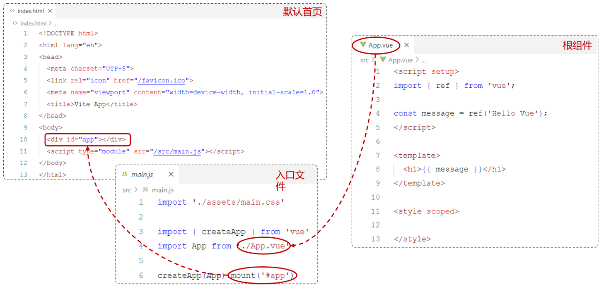
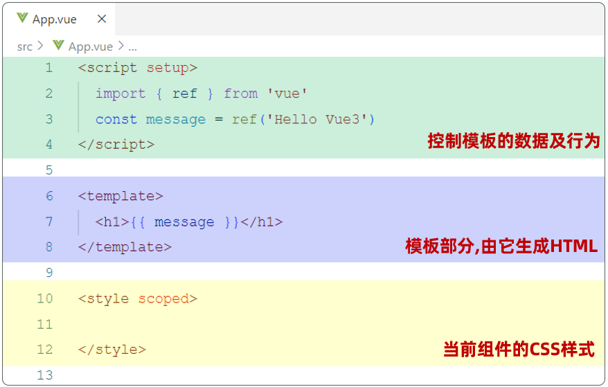
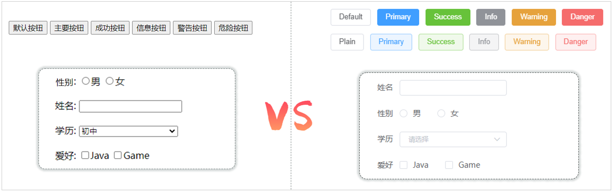

这篇笔记记录 Vue 工程化开发和 Element Plus 的入门实践，重点从脚手架、依赖管理、项目结构和组件库使用开始。

## 本文要点

- 前端工程化强调模块化、组件化、规范化和自动化。
- `create-vue` 可快速生成 Vue 工程化项目。
- npm 负责前端依赖安装和脚本运行。
- Element Plus 提供常用的企业级 UI 组件。

## Vue工程化

  前面我们在介绍Vue的时候，我们讲到Vue是一款用于构建用户界面的渐进式JavaScript框架 。（官方：https://cn.vuejs.org/）

  

  那在前面的课程中，我们已经学习了Vue的基本语法、表达式、指令，并基于Vue的核心包，完成了Vue的案例。 那今天呢，我们要来讲解的基于Vue进行整站开发。


所以现在企业开发中更加讲究前端工程化方式的开发，主要包括如下4个特点:



- 模块化：将js和css等，做成一个个可复用模块
- 组件化：我们将UI组件，css样式，js行为封装成一个个的组件，便于管理
- 规范化：我们提供一套标准的规范的目录接口和编码规范，所有开发人员遵循这套规范
- 自动化：项目的构建，测试，部署全部都是自动完成

所以对于**前端工程化，说白了，就是在企业级的前端项目开发中，把前端开发所需要的工具、技术、流程、经验进行规范化和标准化**。从而统一开发规范、提升开发效率，降低开发难度、提高复用等等。接下来我们就需要学习vue的官方提供的脚手架帮我们完成前端的工程化。


### 环境准备

#### 介绍

- 介绍：create-vue是Vue官方提供的最新的脚手架工具，用于快速生成一个工程化的Vue项目。
- create-vue提供了如下功能：
	- 统一的目录结构
	- 本地调试
	- 热部署
	- 单元测试
	- 集成打包上线
- 而要想使用create-vue来创建vue项目，则必须安装依赖环境：NodeJS 

#### npm介绍

- **npm：**Node Package Manager，是NodeJS的软件包管理器。



在开发前端项目的过程中，我们需要相关的依赖，就可以直接通过 `npm install xxx` 命令，直接从远程仓库中将依赖直接下载到本地了。

### Vue项目创建

#### 项目创建

创建一个工程化的Vue项目，执行命令：`npm create vue``@3.3.4`



**详细步骤说明：**

- `Project name：`------------------》项目名称，默认值：vue-project，可输入想要的项目名称。
- `Add TypeScript?` ----------------》是否加入TypeScript组件？默认值：No。
- `Add JSX Support?` --------------》是否加入JSX支持？默认值：No。
- `Add Vue Router...`--------------》是否为单页应用程序开发添加Vue Router路由管理组件？默认值：No。
- `Add Pinia ...`----------------------》是否添加Pinia组件来进行状态管理？默认值：No。
- `Add Vitest ...`---------------------》是否添加Vitest来进行单元测试？默认值：No。
- `Add an End-to-End ...`-----------》是否添加端到端测试？默认值No。
- `Add ESLint for code quality?` ---》是否添加ESLint来进行代码质量检查？默认值：No。

**提示：**执行上述指令，将会安装并执行 create-vue，它是 Vue 官方的项目脚手架工具

项目创建完成以后，进入`vue-project01` 项目目录，执行命令安装当前项目的依赖：`npm install`



创建项目以及安装依赖的过程，都是需要联网的。【如果网络不太好，可能会造成依赖下载不完整报错，继续再次执行 命令安装。】 

#### 项目结构

我们可以使用VsCode直接打开这个Vue项目。



这是我们创建的第一个项目结构，接下来呢，我们来介绍一下这个项目的结构。如图所示：



在上述的目录中，我们以后操作的最多的目录，就是src目录，因为我们需要在这个目录下来编写前端代码。

### Vue项目开发流程

如下图：



其中`*.vue`是Vue项目中的组件文件，在Vue项目中也称为单文件组件（[SFC](https://cn.vuejs.org/guide/scaling-up/sfc.html)，Single-File Components）。Vue 的单文件组件会将一个组件的逻辑 (JS)，模板 (HTML) 和样式 (CSS) 封装在同一个文件里（`*.vue`） 



### API风格

- Vue的组件有两种不同的风格：**组合式API** 和 **选项式API**
- **组合式API：**是Vue3提供的一种基于函数的组件编写方式，通过使用函数来组织和复用组件的逻辑。它提供了一种更灵活、更可组合的方式来编写组件。代码形式如下：

```HTML
<script setup>
import { ref, onMounted } from 'vue';
const count = ref(0); //声明响应式变量

function increment(){ //声明函数
   count.value++;
}

onMounted(() => { //声明钩子函数
  console.log('Vue Mounted....'); 
})
</script>

<template>
   <input type="button" @click="increment"> Api Demo1 Count : {{ count }}
</template>

<style scoped>
   
</style>
```

- `setup`：是一个标识，告诉Vue需要进行一些处理，让我们可以更简洁的使用组合式API。
- `ref()`：接收一个内部值，返回一个响应式的ref对象，此对象只有一个指向内部值的属性 value。
- `onMounted()`：在组合式API中的钩子方法，注册一个回调函数，在组件挂载完成后执行。

- **选项式API**

**选项式API：**可以用包含多个选项的对象来描述组件的逻辑，如：`data`，`methods`，`mounted`等。选项定义的属性都会暴露在函数内部的`this`上，它会指向当前的组件实例。

```HTML
<script>
export default{
   data() {
      return {
         count: 0
      }
   },
   methods: {
      increment: function(){
         this.count++
      }
   },
   mounted() {
      console.log('vue mounted.....');
   }
}
</script>

<template>
  <input type="button" @click="increment">Api Demo1 Count :  {{ count }}
</template>

<style scoped>

</style>
```

在Vue中的组合式API使用时，是没有this对象的，this对象是undefined。 

## ElementPlus

### 介绍

Element：是饿了么公司前端开发团队提供的一套基于 Vue3 的网站组件库，用于快速构建网页。

Element 提供了很多组件（组成网页的部件）供我们使用。例如 超链接、按钮、图片、表格等等。

官方网站：https://element-plus.org/zh-CN/#/zh-CN

如下图所示就是我们开发的页面和ElementPlus提供的效果对比：可以发现ElementPlus提供的各式各样好看的按钮。



ElementPlus的学习方式和我们之前的学习方式不太一样，对于ElementPlus，我们作为一个后台开发者，只需要**学会如何从 ElementPlus 的官网拷贝组件到我们自己的页面中，并且做一些修改即可**。 我们主要学习的是ElementPlus中提供的常用组件，至于其他组件同学们可以通过我们这几个组件的学习掌握到ElementPlus的学习技巧，然后课后自行学习。

## 小结

Vue 工程化把前端项目从单个页面脚本推进到可维护的项目结构。理解脚手架、npm、组件库和目录规范后，再使用 Element Plus 组件会更顺。
