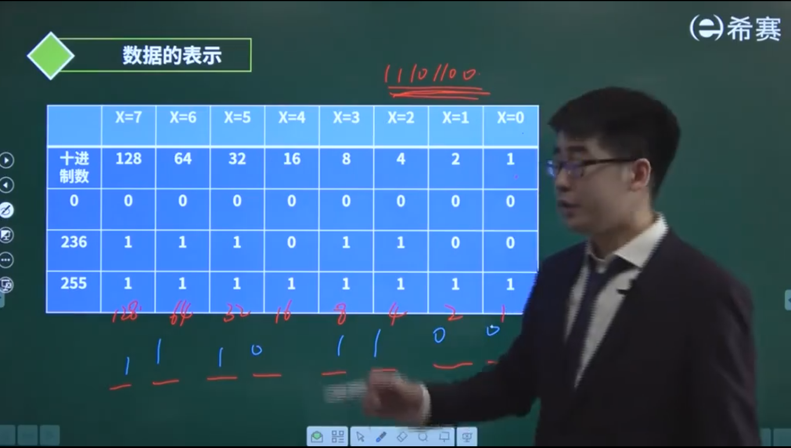
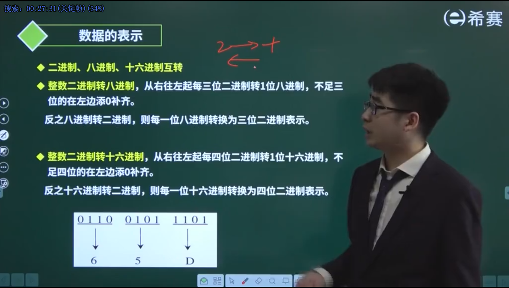
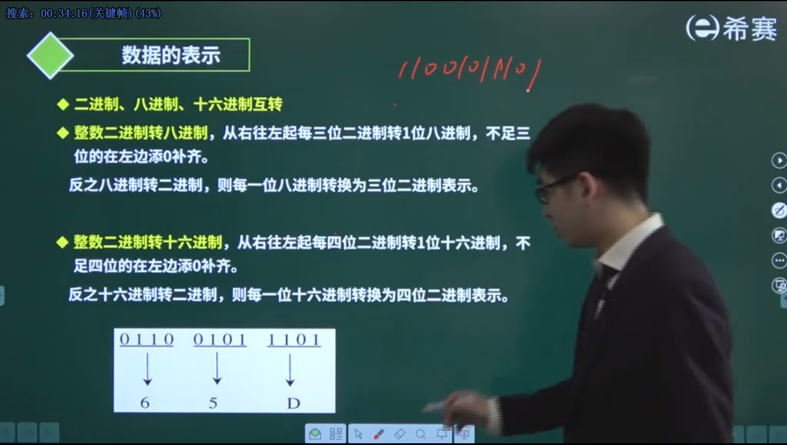
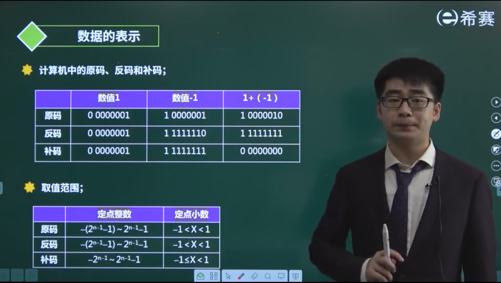
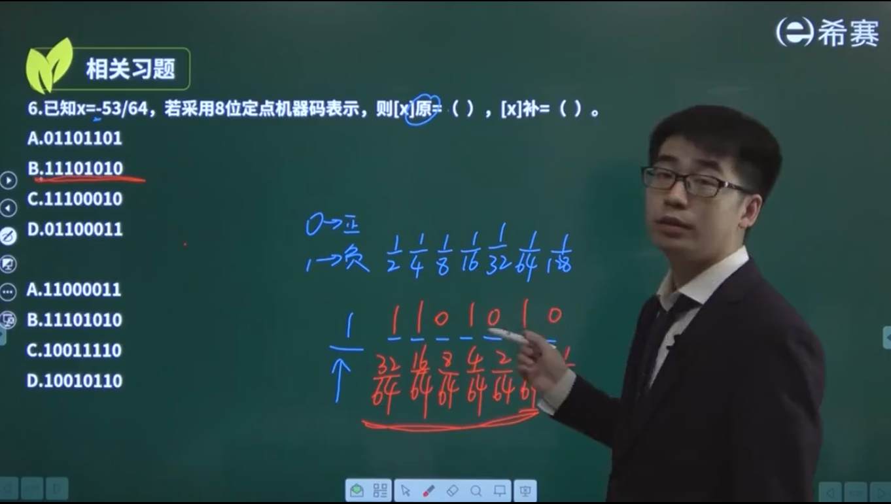

本文整理二进制表示、数制转换以及原码/反码/补码/移码的核心知识点。

<!-- more -->

## 1. 数制基础

### 1.1 常用数制

| 数制 | 基数 | 数码 | 示例 |
|------|------|------|------|
| 二进制 | 2 | 0, 1 | 1101 |
| 八进制 | 8 | 0-7 | 15 |
| 十进制 | 10 | 0-9 | 13 |
| 十六进制 | 16 | 0-9, A-F | D |

### 1.2 数制转换

#### 十进制 → 二进制（除2取余法）

对整数部分**除2取余，逆序排列**：



**示例**：256 转二进制

| 除法 | 商 | 余数 |
|------|-----|------|
| 256 ÷ 2 | 128 | 0 |
| 128 ÷ 2 | 64 | 0 |
| 64 ÷ 2 | 32 | 0 |
| 32 ÷ 2 | 16 | 0 |
| 16 ÷ 2 | 8 | 0 |
| 8 ÷ 2 | 4 | 0 |
| 4 ÷ 2 | 2 | 0 |
| 2 ÷ 2 | 1 | 0 |
| 1 ÷ 2 | 0 | 1 |

结果：`100000000`

#### 二进制 → 十进制（按权展开）

将每一位乘以 2 的对应次幂，求和。


**示例**：

| 二进制 | 计算 | 十进制 |
|--------|------|--------|
| 0 | 0 | 0 |
| 11101100 | 128+64+32+8+4 | 236 |
| 11111111 | 128+64+32+16+8+4+2+1 | 255 |

#### 二进制 ↔ 八进制（三位一组）



**规则**：
- **二进制 → 八进制**：从右往左每**三位**一组，转为一位八进制，不足三位左边补零
- **八进制 → 二进制**：每一位八进制转为三位二进制

**示例**：`1110 0101 1101` 转八进制

```
分组：111 001 011 101
转八进制：7  1  3  5
结果：7135
```

#### 二进制 ↔ 十六进制（四位一组）

**规则**：
- **二进制 → 十六进制**：从右往左每**四位**一组，转为一位十六进制
- **十六进制 → 二进制**：每一位十六进制转为四位二进制

**示例**：`1110 0101 1101` 转十六进制

```
分组：1110 0101 1101
转十六进制：E  5  D
结果：E5D
```



## 2. 原码、反码、补码

### 2.1 原码

**定义**：最高位为符号位（0正1负），其余位为数值位。

**示例**（8位）：

| 十进制 | 原码 |
|--------|------|
| +1 | 00000001 |
| -1 | 10000001 |
| +127 | 01111111 |
| -127 | 11111111 |

### 2.2 反码

**定义**：
- 正数：与原码相同
- 负数：符号位不变，数值位按位取反

**示例**：

| 十进制 | 原码 | 反码 |
|--------|------|------|
| +1 | 00000001 | 00000001 |
| -1 | 10000001 | 11111110 |

### 2.3 补码

**定义**：
- 正数：与原码相同
- 负数：反码 + 1

**示例**：

| 十进制 | 原码 | 反码 | 补码 |
|--------|------|------|------|
| +1 | 00000001 | 00000001 | 00000001 |
| -1 | 10000001 | 11111110 | 11111111 |

**为什么计算机用补码？**

- 加减法统一处理，无需区分符号
- 0 的表示唯一（原码有 +0 和 -0 两种）

### 2.4 移码

**定义**：补码的符号位取反。

**用途**：浮点数的阶码表示。

### 2.5 对比表格



| 编码 | +0 | -0 | 范围（8位） |
|------|-----|-----|------------|
| 原码 | 00000000 | 10000000 | -127 ~ +127 |
| 反码 | 00000000 | 11111111 | -127 ~ +127 |
| 补码 | 00000000 | 00000000（唯一） | -128 ~ +127 |
| 移码 | 10000000 | 10000000（唯一） | -127 ~ +128 |

## 3. 定点数表示

### 3.1 定点整数

小数点固定在最低位之后，表示整数。

### 3.2 定点小数

小数点固定在符号位之后，表示纯小数。



**习题**：已知 x = -53/64，用 8 位定点机器码表示原码。

**解析**：

1. 计算 -53/64 的二进制：
   - 53 = 32 + 16 + 4 + 1 = `110101`
   - 53/64 = 0.110101（二进制）
   - -53/64 = -0.110101

2. 8 位定点小数原码：
   - 符号位：1（负数）
   - 数值位：11010100（补零到 7 位）
   - 结果：`1.11010100`

**答案**：A（1.11010100）

## 4. 总结

### 数制转换速查

| 转换 | 方法 |
|------|------|
| 十进制 → 二进制 | 除2取余，逆序排列 |
| 二进制 → 十进制 | 按权展开求和 |
| 二进制 → 八进制 | 三位一组 |
| 二进制 → 十六进制 | 四位一组 |

### 原反补移码对比

| 编码 | 正数 | 负数 |
|------|------|------|
| 原码 | 不变 | 符号位+数值位 |
| 反码 | 不变 | 符号位不变，数值位取反 |
| 补码 | 不变 | 反码+1 |
| 移码 | 补码符号位取反 | 补码符号位取反 |

**关键点**：
- 计算机内部使用**补码**存储整数
- 0 的补码表示**唯一**
- 定点小数原码要注意小数点位置
