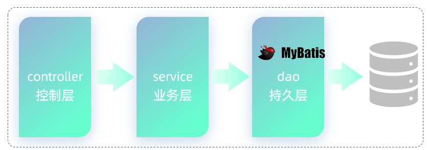
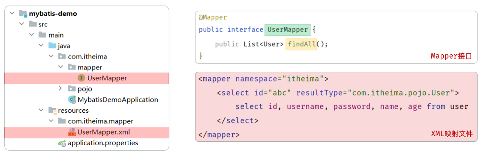
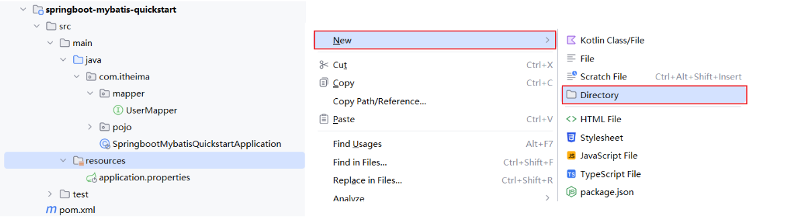
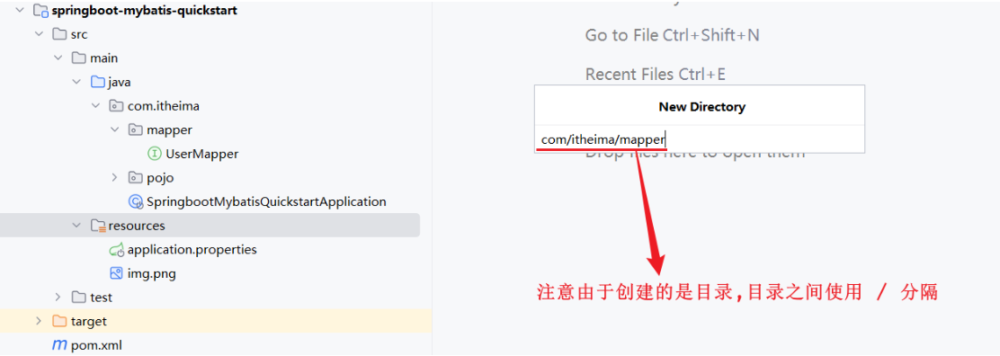
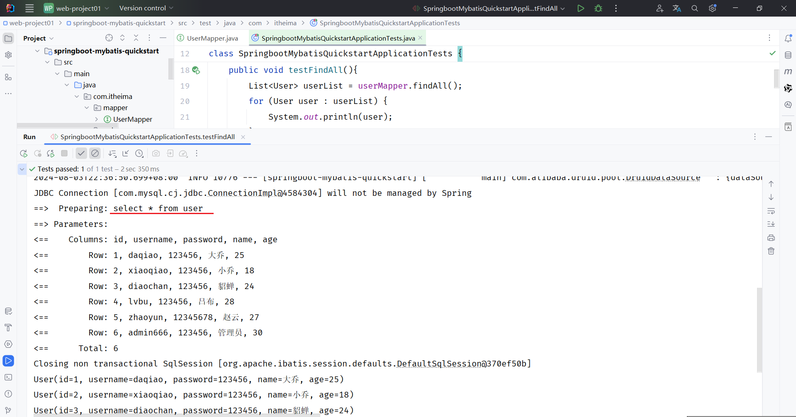
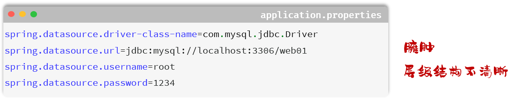
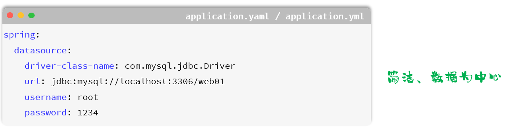
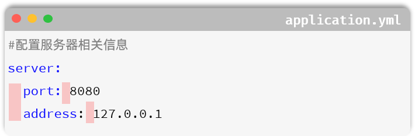

### 1.介绍MyBatis

MyBatis是一款优秀的 **持久层** **框架**，用于简化JDBC的开发。



- 持久层：指的是就是数据访问层(dao)，是用来操作数据库的。
- 框架：是一个半成品软件，是一套可重用的、通用的、软件基础代码模型。在框架的基础上进行软件开发更加高效、规范、通用、可拓展。

在创建出来的springboot工程中，在引导类所在包下，在创建一个包 `mapper` 。在 `mapper` 包下创建一个接口 `UserMapper` ，这是一个持久层接口（Mybatis的持久层接口规范一般都叫 XxxMapper）。

**单元测试**

在创建出来的SpringBoot工程中，在src下的test目录下，已经自动帮我们创建好了测试类 ，并且在测试类上已经添加了注解 `@SpringBootTest`，代表该测试类已经与SpringBoot整合。 

该测试类在运行时，会自动通过引导类加载Spring的环境（IOC容器）。我们要测试那个bean对象，就可以直接通过`@Autowired`注解直接将其注入进行，然后就可以测试了。 

测试类代码如下：

```java
@SpringBootTest
class SpringbootMybatisQuickstartApplicationTests {

    @Autowired
    private UserMapper userMapper;

    @Test
    public void testFindAll(){
        List<User> userList = userMapper.findAll();
        for (User user : userList) {
            System.out.println(user);
        }
    }
}
```

#####  1. 配置Mybatis日志输出

默认情况下，在Mybatis中，SQL语句执行时，我们并看不到SQL语句的执行日志。 在`application.properties`加入如下配置，即可查看日志： 

```properties
#mybatis的配置
mybatis.configuration.log-impl=org.apache.ibatis.logging.stdout.StdOutImpl
```

#### 数据库连接池

数据库连接池的好处：

- 资源重用
- 提升系统响应速度
- 避免数据库连接遗漏

#### 1. 增删改查操作

##### 1. 删除

- 需求：根据ID删除用户信息
- SQL：delete from user where id = 5;

```java
/**
 * 根据id删除
 */
@Delete("delete from user where id = #{id}")
public void deleteById(Integer id);
```

在Mybatis中，我们可以通过参数占位符号 `#{...}` 来占位，在调用`deleteById`方法时，传递的参数值，最终会替换占位符。

##### 1. 新增

- 需求：添加一个用户
- SQL：insert into user(username,password,name,age) values('zhouyu','******','周瑜',20);
- Mapper接口：

```java
/**
 * 添加用户
 */
@Insert("insert into user(username,password,name,age) values(#{username},#{password},#{name},#{age})")
public void insert(User user);
```

如果在SQL语句中，我们需要传递多个参数，我们可以把多个参数封装到一个对象中。然后在SQL语句中，我们可以通过`#{对象属性名}`的方式，获取到对象中封装的属性值。

##### 1. 修改

- 需求：根据ID更新用户信息
- SQL：update user set username = 'zhouyu', password = '******', name = '周瑜', age = 20 where id = 1；
- Mapper接口方法：

```java
/**
 * 根据id更新用户信息
 */
@Update("update user set username = #{username},password = #{password},name = #{name},age = #{age} where id = #{id}")
public void update(User user);
```

##### 1. 查询

- 需求：根据用户名和密码查询用户信息
- SQL：select * from user where username = 'zhouyu' and password = '******'
- Mapper接口方法：

```java
/**
 * 根据用户名和密码查询用户信息
 */
@Select("select * from user where username = #{username} and password = #{password}")
public User findByUsernameAndPassword(@Param("username") String username, @Param("password") String password);
```

@param注解的作用是为接口的方法形参起名字的。（由于用户名唯一的，所以查询返回的结果最多只有一个，可以直接封装到一个对象中）

**说明：**基于官方骨架创建的springboot项目中，接口编译时会保留方法形参名，@Param注解可以省略 (#{形参名})。

**在Mybatis中使用XML映射文件方式开发，需要符合一定的规范：**

1. XML映射文件的名称与Mapper接口名称一致，并且将XML映射文件和Mapper接口放置在相同包下（同包同名）
2. XML映射文件的namespace属性为Mapper接口全限定名一致
3. XML映射文件中sql语句的id与Mapper接口中的方法名一致，并保持返回类型一致。



##### 1. XML配置文件实现

**第1步： 创建XML映射文件**





**第2步：编写XML映射文件**

> xml映射文件中的dtd约束，直接从mybatis官网复制即可; 或者直接AI生成。

```xml
<?xml version="1.0" encoding="UTF-8" ?>
<!DOCTYPE mapper
  PUBLIC "-//mybatis.org//DTD Mapper 3.0//EN"
  "https://mybatis.org/dtd/mybatis-3-mapper.dtd">
<mapper namespace="">
 
</mapper>
```

**第3步：配置**

**a. XML映射文件的namespace属性为Mapper接口全限定名**

```xml
<?xml version="1.0" encoding="UTF-8" ?>
<!DOCTYPE mapper
        PUBLIC "-//mybatis.org//DTD Mapper 3.0//EN"
        "https://mybatis.org/dtd/mybatis-3-mapper.dtd">
<mapper namespace="com.itheima.mapper.UserMapper">

</mapper>
```

**b. XML映射文件中sql语句的id与Mapper接口中的方法名一致，并保持返回类型一致**

```xml
<?xml version="1.0" encoding="UTF-8" ?>
<!DOCTYPE mapper
        PUBLIC "-//mybatis.org//DTD Mapper 3.0//EN"
        "https://mybatis.org/dtd/mybatis-3-mapper.dtd">
<mapper namespace="com.itheima.mapper.EmpMapper">

    <!--查询操作-->
    <select id="findAll" resultType="com.itheima.pojo.User">
        select * from user
    </select>
    
</mapper>
```

resultType 属性的值，与查询返回的单条记录封装的类型一致。

运行测试类，执行结果：




## 1. SpringBoot配置文件

我们可以来对比一下，采用 `application.properties` 和 `application.yml` 来配置同一段信息(数据库连接信息)，两者之间的配置对比：





### 1. 语法

简单的了解过springboot所支持的配置文件，以及不同类型配置文件之间的优缺点之后，接下来我们就来了解下yml配置文件的基本语法：

- 大小写敏感
- 数值前边必须有空格，作为分隔符
- 使用缩进表示层级关系，缩进时，不允许使用Tab键，只能用空格（idea中会自动将Tab转换为空格）
- 缩进的空格数目不重要，只要相同层级的元素左侧对齐即可
- `#`表示注释，从这个字符一直到行尾，都会被解析器忽略



了解完yml格式配置文件的基本语法之后，接下来我们再来看下yml文件中常见的数据格式。在这里我们主要介绍最为常见的两类：

1. 定义对象或Map集合
2. 定义数组、list或set集合

- 对象/Map集合

```yaml
user:
  name: zhangsan
  age: 18
  password: ******
```

- 数组/List/Set集合

```yaml
hobby: 
  - java
  - game
  - sport
```

在yml格式的配置文件中，如果配置项的值是以 0 开头的，值需要使用 '' 引起来，因为以0开头在yml中表示8进制的数据。
