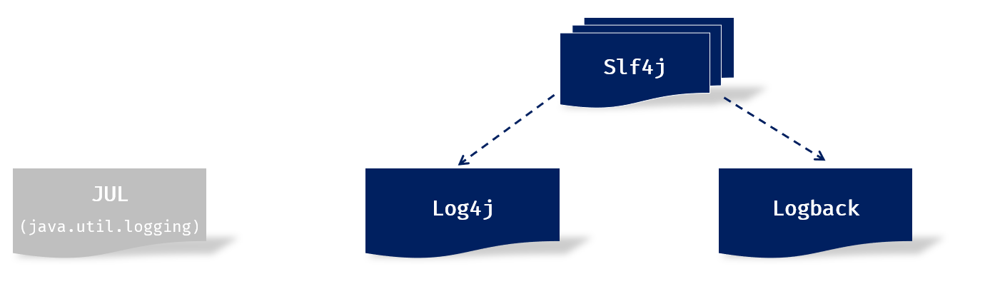
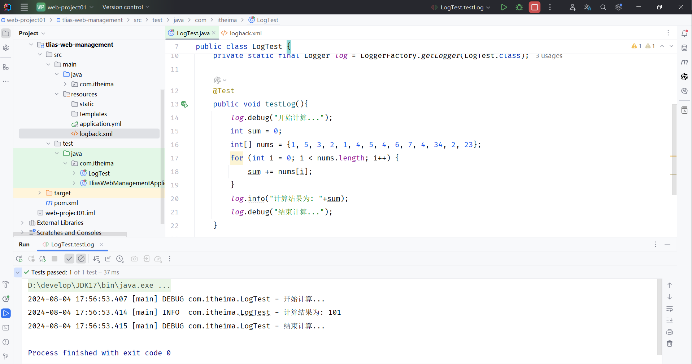

<!-- source: blog/笔记/11.日志.md -->

这篇笔记整理 Java 项目中使用日志框架的基本原因和 Logback 的入门配置。当前主要保留课堂示例，后续可以补充生产环境日志切分、日志级别策略和问题排查案例。

## 本文要点

- `System.out.println` 不适合长期承担项目日志职责。
- 日志框架可以控制输出级别、输出位置和格式。
- Logback 常通过 `logback.xml` 配置 appender、encoder 和 root level。
- 合理的日志级别有助于调试、监控和后续维护。

- 之前我们编写程序时，也可以通过 `System.out.println(...) `来输出日志，为什么我们还要学习单独的日志技术呢？

​    这是因为，如果通过  `System.out.println(...) ` 来记录日志，会存在以下几点问题：

- 硬编码。所有的记录日志的代码，都是硬编码，没有办法做到灵活控制，要想不输出这个日志了，只能删除掉记录日志的代码。
- 只能输出日志到控制台。
- 不便于程序的扩展、维护。

所以，在现在的项目开发中，我们一般都会使用专业的日志框架，来解决这些问题。

1. ### 日志框架



1. ### Logback入门

**1). 准备工作：引入logback的依赖（springboot中无需引入，在springboot中已经传递了此依赖）**

**2). 引入配置文件** **`logback.xml`**  **（资料中已经提供，拷贝进来，放在** **`src/main/resources`** **目录下； 或者直接AI生成）**

```XML
<?xml version="1.0" encoding="UTF-8"?>
<configuration>
    <!-- 控制台输出 -->
    <appender name="STDOUT" class="ch.qos.logback.core.ConsoleAppender">
        <encoder class="ch.qos.logback.classic.encoder.PatternLayoutEncoder">
            <!--格式化输出：%d表示日期，%thread表示线程名，%-5level：级别从左显示5个字符宽度  %msg：日志消息，%n是换行符 -->
            <pattern>%d{yyyy-MM-dd HH:mm:ss.SSS} [%thread] %-5level %logger{50}-%msg%n</pattern>
        </encoder>
    </appender>

    <!-- 日志输出级别 -->
    <root level="ALL">
        <appender-ref ref="STDOUT" />
    </root>
</configuration>
```

**3). 记录日志：定义日志记录对象Logger，记录日志**

```Java
public class LogTest {
    
    //定义日志记录对象
    private static final Logger log = LoggerFactory.getLogger(LogTest.class);

    @Test
    public void testLog(){
        log.debug("开始计算...");
        int sum = 0;
        int[] nums = {1, 5, 3, 2, 1, 4, 5, 4, 6, 7, 4, 34, 2, 23};
        for (int i = 0; i < nums.length; i++) {
            sum += nums[i];
        }
        log.info("计算结果为: "+sum);
        log.debug("结束计算...");
    }

}
```

运行单元测试，可以在控制台中看到输出的日志，如下所示：



我们可以看到在输出的日志信息中，不仅输出了日志的信息，还包括：日志的输出时间、线程名、具体在那个类中输出的。 

1. ### Logback配置文件

Logback日志框架的配置文件叫 `logback.xml` 。 

该配置文件是对Logback日志框架输出的日志进行控制的，可以来配置输出的格式、位置及日志开关等。

常用的两种输出日志的位置：控制台、系统文件。

**1). 如果需要输出日志到控制台。添加如下配置：**

```XML
<!-- 控制台输出 -->
<appender name="STDOUT" class="ch.qos.logback.core.ConsoleAppender">
    <encoder class="ch.qos.logback.classic.encoder.PatternLayoutEncoder">
            <!--格式化输出：%d 表示日期，%thread 表示线程名，%-5level表示级别从左显示5个字符宽度，%msg表示日志消息，%n表示换行符 -->
            <pattern>%d{yyyy-MM-dd HH:mm:ss.SSS} [%thread] %-5level %logger{50}-%msg%n</pattern>
    </encoder>
</appender>
```

**2). 如果需要输出日志到文件。添加如下配置：**

```XML
<!-- 按照每天生成日志文件 -->
<appender name="FILE" class="ch.qos.logback.core.rolling.RollingFileAppender">
    <rollingPolicy class="ch.qos.logback.core.rolling.SizeAndTimeBasedRollingPolicy">
        <!-- 日志文件输出的文件名, %i表示序号 -->
        <FileNamePattern>D:/tlias-%d{yyyy-MM-dd}-%i.log</FileNamePattern>
        <!-- 最多保留的历史日志文件数量 -->
        <MaxHistory>30</MaxHistory>
        <!-- 最大文件大小，超过这个大小会触发滚动到新文件，默认为 10MB -->
        <maxFileSize>10MB</maxFileSize>
    </rollingPolicy>

    <encoder class="ch.qos.logback.classic.encoder.PatternLayoutEncoder">
        <!--格式化输出：%d 表示日期，%thread 表示线程名，%-5level表示级别从左显示5个字符宽度，%msg表示日志消息，%n表示换行符 -->
        <pattern>%d{yyyy-MM-dd HH:mm:ss.SSS} [%thread] %-5level %logger{50}-%msg%n</pattern>
    </encoder>
</appender>
```

**3). 日志开关配置 （开启日志（ALL），取消日志（OFF））**

```XML
<!-- 日志输出级别 -->
<root level="ALL">
    <!--输出到控制台-->
    <appender-ref ref="STDOUT" />
    <!--输出到文件-->
    <appender-ref ref="FILE" />
</root>
```

1. ### Logback日志级别

日志级别指的是日志信息的类型，日志都会分级别，常见的日志级别如下（优先级由低到高）：

| 日志级别 | 说明                                                         | 记录方式         |
| -------- | ------------------------------------------------------------ | ---------------- |
| trace    | 追踪，记录程序运行轨迹 【使用很少】                          | log.trace("...") |
| debug    | 调试，记录程序调试过程中的信息，实际应用中一般将其视为最低级别 【使用较多】 | log.debug("...") |
| info     | 记录一般信息，描述程序运行的关键事件，如：网络连接、io操作 【使用较多】 | log.info("...")  |
| warn     | 警告信息，记录潜在有害的情况 【使用较多】                    | log.warn("...")  |
| error    | 错误信息 【使用较多】                                        | log.error("...") |

可以在配置文件`logback.xml`中，灵活的控制输出那些类型的日志。（大于等于配置的日志级别的日志才会输出）

```XML
<!-- 日志输出级别 -->
<root level="info">
    <!--输出到控制台-->
    <appender-ref ref="STDOUT" />
    <!--输出到文件-->
    <appender-ref ref="FILE" />
</root>
```

## 小结

日志框架解决的是可控制、可扩展、可排查的问题。掌握 Logback 的配置结构和日志级别后，再结合真实项目决定哪些信息应该输出到控制台、文件或监控系统。
