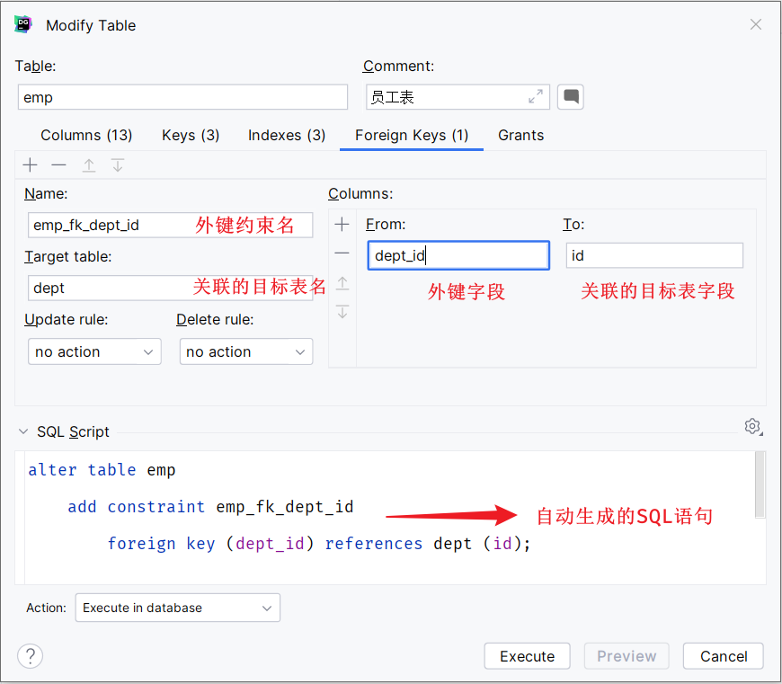
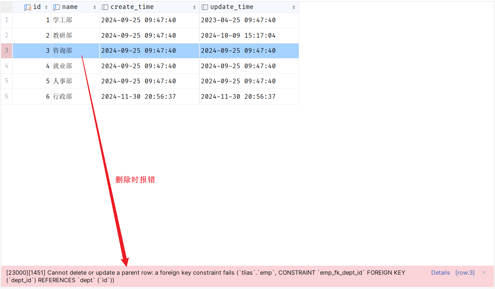
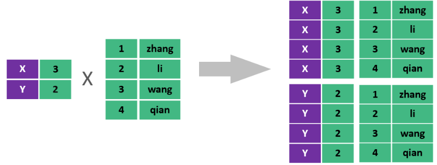
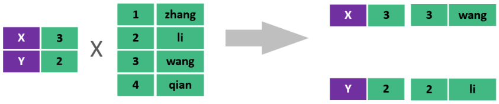
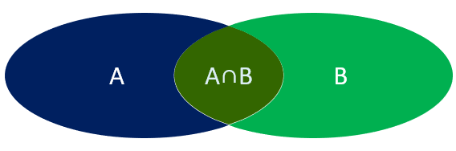
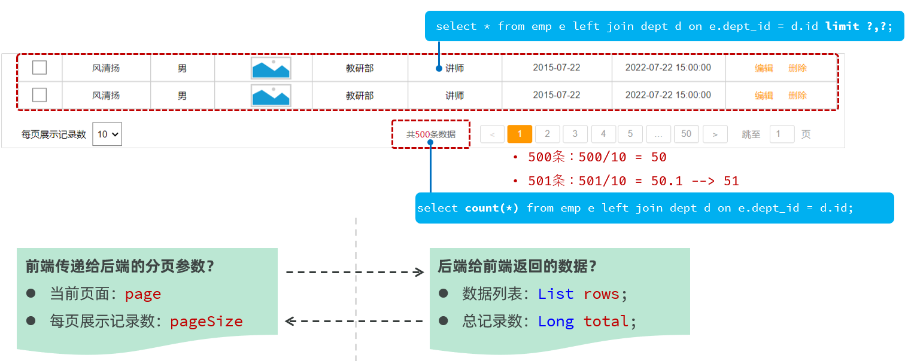
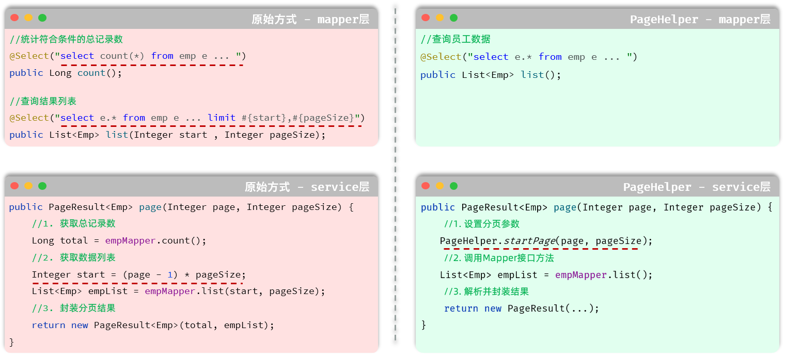

这篇笔记整理数据库表关系和后端查询实现，重点是理解外键约束、逻辑外键以及多表查询在业务代码中的落地方式。公开前建议再复核示例字段是否需要脱敏。

## 本文要点

- 外键约束用于建立表之间的数据关系，保证一致性和完整性。
- 实际项目中常见物理外键和逻辑外键两种取舍。
- 一对多、多对多关系会影响表结构和查询方式。
- MyBatis 多表查询需要同时考虑 SQL、实体对象和结果映射。

**一对多**

**外键约束：让两张表的数据建立连接，保证数据的一致性和完整性。** 

**对应的关键字：foreign key** 

外键约束的语法：

```sql
-- 创建表时指定
create table 表名(
        字段名    数据类型,
        ...
        [constraint]   [外键名称]  foreign  key (外键字段名)   references   主表 (主表列名)        
);


-- 建完表后，添加外键
alter table  表名  add constraint  外键名称  foreign key(外键字段名) references 主表(主表列名);
```

**方式1：通过SQL语句操作**

```sql
-- 修改表： 添加外键约束
alter table emp  add  constraint  fk_dept_id  foreign key (dept_id)  references  dept(id);
```

**方式2：图形化界面操作**

在左侧菜单栏，在emp表上右键，选择 `modify Table... (old UI)`



当我们添加了外键之后，再删除ID为3的部门，就会发现，此时数据库报错了，不允许删除。



外键约束（foreign key）：保证了数据的完整性和一致性。

### 1. 物理外键与逻辑外键

- 物理外键
	- 概念：使用foreign key定义外键关联另外一张表。
	- 缺点：
		- 影响增、删、改的效率（需要检查外键关系）。
		- 仅用于单节点数据库，不适用于分布式、集群场景。
		- 容易引发数据库的死锁问题，消耗性能。

- 逻辑外键
	- 概念：在业务层逻辑中，解决外键关联。
	- 通过逻辑外键，就可以很方便的解决上述问题。

在现在的企业开发中，很少会使用物理外键，都是使用逻辑外键。 甚至在一些数据库开发规范中，会明确指出禁止使用物理外键 foreign key 

### 2. 一对一

其实一对一我们可以看成一种特殊的一对多。一对多我们是怎么设计表关系的？是不是在多的一方添加外键。同样我们也可以通过外键来体现一对一之间的关系，我们只需要在任意一方来添加一个外键就可以了。

**一对一 ：在任意一方加入外键，关联另外一方的主键，并且设置外键为唯一的(UNIQUE)**

### 3. 多对多

- 实现关系：建立第三张中间表，中间表至少包含两个外键，分别关联两方主键

SQL脚本：

```sql
-- 学生表
create table tb_student(
    id int auto_increment primary key comment '主键ID',
    name varchar(10) comment '姓名',
    no varchar(10) comment '学号'
) comment '学生表';
-- 学生表测试数据
insert into tb_student(name, no) values ('黛绮丝', '2000100101'),
                                        ('谢逊', '2000100102'),
                                        ('殷天正', '2000100103'),
                                        ('韦一笑', '2000100104');

-- 课程表
create table tb_course(
   id int auto_increment primary key comment '主键ID',
   name varchar(10) comment '课程名称'
) comment '课程表';
-- 课程表测试数据
insert into tb_course (name) values ('Java'), ('PHP'), ('MySQL') , ('Hadoop');

-- 学生课程表（中间表）
create table tb_student_course(
   id int auto_increment comment '主键' primary key,
   student_id int not null comment '学生ID',
   course_id  int not null comment '课程ID',
   constraint fk_courseid foreign key (course_id) references tb_course (id),
   constraint fk_studentid foreign key (student_id) references tb_student (id)
)comment '学生课程中间表';

-- 学生课程表测试数据
insert into tb_student_course(student_id, course_id) values (1,1),(1,2),(1,3),(2,2),(2,3),(3,4);
```

**多对多 ：需要建立一张中间表，中间表中有两个外键字段，分别关联两方的主键。**


## 1. 多表查询

### 1.1. 介绍（多表查询）

多表查询：查询时从多张表中获取所需数据

> 单表查询的SQL语句：select  字段列表  from  表名;
>
> 那么要执行多表查询，只需要使用逗号分隔多张表即可，如： select   字段列表  from  表1, 表2;

**笛卡尔积：**笛卡尔乘积是指在数学中，两个集合(A集合和B集合)的所有组合情况。



在多表查询时，需要消除无效的笛卡尔积，只保留表关联部分的数据。



在SQL语句中，如何去除无效的笛卡尔积呢？只需要给多表查询加上连接查询的条件即可。

```sql
select * from emp , dept where emp.dept_id = dept.id ;
```

#### 1.1.1. 分类

多表查询可以分为：



1. 连接查询
	1. 内连接：相当于查询A、B交集部分数据
	2. 外连接
		- 左外连接：查询左表所有数据(包括两张表交集部分数据)
		- 右外连接：查询右表所有数据(包括两张表交集部分数据)
2. 子查询

### 1.2. 内连接

内连接查询：查询两表或多表中交集部分数据。

内连接从语法上可以分为：

- 隐式内连接
- 显式内连接

**隐式内连接语法：**

```sql
select  字段列表   from   表1 , 表2   where  条件 ... ;
```

**显式内连接语法：**

```sql
select  字段列表   from   表1  [ inner ]  join 表2  on  连接条件 ... ;
```

- 案例1：查询所有员工的ID，姓名，及所属的部门名称
	-  隐式内连接实现
	- ```sql
		select emp.id, emp.name, dept.name from emp , dept where emp.dept_id = dept.id;
		```

	- 显式内连接实现
	- ```sql
		select emp.id, emp.name, dept.name from emp inner join dept on emp.dept_id = dept.id;
		```

	- 

- 案例2：查询 性别为男, 且工资 高于8000 的员工的ID, 姓名, 及所属的部门名称
	- 隐式内连接实现
	- ```sql
		select emp.id, emp.name, dept.name from emp , dept where emp.dept_id = dept.id and emp.gender = 1 and emp.salary > 8000;
		```

	- 显式内连接实现
	- ```sql
		select emp.id, emp.name, dept.name from emp inner join dept on emp.dept_id = dept.id where emp.gender = 1 and emp.salary > 8000;
		```

	- 在多表联查时，我们指定字段时，需要在字段名前面加上表名，来指定具体是哪一张的字段。 如：emp.dept_id

	- 

**给表起别名简化书写：**

```sql
select  字段列表 from 表1 as 别名1 , 表2 as  别名2  where  条件 ... ;

select  字段列表 from 表1 别名1 , 表2  别名2  where  条件 ... ;  -- as 可以省略
```

使用了别名的多表查询：

```sql
select e.id, e.name, d.name from emp as e , dept as d where e.dept_id = d.id and e.gender = 1 and e.salary > 8000;
```

**注意事项:** 一旦为表起了别名，就不能再使用表名来指定对应的字段了，此时只能够使用别名来指定字段。

### 1.3. 外连接

外连接分为两种：左外连接 和 右外连接。

**左外连接语法：**

```sql
select  字段列表   from   表1  left  [ outer ]  join 表2  on  连接条件 ... ;
```

左外连接相当于查询表1(左表)的所有数据，当然也包含表1和表2交集部分的数据。

**右外连接语法：**

```sql
select  字段列表   from   表1  right  [ outer ]  join 表2  on  连接条件 ... ;
```

右外连接相当于查询表2(右表)的所有数据，当然也包含表1和表2交集部分的数据。

案例1：查询员工表 所有 员工的姓名, 和对应的部门名称 (左外连接)

```sql
-- 左外连接：以left join关键字左边的表为主表，查询主表中所有数据，以及和主表匹配的右边表中的数据
select e.name , d.name  from emp as e left join dept as d on e.dept_id = d.id ;
```

案例2：查询部门表 所有 部门的名称, 和对应的员工名称 (右外连接)

```sql
-- 右外连接：以right join关键字右边的表为主表，查询主表中所有数据，以及和主表匹配的左边表中的数据
select e.name , d.name from emp as e right join dept as d on e.dept_id = d.id;
```

案例3：查询工资 高于8000 的 所有员工的姓名, 和对应的部门名称 (左外连接)

```sql
select e.name , d.name  from emp as e left join dept as d on e.dept_id = d.id where e.salary > 8000;
```

**注意事项：**

左外连接和右外连接是可以相互替换的，只需要调整连接查询时SQL语句中表的先后顺序就可以了。而我们在日常开发使用时，更偏向于左外连接。

### 1.4. 子查询

#### 1.4.1. 介绍（子查询）

SQL语句中嵌套select语句，称为嵌套查询，又称子查询。

```sql
SELECT  *  FROM   t1   WHERE  column1 =  ( SELECT  column1  FROM  t2 ... );
```

子查询外部的语句可以是insert / update / delete / select 的任何一个，最常见的是 select。

根据子查询结果的不同分为：

1. 标量子查询（子查询结果为单个值 [一行一列]）
2. 列子查询（子查询结果为一列，但可以是多行）
3. 行子查询（子查询结果为一行，但可以是多列）
4. 表子查询（子查询结果为多行多列[相当于子查询结果是一张表]）

子查询可以书写的位置：

1. where之后
2. from之后
3. select之后

子查询的要点是，先对需求做拆分，明确具体的步骤，然后再逐条编写SQL语句。 最终将多条SQL语句合并为一条。

#### 1.4.2. 标量子查询

子查询返回的结果是单个值(数字、字符串、日期等)，最简单的形式，这种子查询称为**标量子查询**。

常用的操作符： =   <>   >    >=    <   <=   

- 案例1：查询 最早入职 的员工信息

```sql
-- 1. 查询最早的入职时间
select min(entry_date) from emp;  -- 结果: 2000-01-01

-- 2. 查询入职时间 = 最早入职时间的员工信息
select * from emp where entry_date = '2000-01-01';

-- 3. 合并为一条SQL
select * from emp where entry_date = (select min(entry_date) from emp);
```

- 案例2：查询在 阮小五 入职之后入职的员工信息

```sql
-- 1. 查询 "阮小五" 的入职日期
select entry_date from emp where name = '阮小五'; -- 结果: 2015-01-01

-- 2. 根据上述查询到的这个入职日期, 查询在该日期之后入职的员工信息
select * from emp where entry_date > '2015-01-01';

-- 3. 合并SQL为一条SQL
select * from emp where entry_date > (select entry_date from emp where name = '阮小五');
```

#### 1.4.3. 列子查询

子查询返回的结果是一列(可以是多行)，这种子查询称为列子查询。

常用的操作符：

| 操作符 | 描述                         |
| ------ | ---------------------------- |
| in     | 在指定的集合范围之内，多选一 |
| not in | 不在指定的集合范围之内       |

- 案例1：查询 "教研部" 和 "咨询部" 的所有员工信息

```sql
-- 1. 查询 "教研部" 和 "咨询部" 的部门ID
select id from dept where name = '教研部' or name = '咨询部'; -- 结果: 3,2

-- 2. 根据上面查询出来的部门ID, 查询员工信息
select * from emp where dept_id in(3,2);

-- 3. 合并SQL为一条SQL语句
select * from emp where dept_id in (select id from dept where name = '教研部' or name = '咨询部');
```

#### 1.4.4. 行子查询

子查询返回的结果是一行(可以是多列)，这种子查询称为行子查询。

常用的操作符：= 、<> 、IN 、NOT IN

- 案例1：查询与 "李忠" 的薪资 及 职位都相同的员工信息

```sql
-- 1. 查询 "李忠" 的薪资和职位
select salary , job from emp where name = '李忠'; -- 结果: 5000, 5

-- 2. 根据上述查询到的薪资和职位 , 查询对应员工的信息
select * from emp where (salary, job) = (5000,5);

-- 3. 将两条SQL合并为一条SQL
select * from emp where (salary, job) = (select salary , job from emp where name = '李忠');
```

#### 1.4.5. 表子查询

子查询返回的结果是多行多列，常作为临时表，这种子查询称为**表子查询**。

- 案例：*获取每个部门中薪资最高的员工信息*

```sql
-- a. 获取每个部门的最高薪资
select dept_id, max(salary) from emp group by dept_id;

-- b. 查询每个部门中薪资最高的员工信息
select * from emp e , (select dept_id, max(salary) max_sal from emp group by dept_id) a
    where e.dept_id = a.dept_id and e.salary = a.max_sal;
```

#### 1.4.6. 案例

根据需求，完成多表查询的SQL语句的编写。

- \1. 查询 "教研部" 性别为 男，且在 "2011-05-01" 之后入职的员工信息 。

```sql
select e.* from emp as e , dept as d where e.dept_id = d.id and d.name = '教研部' and e.gender = 1 and e.entry_date > '2011-05-01';
```

- \2. 查询工资 低于公司平均工资的 且 性别为男 的员工信息 。

```sql
select e.* from emp as e , dept as d where e.dept_id = d.id and e.salary < (select avg(salary) from emp) and e.gender = 1;
```

- \3. 查询部门人数超过 10 人的部门名称 。

```sql
select d.name , count(*) from emp as e , dept as d where e.dept_id = d.id group by d.name having count(*) > 10;
```

- \4. 查询在 "2010-05-01" 后入职，且薪资高于 10000 的 "教研部" 员工信息，并根据薪资倒序排序。

```sql
select * from emp e , dept d where e.dept_id = d.id and e.entry_date > '2010-05-01' and e.salary > 10000 and d.name = '教研部' order by e.salary desc;
```

- \5. 查询工资 低于本部门平均工资的员工信息 。【难】

```sql
-- 5.1 查询每个部门的平均工资
select dept_id, avg(salary) avg_sal from emp group by dept_id;

-- 5.2 查询工资 低于本部门平均工资 的员工信息 。
select e.* from emp e , (select dept_id, avg(salary) avg_sal from emp group by dept_id) as a
          where e.dept_id = a.dept_id and e.salary < a.avg_sal;
```

### 1.5. 分页查询

要想从数据库中进行分页查询，我们要使用`LIMIT`关键字，格式为：limit  开始索引  每页显示的条数。

1). 查询第1页数据的SQL语句是：

```sql
select * from emp  limit 0,10;
```

2). 查询第2页数据的SQL语句是：

```sql
select * from emp  limit 10,10;
```

3). 查询第3页的数据的SQL语句是：

```sql
select * from emp  limit 20,10;
```

观察以上SQL语句，发现： 开始索引一直在改变 ， 每页显示条数是固定的

开始索引的计算公式：   `开始索引 = (当前页码 - 1)  *  每页显示条数`

我们继续基于页面原型，继续分析，得出以下结论：

1. 前端在请求服务端时，传递的参数
	1. 当前页码  page
	2. 每页显示条数  pageSize
2. 后端需要响应什么数据给前端
	1. 所查询到的数据列表（存储到List 集合中）
	2. 总记录数



后台给前端返回的数据包含：List集合(数据列表)、total(总记录数)

而这两部分我们通常封装到PageResult对象中，并将该对象转换为json格式的数据响应回给浏览器。

```java
@Data
@NoArgsConstructor
@AllArgsConstructor
public class PageResult {
        private Long total; //总记录数
        private List rows; //当前页数据列表
}
```

#### 1.5.1. 接口描述

**1). 基本信息**

> 请求路径：/emps
>
> 请求方式：GET
>
> 接口描述：该接口用于员工列表数据的条件分页查询

**2). 请求参数**

| 参数名称 | 是否必须 | 示例     | 备注                                       |
| -------- | -------- | -------- | ------------------------------------------ |
| name     | 否       | 张       | 姓名                                       |
| gender   | 否       | 1        | 性别 , 1 男 , 2 女                         |
| begin    | 否       | 2010/1/1 | 范围匹配的开始时间(入职日期)               |
| end      | 否       | 2020/1/1 | 范围匹配的结束时间(入职日期)               |
| page     | 是       | 1        | 分页查询的页码，如果未指定，默认为1        |
| pageSize | 是       | 10       | 分页查询的每页记录数，如果未指定，默认为10 |

请求数据样例：

```java
/emps?name=张&gender=1&begin=2007-09-01&end=2022-09-01&page=1&pageSize=10
```

**3). 响应数据**

参数格式：application/json

参数说明：

| 名称           | 类型      | 是否必须 | 备注                                                         |
| -------------- | --------- | -------- | ------------------------------------------------------------ |
| code           | number    | 必须     | 响应码, 1 成功 , 0 失败                                      |
| msg            | string    | 非必须   | 提示信息                                                     |
| data           | object    | 必须     | 返回的数据                                                   |
| \|- total      | number    | 必须     | 总记录数                                                     |
| \|- rows       | object [] | 必须     | 数据列表                                                     |
| \|- id         | number    | 非必须   | id                                                           |
| \|- username   | string    | 非必须   | 用户名                                                       |
| \|- name       | string    | 非必须   | 姓名                                                         |
| \|- password   | string    | 非必须   | 密码                                                         |
| \|- gender     | number    | 非必须   | 性别 , 1 男 ; 2 女                                           |
| \|- image      | string    | 非必须   | 图像                                                         |
| \|- job        | number    | 非必须   | 职位, 说明: 1 班主任,2 讲师, 3 学工主管, 4 教研主管, 5 咨询师 |
| \|- salary     | number    | 非必须   | 薪资                                                         |
| \|- entryDate  | string    | 非必须   | 入职日期                                                     |
| \|- deptId     | number    | 非必须   | 部门id                                                       |
| \|- deptName   | string    | 非必须   | 部门名称                                                     |
| \|- createTime | string    | 非必须   | 创建时间                                                     |
| \|- updateTime | string    | 非必须   | 更新时间                                                     |

#### 1.5.2. PageHelper分页插件

##### 1.5.2.1. 介绍（PageHelper）

前面我们已经完了基础的分页查询，大家会发现：分页查询功能编写起来比较繁琐。 而分页查询的功能是非常常见的，我们查询员工信息需要分页查询，将来在做其他项目时，查询用户信息、订单信息、商品信息等等都是需要进行分页查询的。

而分页查询的思路、步骤是比较固定的。 在Mapper接口中定义两个方法执行两条不同的SQL语句：

1. 查询总记录数
2. 指定页码的数据列表

在Service当中，调用Mapper接口的两个方法，分别获取：总记录数、查询结果列表，然后在将获取的数据结果封装到PageBean对象中。

大家思考下：在未来开发其他项目，只要涉及到分页查询功能(例：订单、用户、支付、商品)，都必须按照以上操作完成功能开发

结论：原始方式的分页查询，存在着"步骤固定"、"代码频繁"的问题

解决方案：可以使用一些现成的分页插件完成。对于Mybatis来讲现在最主流的就是PageHelper。

**PageHelper是第三方提供的Mybatis框架中的一款功能强大、方便易用的分页插件，支持任何形式的单标、多表的分页查询。**

官网：https://pagehelper.github.io/

那接下来，我们可以对比一下，使用PageHelper分页插件进行分页 与 原始方式进行分页代码实现的上的差别。



- Mapper接口层：
	- 原始的分页查询功能中，我们需要在Mapper接口中定义两条SQL语句。   
	- PageHelper实现分页查询之后，只需要编写一条SQL语句，而且不需要考虑分页操作，就是一条正常的查询语句。
- Service层：
	- 需要根据页码、每页展示记录数，手动的计算起始索引。
	- 无需手动计算起始索引，直接告诉PageHelper需要查询那一页的数据，每页展示多少条记录即可。

##### 1.5.2.2. 代码实现

当使用了PageHelper分页插件进行分页，就无需再Mapper中进行手动分页了。 在Mapper中我们只需要进行正常的列表查询即可。在Service层中，调用Mapper的方法之前设置分页参数，在调用Mapper方法执行查询之后，解析分页结果，并将结果封装到PageResult对象中返回。

1). 在pom.xml引入依赖

```xml
<!--分页插件PageHelper-->
<dependency>
    <groupId>com.github.pagehelper</groupId>
    <artifactId>pagehelper-spring-boot-starter</artifactId>
    <version>1.4.7</version>
</dependency>
```

2). EmpMapper

```java
/**
 * 查询所有的员工及其对应的部门名称
 */
@Select("select e.*, d.name deptName from emp as e left join dept as d on e.dept_id = d.id")
public List<Emp> list();
```

3). EmpServiceImpl

```java
@Override
public PageResult page(Integer page, Integer pageSize) {
    //1. 设置分页参数
    PageHelper.startPage(page,pageSize);

    //2. 执行查询
    List<Emp> empList = empMapper.list();
    Page<Emp> p = (Page<Emp>) empList;

    //3. 封装结果
    return new PageResult(p.getTotal(), p.getResult());
}
```

**注意：**

- PageHelper实现分页查询时，SQL语句的结尾一定一定一定不要加分号(;).。
- PageHelper只会对紧跟在其后的第一条SQL语句进行分页处理。

### 1.6. 条件分页查询

> 条件分页查询在实际项目中非常常用，建议掌握。

## 小结

多表关系的核心是先把业务关系映射成表关系，再选择合适的查询和映射方式。外键是否落到数据库层，需要结合项目规模、性能和维护成本判断。
