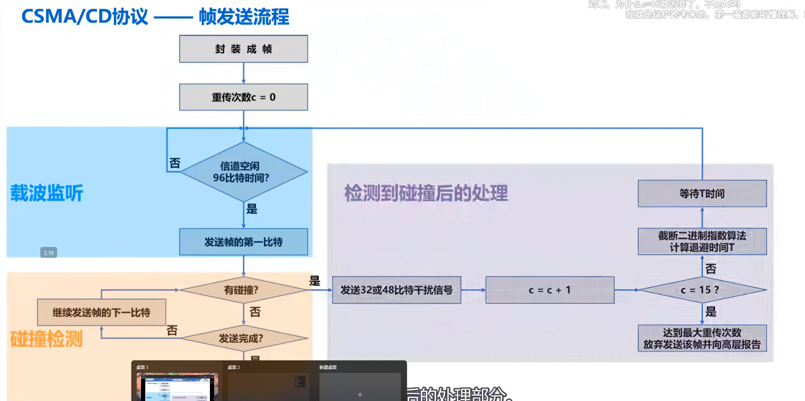
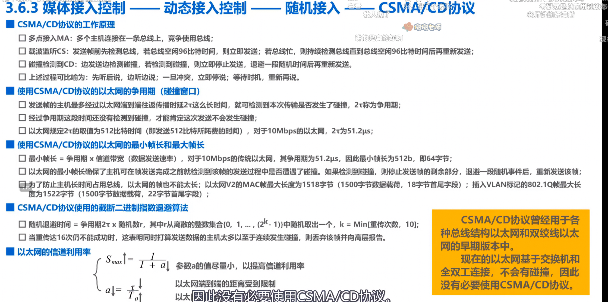
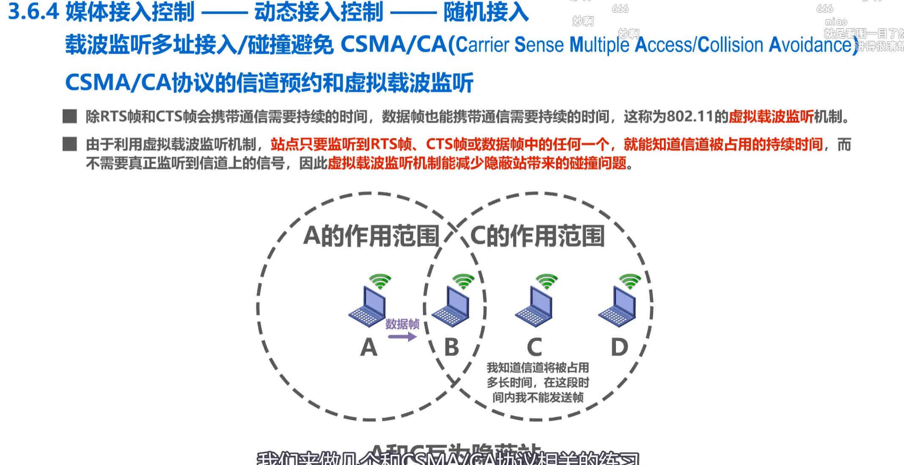
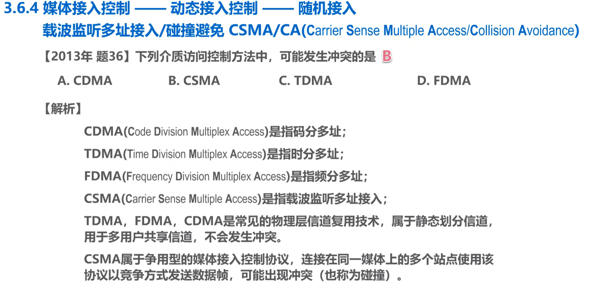

## 1. 信道复用技术

### 1.1 码分复用 CDM


**CDMA 原理**：
- 每个站点被分配唯一的 **m bit 码片序列**（Chip Sequence）
- 码片序列相互正交：不同站点的码片内积为 0
- 发送数据时：发送 1 → 发送码片序列；发送 0 → 发送码片序列的反码

**示例**：
- A 站码片序列：(-1, -1, +1, +1, -1, +1, +1, +1)
- B 站码片序列：(-1, +1, -1, +1, +1, +1, -1, -1)
- A 发送 1，B 发送 0，C 未发送
- 接收端收到的信号 = A 的码片 - B 的码片

### 1.2 CDMA 例题解析


**判断方法**：
1. 将接收到的序列与各站点码片进行**内积运算**
2. 结果为 +1：发送了比特 1
3. 结果为 -1：发送了比特 0
4. 结果为 0：未发送数据

**计算示例**：
```
收到的序列：(-1, +1, +3, -1, -3, -1, +3, +1)

与 A 站码片内积：
(-1)×(-1) + (+1)×(-1) + (+3)×(+1) + (-1)×(+1) + 
(-3)×(-1) + (-1)×(+1) + (+3)×(+1) + (+1)×(+1)
= 1 - 1 + 3 - 1 + 3 - 1 + 3 + 1 = 8 → 结果为 +1 → A 发送了 1
```

---

## 2. CSMA/CD 协议（有线以太网）

### 2.1 帧发送流程



**发送流程**：
1. **封装成帧**，重传计数器 c = 0
2. **载波监听**：信道空闲 96 比特时间？
   - 是：发送帧的第一比特
   - 否：继续监听
3. **碰撞检测**：边发送边监听
   - 有碰撞：发送 32 或 48 比特干扰信号
   - 无碰撞：继续发送下一比特
4. **检测到碰撞后的处理**：
   - 发送干扰信号
   - 等待随机时间 T
   - 使用**二进制指数退避算法**计算退避时间
   - c = c + 1
   - 若 c < 15：返回重传
   - 若 c ≥ 15：报告信道繁忙

### 2.2 帧接收流程


**接收流程**：
1. **监听信道**：信道活跃？
   - 否：继续监听
   - 是：开始接收帧
2. **接收完成**后检查：
   - 帧太小（< 64 字节）→ 认为遭遇碰撞，丢弃
   - 帧的目的 MAC 地址与本机相同或是广播地址？
   - 使用 **CRC** 检查帧是否出现误码
3. **校验正确** → 接收该帧；**校验错误** → 丢弃

### 2.3 CSMA/CD 知识点总结


**关键概念**：

| 概念 | 说明 |
|------|------|
| 争用期 | 碰撞检测的最长时间 = 2τ（端到端往返时间）|
| 最小帧长 | 64 字节（512 bit），保证能检测到碰撞 |
| 最大帧长 | 1518 字节（1500 数据 + 18 首尾）|
| 二进制指数退避 | 第 k 次重传，从 {0, 1, ..., 2^k - 1} 随机选择等待时间 |

**适用场景**：
- 早期共享式以太网（集线器连接）
- 现在的交换式以太网已很少使用

### 2.4 CSMA/CD 考研真题



**题目**：在采用 CSMA/CD 协议的网络中，传输速率为 1Gbps，信号传播速率为 200000km/s，若最小帧长减少 800 比特，则最远的两个站点之间的距离至少需要如何变化？

**解题思路**：
1. 最小帧长 = 争用期 × 数据传输速率
2. 争用期 = 2 × 距离 / 传播速率
3. 最小帧长减少 → 争用期减小 → 距离减小

---

## 3. CSMA/CA 协议（无线局域网）

### 3.1 退避算法时序


**CSMA/CA 工作原理**：
1. **DIFS（DCF 帧间间隔）**：发送前等待 DIFS 时间
2. **退避算法**：信道忙时，冻结退避计时器；信道空闲时，继续倒计时
3. **发送帧**：退避计时器归零后发送
4. **等待确认**：接收方收到帧后发送 ACK

**与 CSMA/CD 的区别**：
- CSMA/CD：边发送边检测碰撞
- CSMA/CA：发送前尽量避免碰撞（无线环境无法有效检测碰撞）

### 3.2 虚拟载波监听



**RTS/CTS 机制**：
1. 发送方先发送 **RTS**（Request to Send）帧
2. 接收方回应 **CTS**（Clear to Send）帧
3. RTS/CTS 帧中包含数据帧的持续时间
4. 其他站点监听到 RTS/CTS 后，在该时间段内保持静默

**作用**：
- 解决**隐藏站问题**（A 和 C 都能与 B 通信，但 A 和 C 互相听不到）
- 减少碰撞概率

### 3.3 CSMA/CA 考研真题


**题目**：以下哪种协议用于无线局域网的碰撞避免？

**答案**：CSMA/CA

**对比**：

| 协议 | 适用场景 | 碰撞处理 |
|------|---------|---------|
| CSMA/CD | 有线以太网 | 检测碰撞后重传 |
| CSMA/CA | 无线局域网 | 发送前避免碰撞 |

### 3.4 介质访问控制总结



**静态划分信道**：
- FDM（频分复用）
- TDM（时分复用）
- WDM（波分复用）
- CDM（码分复用）

**动态接入控制**：
- **争用型**：CSMA/CD、CSMA/CA（可能发生冲突）
- **受控型**：令牌传递（不会发生冲突）

---

## 4. 总结

### 核心知识点

1. **CDMA**：码片序列正交，内积判断发送数据
2. **CSMA/CD**：边发送边检测碰撞，二进制指数退避
3. **CSMA/CA**：发送前避免碰撞，RTS/CTS 解决隐藏站
4. **最小帧长**：64 字节（争用期 × 传输速率）
5. **适用场景**：CSMA/CD 用于有线，CSMA/CA 用于无线
