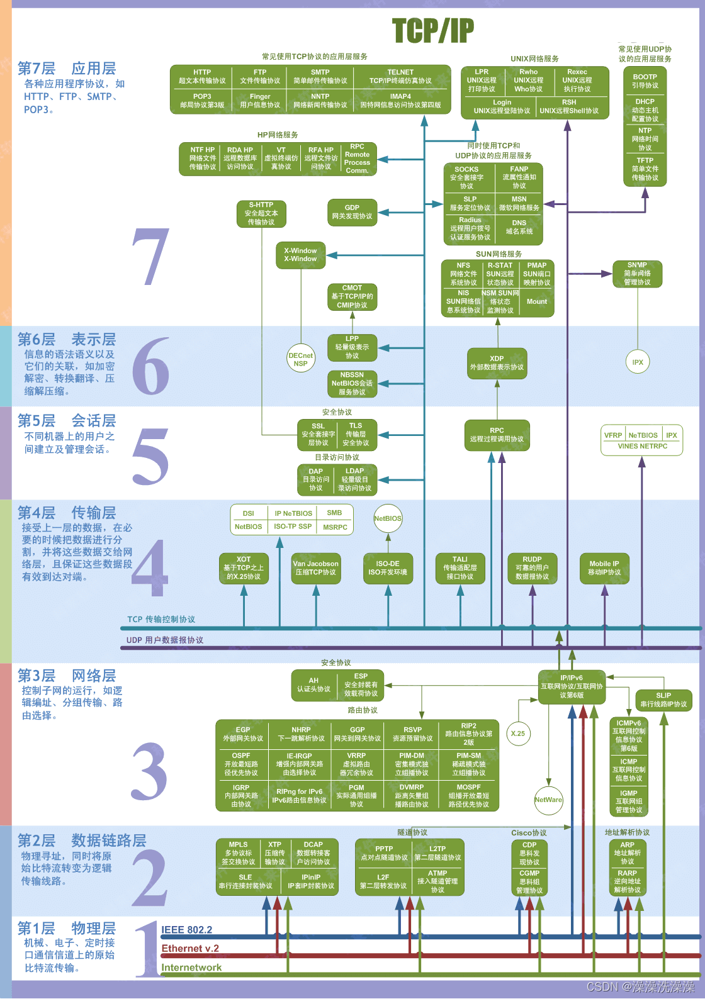
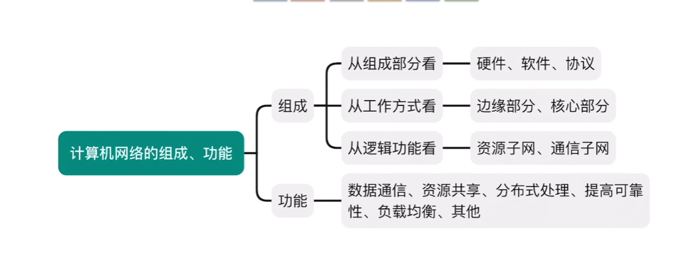
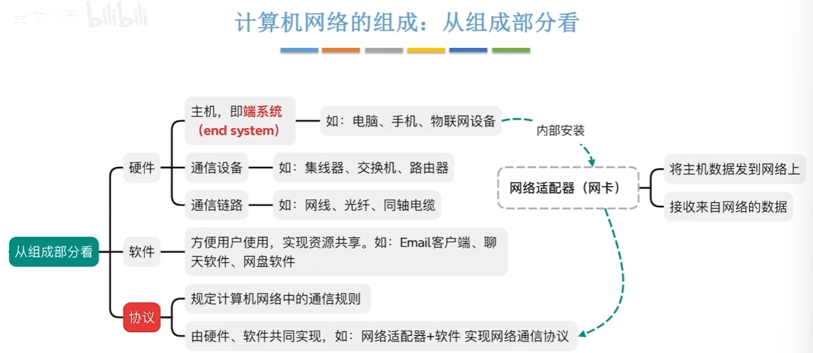
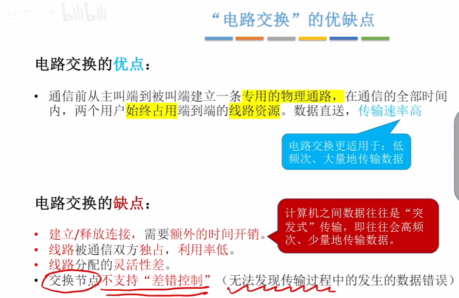
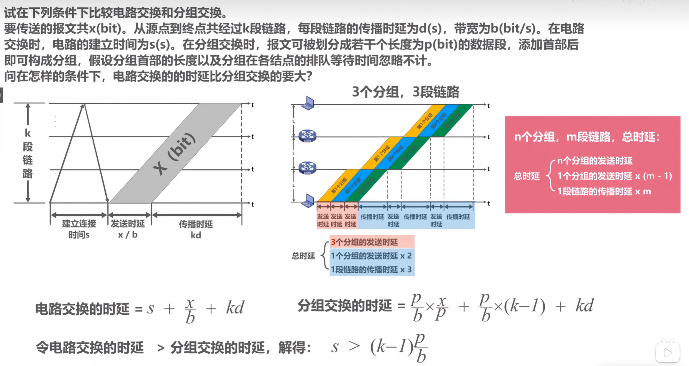
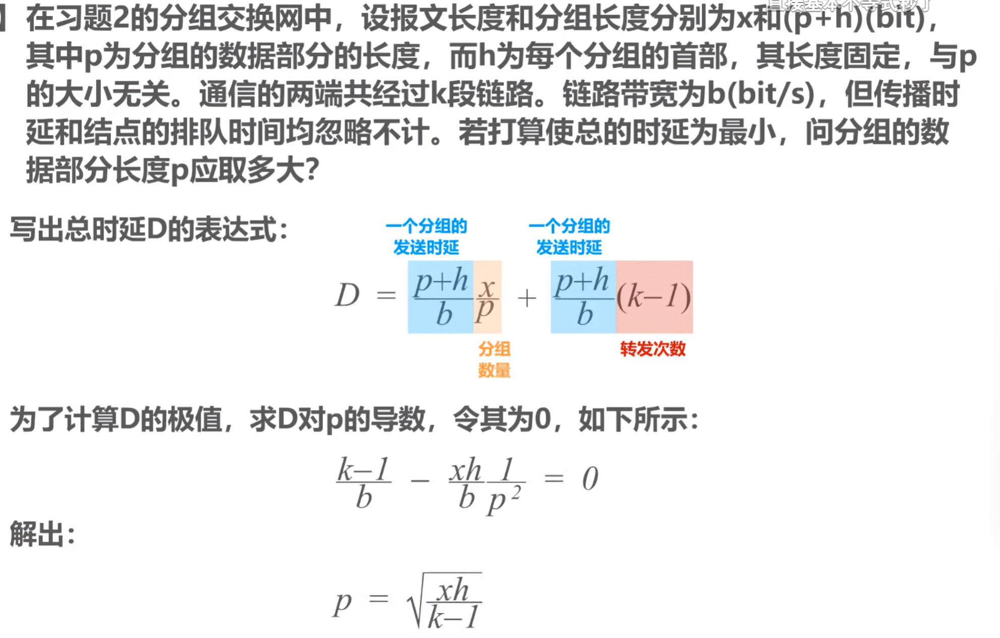
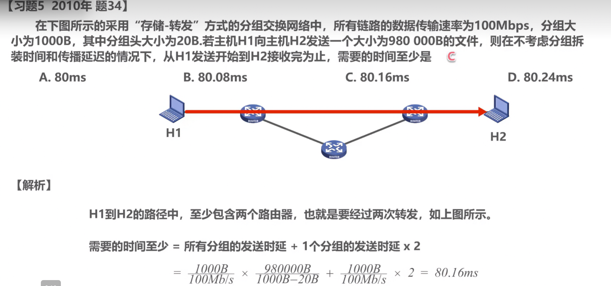
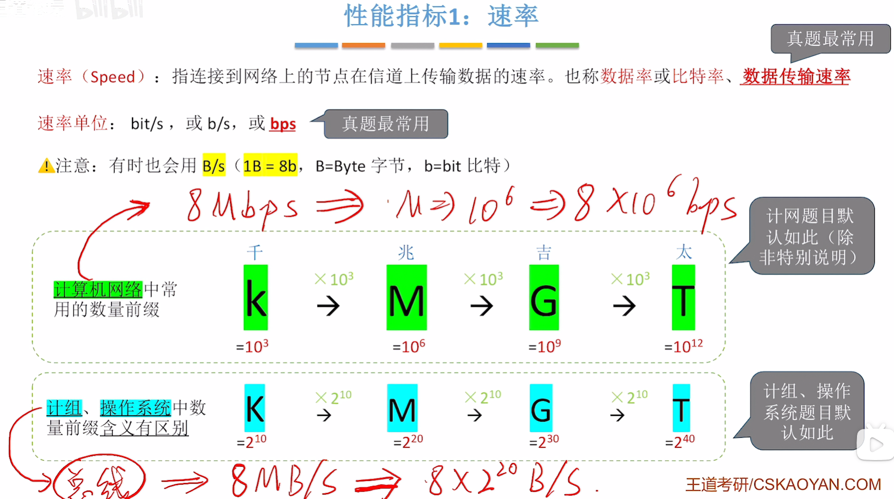
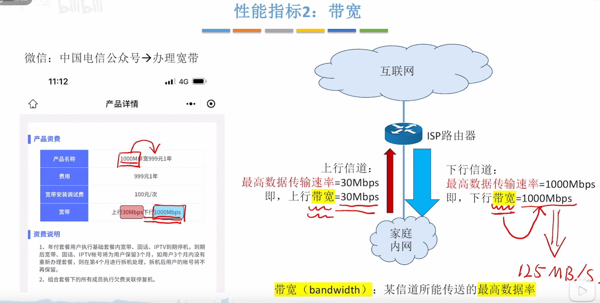
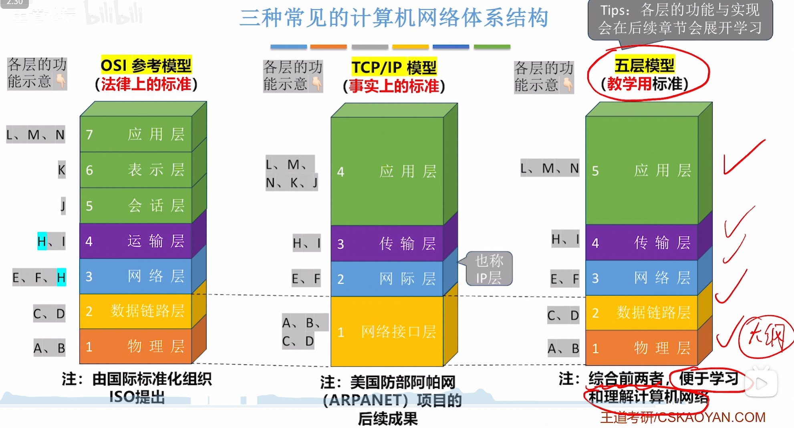

## 1. OSI七层模型

OSI定义了网络互连的七层框架，即ISO开放互连系统参考模型。

- **应用层**（Application Layer）：提供用户接口和应用程序之间的通信服务
- **表示层**（Presentation Layer）：负责数据的格式化、加密和压缩
- **会话层**（Session Layer）：管理应用程序之间的通信会话
- **传输层**（Transport Layer）：为应用程序提供端到端的数据传输服务，主要使用 TCP 和 UDP
- **网络层**（Network Layer）：负责数据包的路由和转发，以及网络中的寻址和拥塞控制
- **数据链路层**（Data Link Layer）：提供点对点的数据传输服务，将比特流转换为数据帧
- **物理层**（Physical Layer）：在物理媒介上传输原始比特流

## 2. TCP/IP四层模型

- **应用层**：处理用户与网络应用程序之间的通信（HTTP、FTP、SMTP等）
- **传输层**：提供端到端的数据传输服务（TCP、UDP）
- **网络层**：负责数据包的路由和转发（IP协议）
- **网络接口层**：管理网络硬件设备和物理媒介之间的通信

**应用层常见协议**：HTTP、FTP、SMTP、POP3、IMAP、DNS、HTTPS、SSH、SNMP、Telnet

**传输层常见协议**：
- TCP：可靠的、面向连接的数据传输（文件传输、网页浏览）
- UDP：无连接的数据传输（音视频传输、在线游戏）

**网络层常见协议**：IP、ICMP、ARP、RARP、IPv6

## 3. 专用术语

#### (1) 实体

实体是指任何可发送或接收信息的硬件或软件进程。对等实体是指通信双方相同层次中的实体。

#### (2) 协议

协议是控制两个对等实体在"水平方向"进行"逻辑通信"的规则的集合。

协议有三大要素：**语法、语义、同步**。
- 语法：定义通信双方所交换信息的格式
- 语义：定义通信双方所要完成的操作
- 同步：定义通信双方的时序关系

#### (3) 服务

在协议的控制下，两个对等实体在水平方向的逻辑通信使得本层能够向上一层提供服务。

- **协议数据单元**（PDU）：对等层次之间传送的数据包
- **服务数据单元**（SDU）：同一系统内层与层之间交换的数据包

---

## 4. 计算机网络概念

1. **集线器（Hub）**：把多个结点连接起来，工作在物理层，普通民用领域已很少用
2. **交换机（Switch）**：把多个结点连接起来，工作在数据链路层，家庭/公司/学校常用
3. **路由器（Router）**：把多个计算机网络互相连接起来，工作在网络层

> Tips：计算机网络课程中的"路由器"和"家用路由器"有区别。家用路由器 = 路由器 + 交换机 + 其他功能

## 5. 计算机网络的组成和功能

## 6. 电路交换、报文交换、分组交换

### 6.1 电路交换 vs 分组交换时延计算

**条件**：报文共 x(bit)，源到终点经 k 段链路，每段传播时延 d(s)，带宽 b(bit/s)。电路交换建立时间 s(s)。分组交换将报文划分为长度 p(bit) 的分组（首部长度和排队时间忽略不计）。

**电路交换时延** = s + x/b + kd

**分组交换时延** = x/b + (k−1)×(p/b) + kd

令电路交换时延 > 分组交换时延，解得：**s > (k−1)×p/b**

**最优分组长度**：设分组数据部分长度为 p，首部为 h，总时延 D：

令 dD/dp = 0，解得 **p = √(xh/(k−1))**

## 7. 计算机网络分类

按覆盖范围分类：**局域网（LAN）**覆盖较小区域（如办公室、校园）；**城域网（MAN）**覆盖城市范围；**广域网（WAN）**覆盖国家或全球范围；**个人区域网（PAN）**覆盖个人周围约10米范围。按拓扑结构可分为总线型、星型、环型、网状型等。

## 8. 性能指标

信道（Channel）：表示向某一方向传送信息的通道。一条通信线路在逻辑上对应一条发送信道和一条接收信道。

主要性能指标包括：**速率**（数据传输速率，单位 bit/s）、**带宽**（信道能通过的最高频率范围，单位 Hz 或 bit/s）、**吞吐量**（单位时间内通过某个网络的实际数据量）、**时延**（发送时延 + 传播时延 + 排队时延 + 处理时延）、**往返时间 RTT**、**丢包率**。

## 9. 分层架构

分层架构将复杂的网络通信问题分解为若干层次，每层实现特定功能并为上层提供服务。OSI 采用七层模型，TCP/IP 采用四层模型，两者可对应映射。各层的协议数据单元（PDU）不同：物理层为比特、数据链路层为帧、网络层为分组/包、传输层为报文段。层与层之间通过**服务访问点（SAP）**进行交互。

## 10. 各层功能速查

| 层次 | 传输单位 | 主要功能 | 典型协议 |
| --- | --- | --- | --- |
| 物理层 | 比特 | 比特流的透明传输（电气、物理特性） | — |
| 数据链路层 | 帧 | 结点到结点的可靠传输，帧同步、差错控制、流量控制、访问控制 | 以太网、PPP、HDLC |
| 网络层 | 分组 | 源主机到目的主机的分组传输（跨越多个网络） | IP、ICMP、ARP |
| 运输层 | 报文 | 进程到进程的可靠传输 | TCP、UDP |
| 应用层 | 报文 | 提供用户接口和网络服务 | HTTP、FTP、DNS、SMTP |

> **易混点**：数据链路层提供的是"分组在一个网络（或一段链路）上传输服务"，网络层提供的是"跨网络的主机到主机传输服务"。
