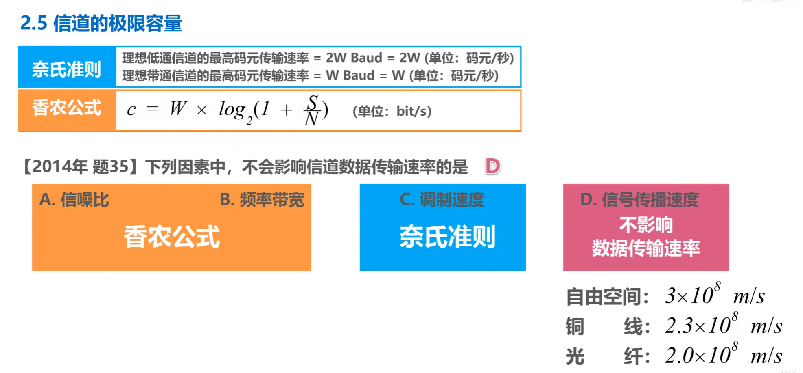
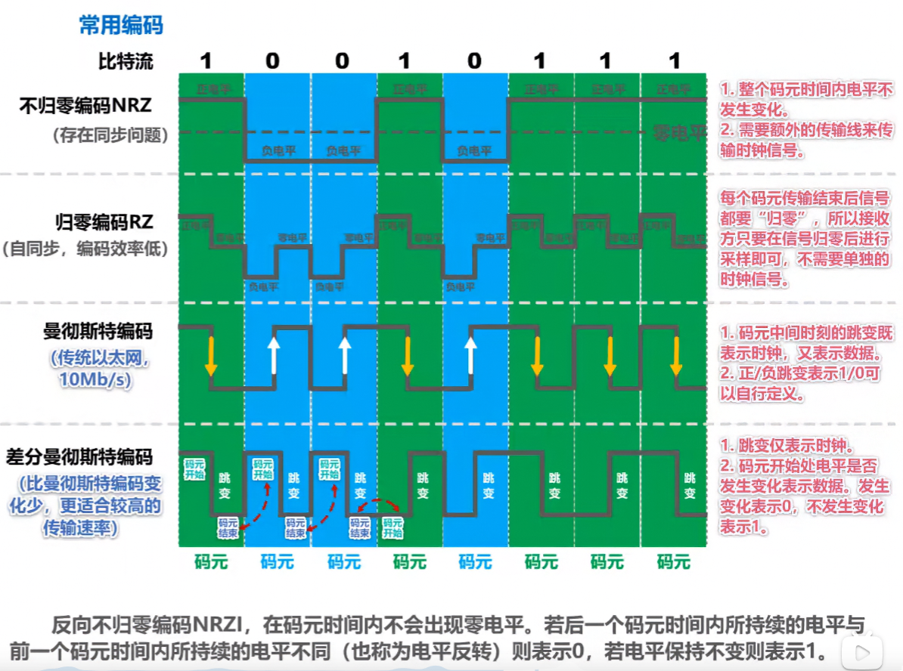
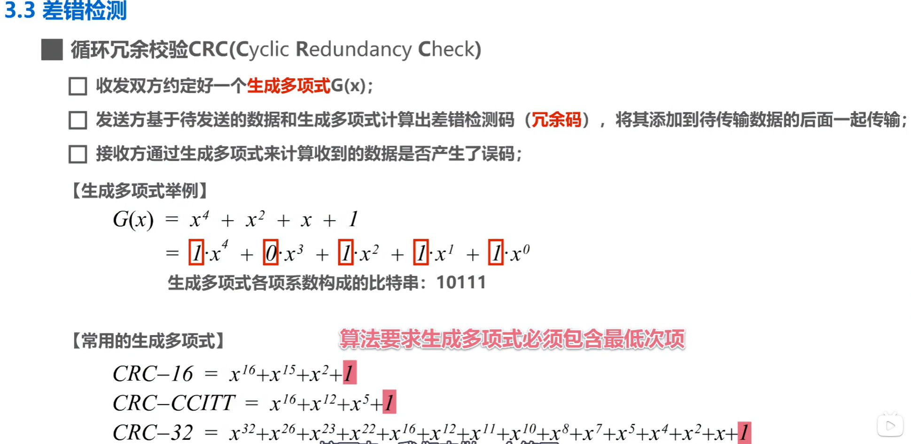
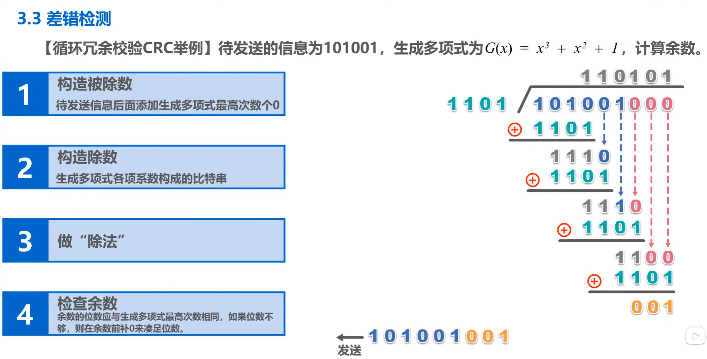

## 1. 编码与调制

### 1.1 编码与调制概述


**基本概念**：
- **基带信号**：数字设备产生的原始信号（如计算机输出的矩形波）
- **宽带信号**：经过调制后的信号（适合远距离传输）

**编码方式**：
- **数字数据 → 数字信号**：使用数字编码（如 NRZ、曼彻斯特编码）
- **数字数据 → 模拟信号**：需要调制（ASK、FSK、PSK、QAM）
- **模拟数据 → 数字信号**：需要采样、量化、编码（PCM）
- **模拟数据 → 模拟信号**：可以使用调制放大

### 1.2 调制方式



**基本调制方式**：

| 调制方式 | 英文 | 原理 | 特点 |
|---------|------|------|------|
| 调幅 AM | Amplitude Shift Keying | 改变载波振幅 | 实现简单，抗干扰差 |
| 调频 FM | Frequency Shift Keying | 改变载波频率 | 抗干扰好，带宽大 |
| 调相 PM | Phase Shift Keying | 改变载波相位 | 抗干扰好，实现复杂 |

**混合调制**：
- **QAM（正交振幅调制）**：结合调幅和调相
- QAM-16：16 种状态，每个码元携带 4 bit
- QAM-64：64 种状态，每个码元携带 6 bit

**码元**：
- 在使用时间域的波形表示数字信号时，代表不同离散数值的基本波形
- 一个码元可以携带多个 bit 的信息

---

## 2. 信道特性

### 2.1 奈氏准则（理想低通信道）


**奈氏准则**：
- 理想低通信道的最高码元传输速率 = **2W Baud**
- 其中 W 是信道带宽（Hz）

**含义**：
- 在带宽为 W Hz 的理想低通信道中，码元传输速率为 2W Baud
- 每个码元可以携带 n bit 信息（n = log2(V)，V 为离散等级数）
- 最大数据传输速率 = 2W × log2(V) bps

**示例**：
- 信道带宽 W = 3000 Hz
- 最高码元传输速率 = 2 × 3000 = 6000 Baud
- 若使用 4 级量化（V = 4），则最高数据速率 = 6000 × log2(4) = 12000 bps

### 2.2 香农定理（有噪声信道）



**香农定理**：
- 信道的极限数据传输速率 = **W × log2(1 + S/N) bps**
- 其中 W 是带宽（Hz），S/N 是信噪比

**信噪比**：
- 通常用分贝（dB）表示：信噪比(dB) = 10 × log10(S/N)
- 例如：信噪比 30dB → S/N = 1000

**含义**：
- 信道带宽和信噪比决定了信道的极限传输速率
- 实际传输速率不可能超过这个极限值

**示例**：
- 信道带宽 W = 3000 Hz，信噪比 = 30dB（S/N = 1000）
- 极限数据速率 = 3000 × log2(1 + 1000) ≈ 3000 × 10 = 30000 bps

### 2.3 奈氏准则与香农定理的关系

| 准则 | 适用条件 | 决定因素 |
|------|---------|---------|
| 奈氏准则 | 理想无噪声信道 | 带宽 W |
| 香农定理 | 有噪声信道 | 带宽 W + 信噪比 S/N |

**实际应用**：
- 通常同时考虑两个准则
- 取两者中较小的值作为极限数据速率
- 若题目未指明信道类型，默认按**低通信道**处理

---

## 3. 常用编码方式


### 3.1 编码类型对比

| 编码 | 类型 | 特点 |
|------|------|------|
| 不归零编码 NRZ | 非自同步 | 高电平=1，低电平=0；需要额外时钟同步 |
| 归零编码 RZ | 自同步 | 每个码元中间跳变到零电平；编码效率低 |
| 反向不归零编码 NRZI | 自同步 | 遇 1 翻转，遇 0 不变；USB 使用 |
| 差分曼彻斯特编码 | 自同步 | 位中间跳变=0，位开始跳变=1；局域网使用 |
| 曼彻斯特编码 | 自同步 | 位中间跳变：低→高=1，高→低=0；以太网使用 |

### 3.2 曼彻斯特编码详解

**编码规则**：
- 每个码元中间都有跳变（用于时钟同步）
- **高→低跳变**：表示 1
- **低→高跳变**：表示 0

**优点**：
- 自带时钟同步信号
- 抗干扰能力强

**缺点**：
- 编码效率只有 50%（每个码元只携带 1 bit）

---

## 4. 数据链路层

### 4.1 封装成帧



**封装成帧**：在数据链路层，将网络层交付的协议数据单元添加帧头和帧尾，形成帧。

**帧的结构**：

```
帧首部 | 数据部分 | 帧尾部
```

**透明传输**：
- 数据链路层对数据部分的内容没有任何限制
- 就像数据链路层不存在一样

**字节填充**（面向字节的物理链路）：
- 使用转义字符实现透明传输
- 数据中出现与定界符相同的字节时，在前面插入转义字符

**比特填充**（面向比特的物理链路）：
- 使用标志字段（01111110）作为帧定界符
- 数据中出现连续 5 个 1 时，自动插入一个 0

**最大传送单元 MTU**：
- 每一种链路层协议都规定了数据部分的最大长度
- 以太网的 MTU = 1500 字节

### 4.2 差错检测



**XOR 运算**：
- 数据链路层使用异或运算进行简单的差错检测
- 发送方：将数据按位异或，得到校验码
- 接收方：将数据和校验码一起异或，结果为 0 表示无差错

**CRC（循环冗余校验）**：
- 使用生成多项式进行模 2 除法
- 发送方：数据 + FCS（CRC 校验码）
- 接收方：用同样的生成多项式除，余数为 0 表示无差错

**特点**：
- 只能检测错误，不能纠正错误
- 检错能力强，实现简单
- 广泛应用于以太网、WiFi 等

---

## 5. 总结

### 核心知识点

1. **编码调制**：数字数据→数字信号用编码，数字数据→模拟信号用调制
2. **奈氏准则**：理想低通信道最高码元速率 = 2W Baud
3. **香农定理**：有噪声信道极限速率 = W × log2(1 + S/N)
4. **曼彻斯特编码**：位中间跳变表示 0/1，自带时钟同步
5. **封装成帧**：添加帧头帧尾，透明传输，MTU 限制
6. **差错检测**：CRC 校验，只能检错不能纠错
