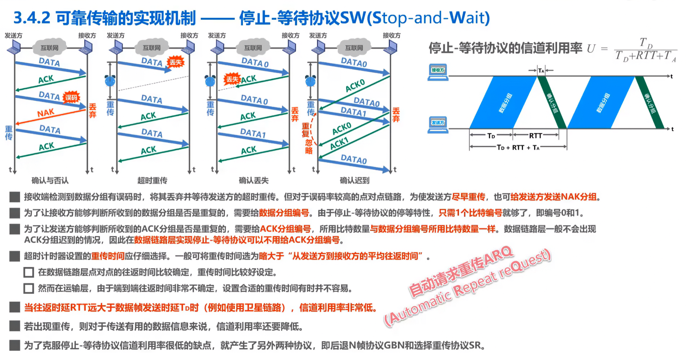
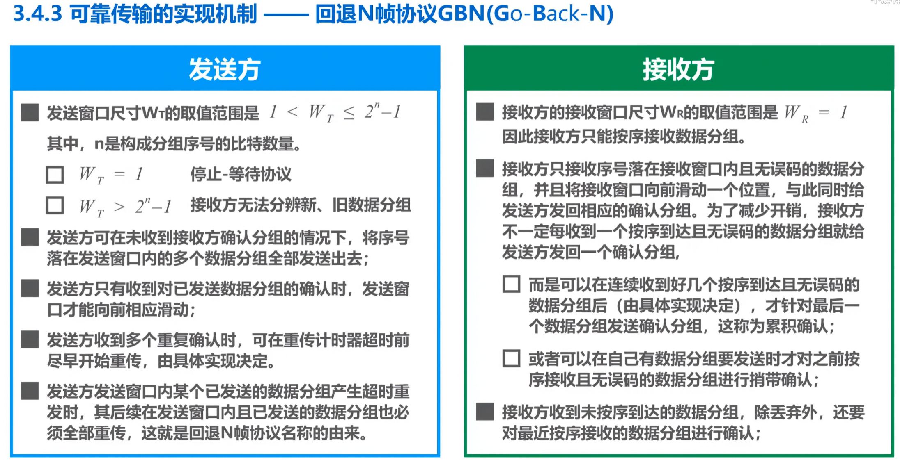

## 1. 可靠传输基本概念

### 1.1 传输差错类型

使用差错检测技术（如 CRC），接收方可以检测出帧在传输过程中是否产生误码。

**传输差错类型**：
- **比特差错**：数据中某些比特发生了翻转
- **分组丢失**：数据包在网络中丢失
- **分组失序**：数据包到达顺序与发送顺序不一致
- **分组重复**：同一数据包被重复传输

**可靠传输要求**：
- 有线链路：误码率低，通常不要求可靠传输（上层处理）
- 无线链路：误码率高，必须提供可靠传输服务

---

## 2. 停止-等待协议（Stop-and-Wait）



### 2.1 工作原理

**发送方**：
1. 发送一个数据分组
2. **暂停发送**，等待接收方的确认
3. 收到 ACK 后，发送下一个分组

**接收方**：
1. 收到数据分组后，进行差错检测
2. 若正确：发送 ACK 确认
3. 若错误：丢弃该分组，不发送任何响应

### 2.2 异常处理

**确认丢失**：
- 发送方超时未收到 ACK → 重新发送数据分组
- 接收方收到重复分组 → 丢弃但仍发送 ACK

**确认迟到**：
- 发送方超时重传 → 收到迟到的 ACK
- 发送方忽略迟到的 ACK，继续发送下一个分组

### 2.3 信道利用率

**公式**：
```
U = T_D / (T_D + RTT + T_A)

其中：
- T_D：发送数据分组的时间
- RTT：往返时延
- T_A：发送确认分组的时间
```

**特点**：
- 信道利用率低（大部分时间在等待确认）
- 适用于数据量小、实时性要求不高的场景

---

## 3. 回退N帧协议（Go-Back-N）



### 3.1 发送方工作原理

**窗口机制**：
- 发送窗口大小 W_T：1 < W_T ≤ 2^n - 1（n 为序号位数）
- 发送方可以在未收到确认的情况下，连续发送 W_T 个分组

**超时重传**：
- 若某个分组超时，**从该分组开始的所有已发送但未确认的分组都需要重传**
- 这就是"回退N帧"名称的由来

### 3.2 接收方工作原理

**接收窗口**：
- 接收窗口大小 W_R = 1（只能按序接收）
- 只接受序号在接收窗口内且无误码的分组

**累计确认**：
- 接收方不必每个分组都发送 ACK
- 可以在收到多个正确分组后，发送一个累计确认
- 例如：收到 0、1、2 后，发送 ACK 2 表示 0、1、2 都已正确接收

### 3.3 优缺点

**优点**：
- 实现简单
- 信道利用率比停止-等待协议高

**缺点**：
- 超时重传时，需要回退重传多个分组（即使后续分组已正确接收）
- 适用于误码率低的网络

---

## 4. 选择重传协议（Selective Repeat）


### 4.1 发送方工作原理

**窗口机制**：
- 发送窗口大小 W_T：1 < W_T ≤ 2^(n-1)
- 可以在未收到确认的情况下，连续发送 W_T 个分组

**超时重传**：
- 只重传超时的分组（不回退）
- 对已正确接收的分组发送确认

### 4.2 接收方工作原理

**接收窗口**：
- 接收窗口大小 W_R > 1（可以乱序接收）
- 接收方可以接受未按序到达但无误码的分组

**逐个确认**：
- 接收方对每个正确接收的分组单独发送 ACK
- 不使用累计确认

### 4.3 优缺点

**优点**：
- 只重传出错的分组，效率更高
- 适用于误码率较高的网络

**缺点**：
- 实现复杂
- 接收方需要缓存乱序到达的分组

### 4.4 三种协议对比

| 特性 | 停止-等待 | 回退N帧 | 选择重传 |
|------|----------|---------|---------|
| 发送窗口 | 1 | 1 < W_T ≤ 2^n - 1 | 1 < W_T ≤ 2^(n-1) |
| 接收窗口 | 1 | 1 | W_R > 1 |
| 确认方式 | 逐个确认 | 累计确认 | 逐个确认 |
| 重传方式 | 重传单个 | 回退重传 | 选择重传 |
| 实现复杂度 | 低 | 中 | 高 |

---

## 5. PPP 协议


### 5.1 PPP 帧格式

```
F(7E) | 地址(FF) | 控制(03) | 协议 | 信息 | FCS | F(7E)
```

**字段说明**：
- **F（标志字段）**：0x7E，帧定界符
- **地址字段**：0xFF（广播地址）
- **控制字段**：0x03
- **协议字段**：标识信息字段的内容类型
- **FCS**：帧校验序列（CRC 校验）

### 5.2 PPP 工作流程

**建立阶段**：
1. LCP（链路控制协议）协商链路参数
2. 认证阶段（可选）：PAP 或 CHAP
3. NCP（网络控制协议）协商网络层参数

**数据传输阶段**：
- 封装数据帧
- 透明传输（字节填充或比特填充）

**终止阶段**：
- LCP 关闭链路
- 释放连接

### 5.3 PPP 特点

- 简单可靠
- 支持多种网络层协议
- 适用于点对点链路（如拨号上网、PPPoE）

---

## 6. 总结

### 核心知识点

1. **停止-等待**：简单但效率低，信道利用率低
2. **回退N帧**：连续发送，累计确认，超时回退重传
3. **选择重传**：连续发送，逐个确认，选择性重传
4. **PPP**：点对点协议，简单可靠，支持多种网络层协议

### 选择依据

- 数据量小、实时性要求不高 → 停止-等待
- 误码率低的网络 → 回退N帧
- 误码率高的网络 → 选择重传
- 点对点链路 → PPP
