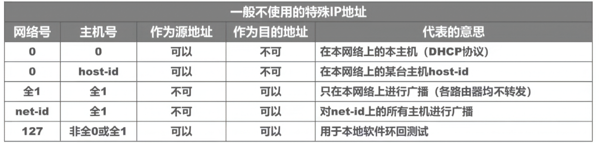

## 1. MAC 地址与多播

### 1.1 MAC 多播地址判断


**判断方法**：检查 MAC 地址第一字节的最低位（b0 位）：
- **b0 = 0**：单播地址（一对一通信）
- **b0 = 1**：多播地址（一对多通信）

**示例**：`07-E0-12-F6-2A-D8`
- 第一字节 `07` 的二进制为 `0000 0111`
- 最低位 b0 = 1 → 这是**多播地址**

### 1.2 IEEE 802 局域网 MAC 地址格式


**EUI-48 格式**（48 位 = 6 字节）：

| 字段 | 长度 | 说明 |
|------|------|------|
| OUI（组织唯一标识符） | 3 字节 | 由 IEEE 分配给厂商 |
| 网络接口标识符 | 3 字节 | 厂商自行分配 |

**第一字节的位含义**：
- **b0 位**：0 = 单播，1 = 多播
- **b1 位**：0 = 全球管理（厂商分配），1 = 本地管理

**地址数量**：2^47 ≈ 281 万亿个全球单播地址

---

## 2. VLAN 技术

### 2.1 IEEE 802.1Q 帧格式


**VLAN 标记结构**（插入 4 字节 VLAN 标签）：

```
目的MAC(6B) | 源MAC(6B) | VLAN标签(4B) | 类型(2B) | 数据(46-1500B) | FCS(4B)
```

**VLAN 标签字段**：
- **TPID**（2 字节）：0x8100，表示 802.1Q 帧
- **TCI**（2 字节）：包含优先级、CFI、VID

**VID（VLAN ID）**：
- 取值范围：0 ~ 4095（12 位）
- 有效范围：1 ~ 4094（0 和 4095 保留）
- 唯一标识以太网帧属于哪个 VLAN

**交换机处理**：
- **入向**：收到普通以太网帧 → 打标签（插入 4 字节 VLAN 标记）
- **出向**：转发前 → 去标签（删除 4 字节 VLAN 标记）

### 2.2 交换机端口类型

**三种端口类型**：

| 类型 | 说明 | PVID |
|------|------|------|
| Access | 连接终端设备，只属于一个 VLAN | 通常为 1 |
| Trunk | 连接交换机/路由器，可属于多个 VLAN | 默认为 1 |
| Hybrid | 华为特有，灵活配置 | 可自定义 |

### 2.3 Tagged 与 Untagged 帧

**Untagged Frame（普通数据帧）**：
- 终端设备（电脑、打印机）发出的原始以太网帧
- 不带任何 VLAN 标签，终端设备不认识 VLAN

**Tagged Frame（带标签的数据帧）**：
- 交换机之间传输时，在帧中插入 4 字节 VLAN Tag
- 明确标明该帧属于哪个 VLAN（VID）

### 2.4 PVID（Port VLAN ID）

**PVID 的核心作用**：给"无标签"的数据帧"贴标签"

**术语对照**：
- **思科**：称为 Native VLAN（本征 VLAN）
- **华为**：称为 Port VLAN ID（端口 VLAN ID）

**工作流程**：

**数据进入交换机（Ingress）**：
1. 收到 Untagged 数据帧
2. 查看端口 PVID 设置（假设 PVID=10）
3. 为数据帧打上 VLAN Tag，标记为 VLAN 10
4. 后续按 VLAN 10 成员处理和转发

**数据离开交换机（Egress）**：
1. 检查端口设置
2. 若端口允许该 VLAN 以 Untagged 方式送出 → **剥离 VLAN Tag** 再发送
3. 若端口允许该 VLAN 以 Tagged 方式送出 → **保留 VLAN Tag** 直接发送

### 2.5 Trunk 端口工作原理


**Trunk 端口特点**：
- 用于交换机之间或交换机与路由器互连
- 可以承载多个 VLAN 的流量
- 默认 PVID = 1

**发送处理**：
- 对 VID = PVID 的帧：**去标签**后转发
- 对 VID ≠ PVID 的帧：保留标签转发

**接收处理**：
- 收到未打标签的帧：根据端口 PVID 打标签
- 收到已打标签的帧：直接转发

---

## 3. IPv4 地址

### 3.1 IPv4 地址分类


**地址分类规则**（根据第一个十进制数）：

| 类别 | 第一字节范围 | 网络号长度 | 主机号长度 |
|------|-------------|-----------|-----------|
| A 类 | 1 ~ 126 | 8 位 | 24 位 |
| B 类 | 128 ~ 191 | 16 位 | 16 位 |
| C 类 | 192 ~ 223 | 24 位 | 8 位 |

**判断要点**：
- 网络号全 0：本网络本主机（DHCP）
- 主机号全 0：网络地址（不可指派）
- 主机号全 1：广播地址（不可指派）

### 3.2 特殊 IPv4 地址



| 地址类型 | 示例 | 用途 |
|---------|------|------|
| 网络号全 0 | 0.x.x.x | 本网络本主机（DHCP） |
| 主机号全 1 | x.x.x.255 | 本网络广播 |
| 网络号全 1 | 255.255.255.255 | 受限广播（路由器不转发） |
| 127.x.x.x | 127.0.0.1 | 本地环回测试 |

**环回测试**：通过"自发自收"方式验证本地协议栈，不经过网卡。

### 3.3 子网划分


**子网划分步骤**：

1. **确定子网掩码**：将 IP 地址与子网掩码进行 AND 运算
2. **计算网络地址**：IP & 子网掩码 = 网络地址
3. **计算广播地址**：网络地址 | (NOT 子网掩码) = 广播地址

**示例**：
- IP：180.80.77.55
- 子网掩码：255.255.252.0（/22）

**计算过程**：
```
IP：      180.80.0100 1101.0011 0111
掩码：    255.255.1111 1100.0000 0000
网络地址：180.80.0100 1100.0000 0000 = 180.80.76.0
广播地址：180.80.0100 1111.1111 1111 = 180.80.79.255
```

---

## 4. 总结

### 核心知识点

1. **MAC 多播**：第一字节最低位为 1
2. **VLAN**：802.1Q 帧插入 4 字节标签，VID 范围 1-4094
3. **端口类型**：Access（终端）、Trunk（交换机间）、Hybrid（灵活）
4. **Tagged/Untagged**：终端发 Untagged，交换机间发 Tagged
5. **PVID**：为 Untagged 帧打标签（入向），或剥离标签（出向）
6. **IPv4 分类**：A/B/C 类根据第一字节判断
7. **子网划分**：IP & 掩码 = 网络地址，网络地址 | (NOT 掩码) = 广播地址
