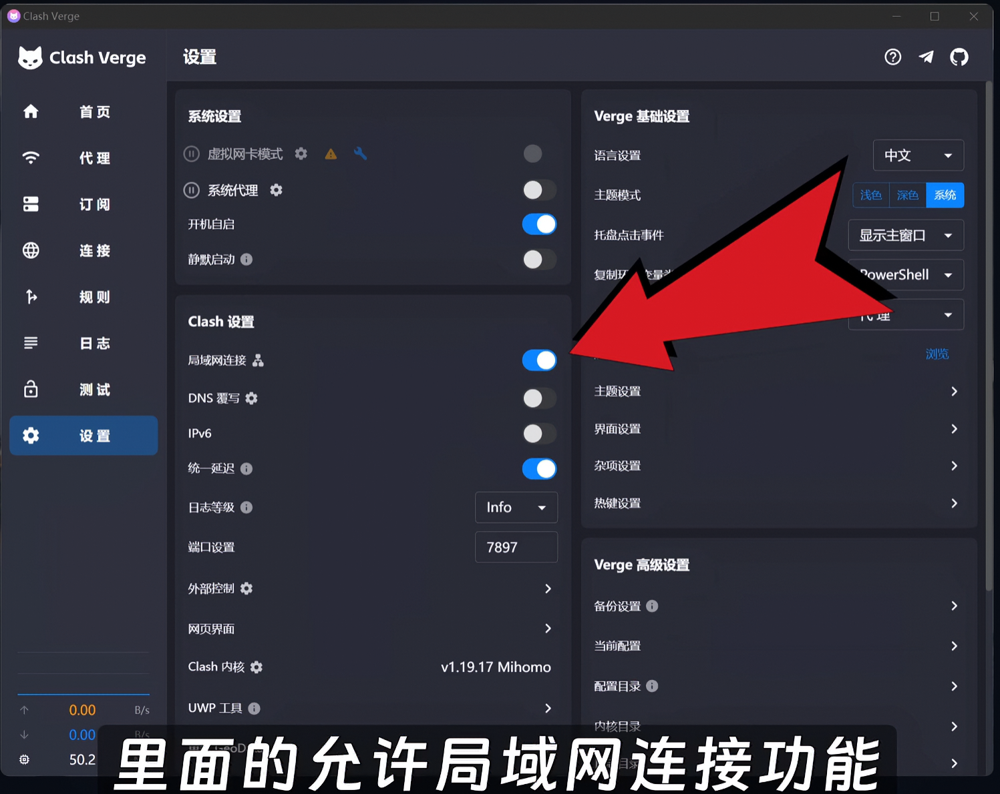
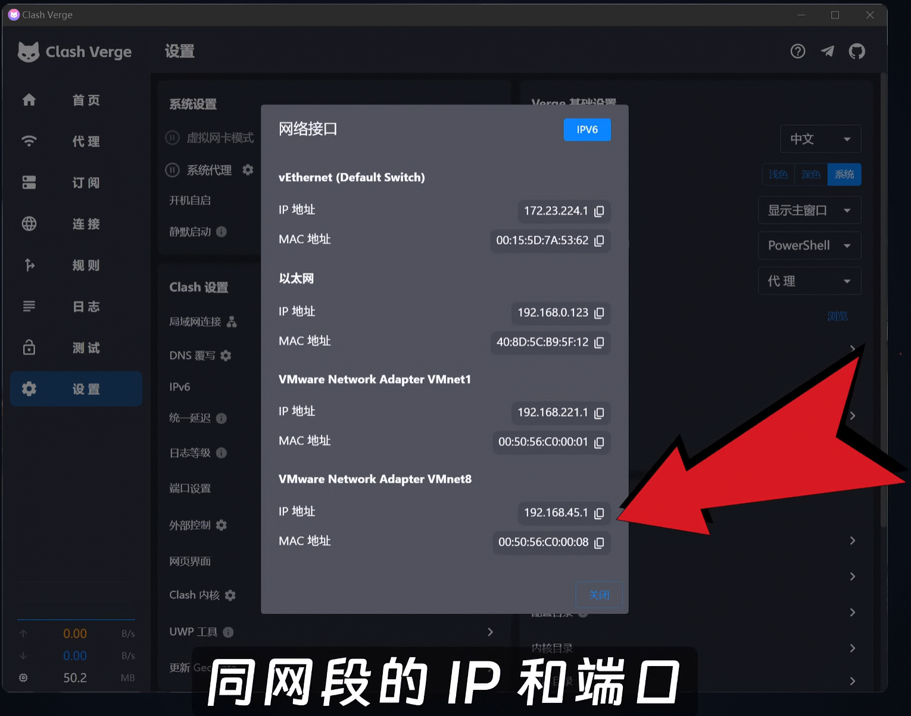
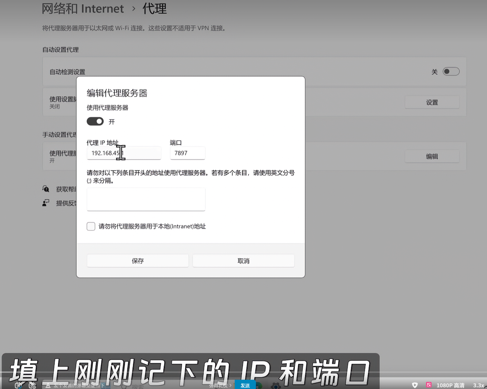

<!-- source: 博客备选笔记/让虚拟机直接使用主机的clash.md -->

这是 Windows 上实现**透明网关/全局路由**的方案，核心思路是：**让 Windows 热点的上游不是物理网卡，而是 Clash 的 TUN 虚拟网卡**。这样手机连上热点后无需任何代理设置，所有流量强制经过 TUN。

---

### 原理

Windows 自带热点的默认逻辑是：热点网卡 → 物理网卡（WiFi/以太网）→ 互联网。  
我们要改成：热点网卡 → **Clash TUN 虚拟网卡** → 互联网。

> ⚠️ **已知限制**：Clash Verge Rev 的 TUN 与 Windows ICS（网络共享）存在兼容性冲突，部分版本下同时开启会导致本机和热点设备都无法上网
> 
> 。以下方案在 Clash for Windows 时代被验证可行，在 Clash Verge Rev 上**可能需要多次尝试或特定版本**。

---

### 操作步骤

#### 1. 先开启 Clash Verge 的 TUN 模式

- 打开 Clash Verge → 设置 → 开启 **TUN 模式**
    
- 确保已安装服务模式（Service Mode），TUN 网卡正常创建（设备管理器中能看到如 `Meta Tunnel` 或 `Clash` 字样的虚拟网卡）
    
- 确认电脑本机可以正常翻墙
    

#### 2. 再开启 Windows 移动热点

- 设置 → 网络和 Internet → 移动热点 → 开启
    
- 记住热点名称和密码，**此时先不要连接手机**
    

#### 3. 关键：在 TUN 网卡上配置 ICS 共享

按 `Win + R`，输入 `ncpa.cpl` 回车，打开网络连接面板：

1. 找到 **Clash 的 TUN 虚拟网卡**（名称通常包含 `Meta Tunnel`、`Clash`、`mihomo` 或 `Wintun`）
    
2. 右键 → **属性** → 切换到 **共享** 选项卡
    
3. 勾选 **"允许其他网络用户通过此计算机的 Internet 连接来连接"**
    
4. 在 **"家庭网络连接"** 下拉框中，选择**刚才开启热点生成的网卡**（通常叫 `本地连接*`、`Microsoft Wi-Fi Direct Virtual Adapter` 或 `Local Area Connection`）
    
5. 确定保存
    

> **顺序很重要**：必须是 **先开 TUN → 再开热点 → 最后设置共享**。如果反过来，Windows 的 ICS 会与 TUN 冲突
> 
> 。

#### 4. 手机连接热点

- 手机直接连接电脑热点，**不需要设置任何代理**（不要填 IP 和端口）
    
- 打开浏览器测试，所有流量应已被 TUN 透明接管
