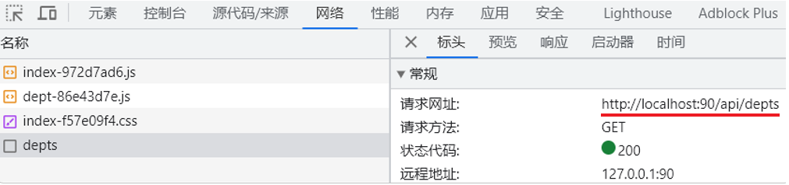
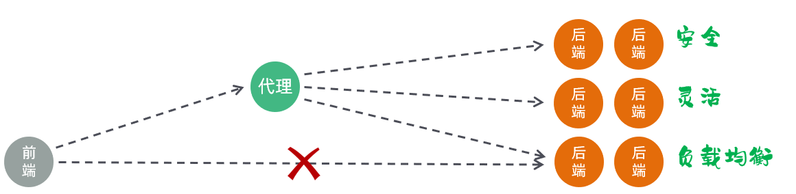
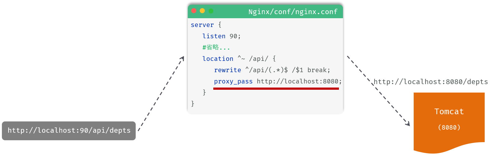
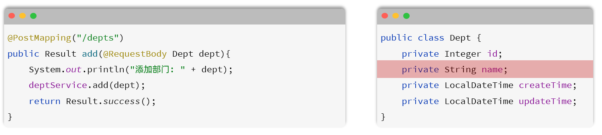
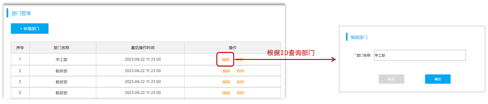
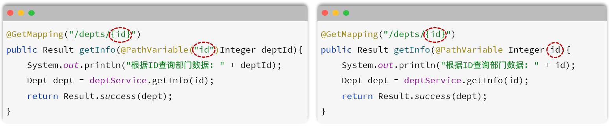
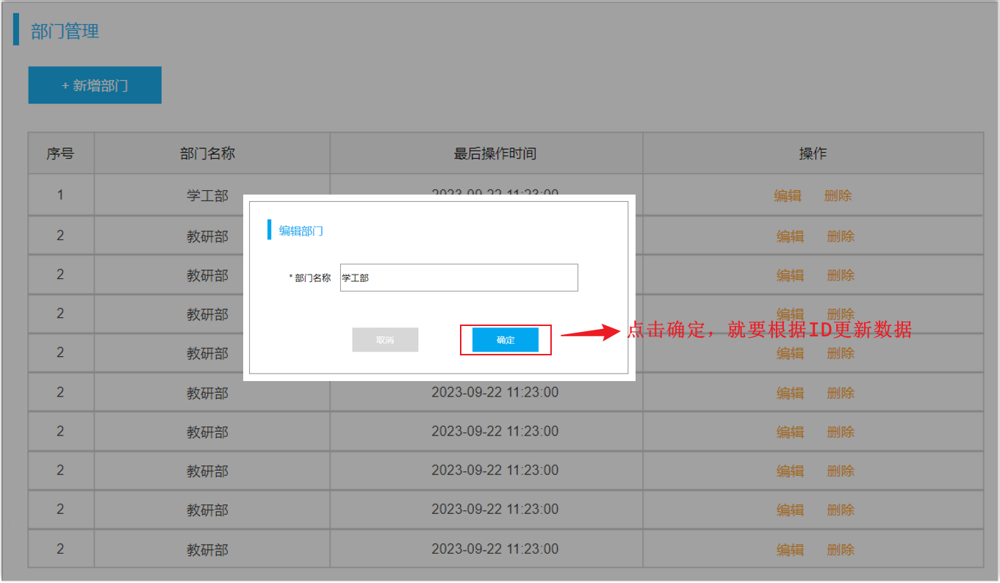
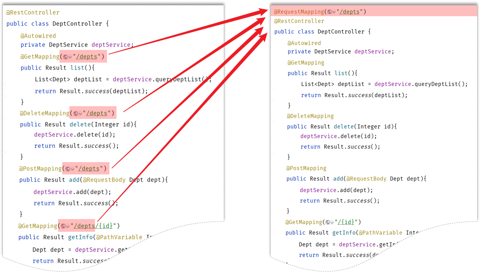

**什么是REST风格呢?**

- REST（Representational State Transfer），表述性状态转换，它是一种软件架构风格。

**传统URL风格如下：**

- http://localhost:8080/user/getById?id=1      GET：查询id为1的用户
- http://localhost:8080/user/saveUser            POST：新增用户
- http://localhost:8080/user/updateUser         POST：修改用户
- http://localhost:8080/user/deleteUser?id=1  GET：删除id为1的用户

**基于REST风格URL如下：**

- http://localhost:8080/users/1       GET：查询id为1的用户
- http://localhost:8080/users          POST：新增用户
- http://localhost:8080/users          PUT：修改用户
- http://localhost:8080/users/1       DELETE：删除id为1的用户

其中总结起来，就一句话：通过URL定位要操作的资源，通过HTTP动词(请求方式)来描述具体的操作。

在REST风格的URL中，通过四种请求方式，来操作数据的增删改查。 

- GET ：  查询
- POST ：新增
- PUT ：  修改
- DELETE ：删除

我们看到如果是基于REST风格，定义URL，URL将会**更加简洁、更加规范、更加优雅**。


介绍：Apifox是一款集成了Api文档、Api调试、Api Mock、Api测试的一体化协作平台。

作用：接口文档管理、接口请求测试、Mock服务。


1. #### 接口测试

经过测试，我们发现，现在我们其实是可以通过任何方式的请求来访问查询部门的这个接口的。 而在接口文档中，明确要求该接口的请求方式为GET，那么如何限制请求方式呢？

- 方式一：在controller方法的@RequestMapping注解中通过method属性来限定。

- 方式二：在controller方法上使用，@RequestMapping的衍生注解 @GetMapping。 该注解就是标识当前方法，必须以GET方式请求。

- 

- ```java
	@RestController
	public class DeptController {
	
	    @Autowired
	    private DeptService deptService;
	
	    /**
	     * 查询部门列表
	     */
	    @GetMapping("/depts")
	    public Result list(){
	        List<Dept> deptList = deptService.findAll();
	        return Result.success(deptList);
	    }
	}
	```

上述两种方式，在项目开发中，推荐使用第二种方式，简洁、优雅。 

- GET方式：@GetMapping
- POST方式：@PostMapping
- PUT方式：@PutMapping
- DELETE方式：@DeleteMapping

1. #### 数据封装

-  1<!-- 日志输出级别 -->2<root level="info">3    <!--输出到控制台-->4    <appender-ref ref="STDOUT" />5    <!--输出到文件-->6    <appender-ref ref="FILE" />7</root>XML
- 如果实体类属性名和数据库表查询返回的字段名不一致，不能自动封装。

 解决方案：

- 手动结果映射
- 起别名
- 开启驼峰命名

**3). 开启驼峰命名****(推荐)**

如果字段名与属性名符合驼峰命名规则，mybatis会自动通过驼峰命名规则映射。驼峰命名规则：   abc_xyz    =>   abcXyz

- 表中字段名：abc_xyz
- 类中属性名：abcXyz

在application.yml中做如下配置，开启开关。

```yaml
mybatis:
  configuration:
    map-underscore-to-camel-case: true
```

要使用驼峰命名前提是 实体类的属性 与 数据库表中的字段名严格遵守驼峰命名。


1. ### 前后端联调

2. #### 联调测试

3. #### 请求访问流程



1). 浏览器发起请求，请求的是localhost:90 ，那其实请求的是nginx服务器。

2). 在nginx服务器中呢，并没有对请求直接进行处理，而是将请求转发给了后端的tomcat服务器，最终由tomcat服务器来处理该请求。

这个过程就是通过nginx的反向代理实现的。 那为什么浏览器不直接请求后端的tomcat服务器，而是直接请求nginx服务器呢，主要有以下几点原因：



1). 安全：由于后端的tomcat服务器一般都会搭建集群，会有很多的服务器，把所有的tomcat暴露给前端，让前端直接请求tomcat，对于后端服务器是比较危险的。

2). 灵活：基于nginx的反向代理实现，更加灵活，后端想增加、减少服务器，对于前端来说是无感知的，只需要在nginx中配置即可。

3). 负载均衡：基于nginx的反向代理，可以很方便的实现后端tomcat的负载均衡操作。

具体的请求访问流程如下：



> 1. location：用于定义匹配特定uri请求的规则。
> 2. ^~ /api/：表示精确匹配，即只匹配以/api/开头的路径。
> 3. rewrite：该指令用于重写匹配到的uri路径。
> 4. proxy_pass：该指令用于代理转发，它将匹配到的请求转发给位于后端的指令服务器。


1. ## 删除部门

- **方案二：通过Spring提供的** **`@RequestParam`** **注解，将请求参数绑定给方法形参**

```java
@DeleteMapping("/depts")
public Result delete(@RequestParam("id") Integer deptId){
    System.out.println("根据ID删除部门: " + deptId);
    return Result.success();
}
```

`@RequestParam` 注解的value属性，需要与前端传递的参数名保持一致 。

@RequestParam注解required属性默认为true，代表该参数必须传递，如果不传递将报错。 如果参数可选，可以将属性设置为false。

- **方案三：如果请求参数名与形参变量名相同，直接定义方法形参即可接收。（省略@RequestParam）**

```java
@DeleteMapping("/depts")
public Result delete(Integer id){
    System.out.println("根据ID删除部门: " + deptId);
    return Result.success();
}
```

对于以上的这三种方案呢，我们**推荐第三种方案**。

1. ### 代码实现

**1). Controller层**

在 `DeptMapper`  中，增加 `delete` 方法，代码实现如下：

```java
/**
 * 根据id删除部门 - delete http://localhost:8080/depts?id=1
 */
@DeleteMapping("/depts")
public Result delete(Integer id){
    System.out.println("根据id删除部门, id=" + id);
    deptService.deleteById(id);
    return Result.success();
}
```

**2). Service层**

在 `DeptService` 中，增加 `deleteById` 方法，代码实现如下：

```java
/**
 * 根据id删除部门
 */
void deleteById(Integer id);
```

在 `DeptServiceImpl` 中，增加 `deleteById` 方法，代码实现如下：

```java
public void deleteById(Integer id) {
    deptMapper.deleteById(id);
}
```

**3). Mapper层**

在 `DeptMapper` 中，增加 `deleteById` 方法，代码实现如下：

```java
/**
 * 根据id删除部门
 */
@Delete("delete from dept where id = #{id}")
void deleteById(Integer id);
```

如果mapper接口方法形参只有一个普通类型的参数，`#{…}` 里面的属性名可以随便写，如：`#{id}`、`#{value}`。

对于 DML 语句来说，执行完毕，也是有返回值的，返回值代表的是增删改操作，影响的记录数，所以可以将执行 DML 语句的方法返回值设置为 Integer。 但是一般开发时，是不需要这个返回值的，所以也可以设置为void。

1. ## 新增部门

1. ### json参数接收

我们看到，在controller中，需要接收前端传递的请求参数。 那接下来，我们就先来看看在服务器端的Controller程序中，如何获取json格式的参数。 

- JSON格式的参数，通常会使用一个实体对象进行接收 。
- 规则：JSON数据的键名与方法形参对象的属性名相同，并需要使用`@RequestBody`注解标识。

前端传递的请求参数格式为json，内容如下：`{"name":"研发部"}`。这里，我们可以通过一个对象来接收，只需要保证对象中有name属性即可。



1. ### 代码实现

**1). Controller层**

在`DeptController`中增加方法save，具体代码如下：

```java
/**
 * 新增部门 - POST http://localhost:8080/depts   请求参数：{"name":"研发部"}
 */
@PostMapping("/depts")
public Result save(@RequestBody Dept dept){
    System.out.println("新增部门, dept=" + dept);
    deptService.save(dept);
    return Result.success();
}
```

**2). Service层**

在`DeptService`中增加接口方法save，具体代码如下：

```java
/**
 * 新增部门
 */
void save(Dept dept);
```

在`DeptServiceImpl`中增加save方法，完成添加部门的操作，具体代码如下：

```java
public void save(Dept dept) {
    //补全基础属性
    dept.setCreateTime(LocalDateTime.now());
    dept.setUpdateTime(LocalDateTime.now());
    //保存部门
    deptMapper.insert(dept);
}
```

**3). Mapper层**

```java
/**
 * 保存部门
 */
@Insert("insert into dept(name,create_time,update_time) values(#{name},#{createTime},#{updateTime})")
void insert(Dept dept);
```

如果在mapper接口中，需要传递多个参数，可以把多个参数封装到一个对象中。 在SQL语句中获取参数的时候，`#{...}` 里面写的是对象的属性名【注意是属性名，不是表的字段名】。

1. ## 修改部门

对于任何业务的修改功能来说，一般都会分为两步进行：查询回显、修改数据。

1. ### 查询回显

1. #### 需求

当我们点击 "编辑" 的时候，需要根据ID查询部门数据，然后用于页面回显展示。



1. #### 接口描述

参照参照课程资料中提供的接口文档。 `部门管理` -> `根据ID查询`

1. #### 路径参数接收

`/depts/1`，`/depts/2` 这种在url中传递的参数，我们称之为**路径参数**。 那么如何接收这样的路径参数呢 ？

路径参数：通过请求URL直接传递参数，使用{…}来标识该路径参数，需要使用 **`@PathVariable`**获取路径参数。如下所示：



如果路径参数名与controller方法形参名称一致，`@PathVariable`注解的value属性是可以省略的。

1. #### 代码实现

**1). Controller层**

在 `DeptController` 中增加 `getById`方法，具体代码如下：

```java
/**
 * 根据ID查询 - GET http://localhost:8080/depts/1
 */
@GetMapping("/depts/{id}")
public Result getById(@PathVariable Integer id){
    System.out.println("根据ID查询, id=" + id);
    Dept dept = deptService.getById(id);
    return Result.success(dept);
}
```

**2). Service层**

在 `DeptService` 中增加 `getById`方法，具体代码如下：

```java
/**
 * 根据id查询部门
 */
Dept getById(Integer id);
```

在 `DeptServiceImpl` 中增加 `getById`方法，具体代码如下：

```java
public Dept getById(Integer id) {
    return deptMapper.getById(id);
}
```

**3). Mapper层**

在 `DeptMapper` 中增加 `getById` 方法，具体代码如下：

```java
/**
* 根据ID查询部门数据
*/
@Select("select id, name, create_time, update_time from dept where id = #{id}")
Dept getById(Integer id);
```

1. ### 修改数据

1. #### 需求

查询回显回来之后，就可以对部门的信息进行修改了，修改完毕之后，点击确定，此时，就需要根据ID修改部门的数据。



通过接口文档，我们可以看到前端传递的请求参数是json格式的请求参数，在Controller的方法中，我们可以通过 `@RequestBody` 注解来接收，并将其封装到一个对象中。

1. #### 代码实现

**1). Controller层**

在 `DeptController` 中增加 `update` 方法，具体代码如下：

```java
/**
 * 修改部门 - PUT http://localhost:8080/depts  请求参数：{"id":1,"name":"研发部"}
 */
@PutMapping("/depts")
public Result update(@RequestBody Dept dept){
    System.out.println("修改部门, dept=" + dept);
    deptService.update(dept);
    return Result.success();
}
```

**2). Service层**

在 `DeptService` 中增加 `update` 方法。

```java
/**
 * 修改部门
 */
void update(Dept dept);
```

在 `DeptServiceImpl` 中增加 `update` 方法。 由于是修改操作，每一次修改数据，都需要更新updateTime。所以，具体代码如下：

```java
public void update(Dept dept) {
    //补全基础属性
    dept.setUpdateTime(LocalDateTime.now());
    //保存部门
    deptMapper.update(dept);
}
```

**3). Mapper层**

在 `DeptMapper` 中增加 `update` 方法，具体代码如下：

```java
/**
 * 更新部门
 */
@Update("update dept set name = #{name},update_time = #{updateTime} where id = #{id}")
void update(Dept dept);
```

1. #### @RequestMapping

到此呢，关于基本的部门的增删改查功能，我们已经实现了。  我们会发现，我们在 `DeptController` 中所定义的方法，所有的请求路径，都是 `/depts` 开头的，只要操作的是部门数据，请求路径都是 `/depts` 开头。 

那么这个时候，我们其实是可以把这个公共的路径 `/depts` 抽取到类上的，那在各个方法上，就可以省略了这个 `/depts` 路径。 代码如下：



一个完整的请求路径，应该是类上的 @RequestMapping 的value属性 + 方法上的 @RequestMapping的value属性。
