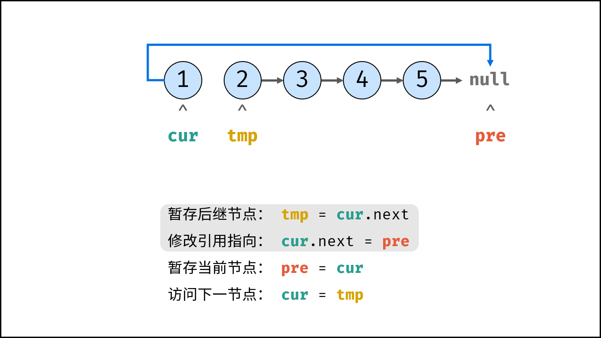
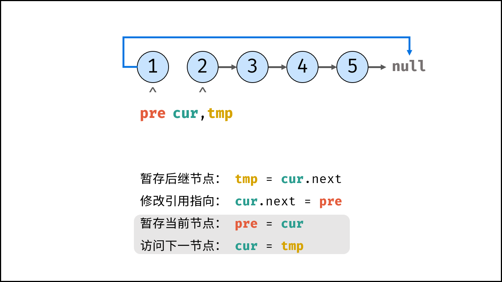
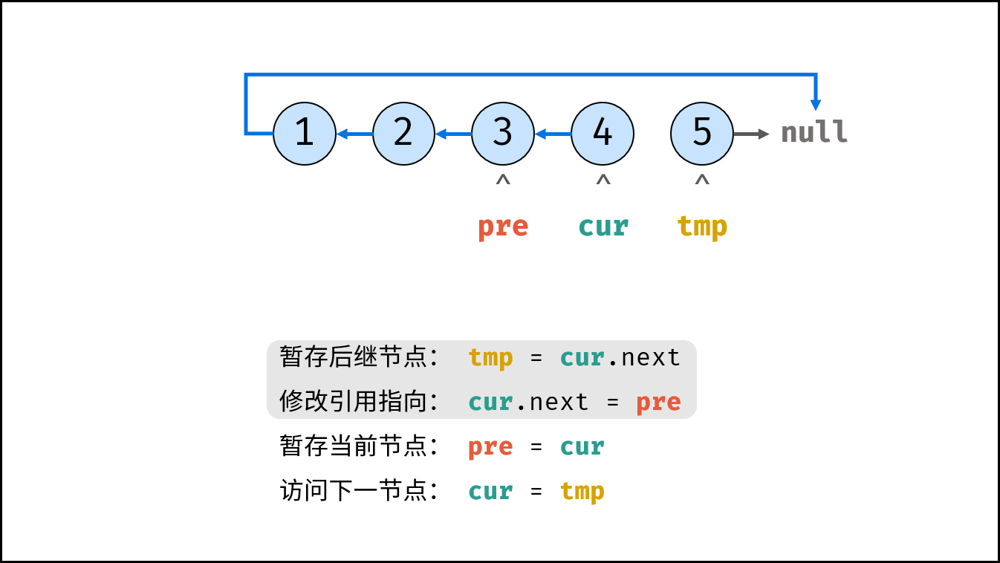

<!-- source: 25暑假/2/链表2.md -->
#### 1. 删除链表中的节点（LeetCode 237）

**问题本质**：在只给定被删除节点（非尾节点）的情况下，实现节点删除

```c++
void deleteNode(struct ListNode* node) {
        node->val = node->next->val;
        node->next = node->next->next;              
}
```

**要点**：

1. 无法访问前驱节点，因此采用"值替换+跳过"策略
2. 时间复杂度 O(1)，空间复杂度 O(1)
3. 特例处理：不能删除尾节点（题目保证）
4. 实际应用场景：内存受限环境中的快速删除

#### 2. 反转链表（LeetCode 206）

**1.迭代法**：

```c++
class Solution {
public:
    ListNode* reverseList(ListNode* head) {
        ListNode *cur = head, *pre = nullptr;
        while(cur != nullptr) {
            ListNode* tmp = cur->next; // 暂存后继节点 cur.next
            cur->next = pre;           // 修改 next 引用指向
            pre = cur;                 // pre 暂存 cur
            cur = tmp;                 // cur 访问下一节点
        }
        return pre;
    }
};
```

### [详细题解](https://leetcode.cn/problems/reverse-linked-list/solutions/2361282/206-fan-zhuan-lian-biao-shuang-zhi-zhen-r1jel)

**2.递归法**：

```c++
class Solution {
public:
    ListNode* reverseList(ListNode* head) {
        return recur(head, nullptr);           // 调用递归并返回
    }
private:
    ListNode* recur(ListNode* cur, ListNode* pre) {
        if (cur == nullptr) return pre;        // 终止条件
        ListNode* res = recur(cur->next, cur); // 递归后继节点
        cur->next = pre;                       // 修改节点引用指向
        return res;                            // 返回反转链表的头节点
    }
};
```

**对比**：

| 方法   | 时间复杂度 | 空间复杂度 | 适用场景         |
| ------ | ---------- | ---------- | ---------------- |
| 迭代法 | O(n)       | O(1)       | 内存敏感场景     |
| 递归法 | O(n)       | O(n)       | 代码简洁要求场景 |

**技巧**：

1. 三指针法（prev/curr/next）确保指针安全
2. 虚拟头节点简化边界处理
3. 循环不变式：每次迭代后prev指向已反转部分

#### 3. 设计链表（LeetCode 707）

**双向链表实现框架**：

```c++
typedef struct MyLinkedListNode {
    int val;
    struct MyLinkedListNode *prev;
    struct MyLinkedListNode *next;
} Node;

typedef struct {
    Node *head;  // 虚拟头节点
    Node *tail;  // 虚拟尾节点
    int size;    // 维护链表长度
} MyLinkedList;
```

**操作实现**：

1. **初始化**：

```c++
MyLinkedList* myLinkedListCreate() {
    MyLinkedList *obj = malloc(sizeof(MyLinkedList));
    obj->head = malloc(sizeof(Node));
    obj->tail = malloc(sizeof(Node));
    obj->head->next = obj->tail;
    obj->tail->prev = obj->head;
    obj->size = 0;
    return obj;
}
```

1. **插入节点**：

```c++
void addAtIndex(MyLinkedList* obj, int index, int val) {
    if (index < 0 || index > obj->size) return;
    
    // 定位到插入位置前驱节点
    Node *prevNode = obj->head;
    for (int i = 0; i < index; i++) 
        prevNode = prevNode->next;
    
    // 创建并连接新节点
    Node *newNode = malloc(sizeof(Node));
    newNode->val = val;
    newNode->prev = prevNode;
    newNode->next = prevNode->next;
    
    // 更新指针
    prevNode->next->prev = newNode;
    prevNode->next = newNode;
    obj->size++;
}
```

1. **删除节点**：

```c++
void deleteAtIndex(MyLinkedList* obj, int index) {
    if (index < 0 || index >= obj->size) return;
    
    // 定位到待删除节点
    Node *delNode = obj->head->next;
    for (int i = 0; i < index; i++)
        delNode = delNode->next;
    
    // 更新指针
    delNode->prev->next = delNode->next;
    delNode->next->prev = delNode->prev;
    
    free(delNode);  // 关键：释放内存
    obj->size--;
}
```

**设计原则**：

1. **虚拟头尾节点**：统一处理边界情况
2. **size维护**：避免多余遍历（时间复杂度优化）
3. **指针安全**：每次操作前检查NULL
4. **内存管理**：delete时释放节点内存

#### 4. 双链表高级操作

**链表逆序**：

```c++
void reverseList(MyLinkedList* obj) {
    if (obj->size < 2) return;
    
    Node *current = obj->head->next;
    while (current != obj->tail) {
        // 交换prev/next指针
        Node *temp = current->next;
        current->next = current->prev;
        current->prev = temp;
        
        current = temp;
    }
    
    // 更新头尾连接
    Node *temp = obj->head->next;
    obj->head->next = obj->tail->prev;
    obj->tail->prev = temp;
    
    // 修复边界指针
    obj->head->next->prev = obj->head;
    obj->tail->prev->next = obj->tail;
}
```

**有序链表合并**（迭代法）：

```c++
MyLinkedList* mergeTwoLists(MyLinkedList* l1, MyLinkedList* l2) {
    MyLinkedList *merged = myLinkedListCreate();
    Node *p1 = l1->head->next;
    Node *p2 = l2->head->next;
    
    while (p1 != l1->tail && p2 != l2->tail) {
        if (p1->val <= p2->val) {
            addAtTail(merged, p1->val);
            p1 = p1->next;
        } else {
            addAtTail(merged, p2->val);
            p2 = p2->next;
        }
    }
    
    // 添加剩余元素
    while (p1 != l1->tail) {
        addAtTail(merged, p1->val);
        p1 = p1->next;
    }
    while (p2 != l2->tail) {
        addAtTail(merged, p2->val);
        p2 = p2->next;
    }
    
    return merged;
}
```

**最佳实践**：

1. 逆序操作中同步更新prev/next指针
2. 合并操作使用双指针+尾插法
3. 虚拟头节点处理空链表情况
4. 递归合并注意栈溢出风险

#### 5. 扁平化多级双向链表（LeetCode 430）

**DFS解法**：

```c++
struct Node* flatten(struct Node* head) {
    struct Node* curr = head;
    while (curr) {
        if (curr->child) {
            // 保存后继节点
            struct Node* next = curr->next;
            
            // 递归扁平化child
            struct Node* child = flatten(curr->child);
            curr->child = NULL;
            
            // 连接child链表
            curr->next = child;
            child->prev = curr;
            
            // 找到child链表的尾部
            while (child->next) 
                child = child->next;
            
            // 连接原后继节点
            child->next = next;
            if (next) next->prev = child;
        }
        curr = curr->next;
    }
    return head;
}
```

**迭代优化**：

```c++
struct Node* flatten(struct Node* head) {
    struct Node* curr = head;
    while (curr) {
        if (curr->child) {
            struct Node* next = curr->next;
            struct Node* child = curr->child;
            
            // 连接child
            curr->next = child;
            child->prev = curr;
            curr->child = NULL;
            
            // 找到child尾部
            while (child->next)
                child = child->next;
            
            // 连接原后继
            child->next = next;
            if (next) next->prev = child;
        }
        curr = curr->next;
    }
    return head;
}
```

**关键点**：

1. 深度优先处理嵌套结构
2. 三步操作：保存next→处理child→重新连接
3. 时间复杂度 O(n)，空间复杂度 O(深度)
4. 注意child指针置空防止循环引用
