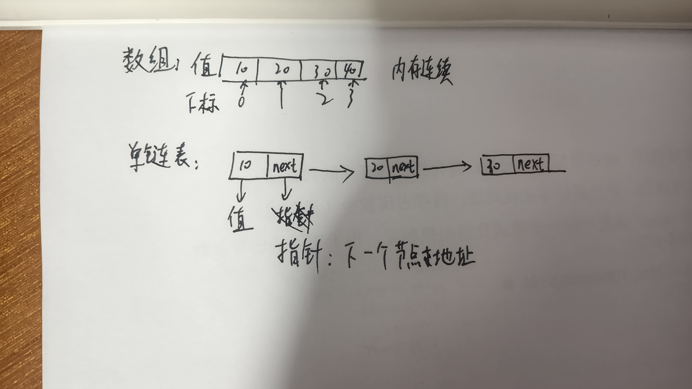

<!-- source: 25暑假/3/链表3.md -->

以下是针对链表相关问题的分步解答，包含图示说明和代码实现：

---

### **（1）链表 vs 数组存储结构区别**

#### 图示说明：

```plaintext
数组内存布局：
+---+---+---+---+---+
| 1 | 2 | 3 | 4 | 5 |  连续内存块，通过下标直接访问
+---+---+---+---+---+
  ↑   ↑   ↑   ↑   ↑
 基地址+偏移量

链表内存布局：
[1|→]→[2|→]→[3|→]→[4|→]→[5|→]→NULL
 ↑      ↑      ↑      ↑      ↑
 0x100  0x200  0x300  0x400  0x500 （分散内存地址）
```

#### 关键区别：
| 特性          | 数组                     | 链表                     |
|---------------|--------------------------|--------------------------|
| 内存连续性    | 连续                     | 非连续                   |
| 访问方式      | O(1)随机访问             | O(n)顺序访问             |
| 插入/删除成本 | O(n)需要移动元素         | O(1)修改指针             |
| 扩容          | 需重新分配内存           | 动态增加节点             |

---

### **（2）删除链表中第一个值为5的元素**
#### 代码实现（C++）：
```cpp
struct ListNode {
    int val;
    ListNode *next;
    ListNode(int x) : val(x), next(nullptr) {}
};

void deleteFirst5(ListNode* head) {
    ListNode *dummy = new ListNode(0);
    dummy->next = head;
    ListNode *cur = dummy;
    
    while (cur->next) {
        if (cur->next->val == 5) {
            ListNode *tmp = cur->next;
            cur->next = cur->next->next;
            delete tmp;  // 防止内存泄漏
            break;       // 只删除第一个
        }
        cur = cur->next;
    }
}
```

#### 操作流程：

1. 创建虚拟头节点处理头节点删除情况
2. 遍历找到第一个值为5的节点前驱
3. 修改指针跳过目标节点并释放内存

---

### **（3）删除链表中所有值为5的元素**

#### 代码实现（C++）：

```cpp
void deleteAll5s(ListNode* head) {
    ListNode *dummy = new ListNode(0);
    dummy->next = head;
    ListNode *cur = dummy;
    
    while (cur->next) {
        if (cur->next->val == 5) {
            ListNode *tmp = cur->next;
            cur->next = cur->next->next;
            delete tmp;
        } else {
            cur = cur->next;  // 只有不删除时才移动
        }
    }
}
```

- 不移动指针当删除节点时（避免跳过连续5）
- 使用`while (cur->next)`确保不会访问空指针

---

### **LeetCode 430 扁平化多级双向链表**

#### 解题思路：

深度优先搜索
思路与算法

当我们遍历到某个节点 node 时，如果它的 child 成员不为空，那么我们需要将 child 指向的链表结构进行扁平化，并且插入 node 与 node 的下一个节点之间。

因此，我们在遇到 child 成员不为空的节点时，就要先去处理 child 指向的链表结构，这就是一个「深度优先搜索」的过程。当我们完成了对 child 指向的链表结构的扁平化之后，就可以「回溯」到 node 节点。

为了能够将扁平化的链表插入 node 与 node 的下一个节点之间，我们需要知道扁平化的链表的最后一个节点 last，随后进行如下的三步操作：

将 node 与 node 的下一个节点 next 断开：

将 node 与 child 相连；

将 last 与 next 相连。

这样一来，我们就可以将扁平化的链表成功地插入。

```plaintext
原始结构：
 1---2---3---4---5---6--NULL
         |
         7---8---9---10--NULL
             |
             11--12--NULL

扁平化后：
1-2-3-7-8-11-12-9-10-4-5-6-NULL
```

#### DFS

```c++
class Solution {
private:
    // 递归辅助函数
    Node* dfs(Node* node) {
        Node* cur = node;
        Node* last = nullptr; // 记录链表的最后一个节点

        while (cur) {
            Node* next = cur->next;//Node* next声明一个局部变量保存这个下一个节点的地址  提前保存 next是因为后续处理可能会修改 cur->next的值
            
            // 如果有子节点，先处理子链表
            if (cur->child) {
                Node* child_last = dfs(cur->child); // 递归处理子链表
                //child是指向下级链表头节点的指针
                next = cur->next; // 重新获取next，因为可能在递归中改变
                
                // 将当前节点与子链表连接
                cur->next = cur->child;
                cur->child->prev = cur;
                
                // 如果当前节点有下一个节点，将子链表末尾与它连接
                if (next) {
                    child_last->next = next;
                    next->prev = child_last;
                }
                
                cur->child = nullptr; // 清空child指针
                last = child_last;    // 更新最后节点为子链表的最后节点
            } 
            else {
                last = cur; // 没有子节点，当前节点就是最后节点
            }
            
            cur = next; // 移动到下一个节点
        }
        
        return last; // 返回处理后的链表最后一个节点
    }

public:
    Node* flatten(Node* head) {
        dfs(head); // 调用递归函数
        return head;
    }
};
```


#### 代码实现（递归法）：

```cpp
Node* flatten(Node* head) {
    Node *cur = head;
    while (cur) {
        if (cur->child) {
            Node *next = cur->next;
            Node *child = flatten(cur->child);
            
            cur->next = child;
            child->prev = cur;
            cur->child = nullptr;
            
            while (cur->next) cur = cur->next;
            cur->next = next;
            if (next) next->prev = cur;
        }
        cur = cur->next;
    }
    return head;
}
```
