<!-- source: 25暑假/4/计算机网络/OSI.md -->
## 1. OSI七层模型

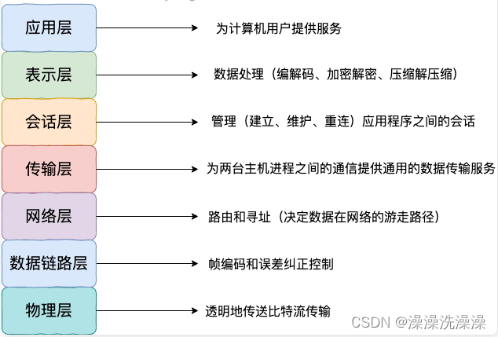

OSI定义了网络互连的七层框架，即ISO开放互连系统参考模型。

- 应用层（Application Layer）：这是网络体系结构中的最顶层，**提供用户接口和应用程序之间的通信服务**。在这一层，用户可以访问各种网络应用程序，如电子邮件、文件传输和远程登录。
- 表示层（Presentation Layer）：该层**负责数据的格式化、加密和压缩**，以确保数据在不同系统之间的交换是有效的和安全的。它还提供了数据格式转换和语法转换的功能。
- 会话层（Session Layer）：会话层**管理应用程序之间的通信会话**，负责建立、维护和终止会话。它还提供了数据的同步和检查点恢复功能，以确保通信的完整性和持续性。
- 传输层（Transport Layer）：传输层**为应用程序提供端到端的数据传输服务**，负责数据的分段、传输控制、错误恢复和流量控制。它主要使用 TCP（传输控制协议）和 UDP（用户数据报协议）来实现这些功能。
- 网络层（Network Layer）：网络层**负责数据包的路由和转发**，以及**网络中的寻址和拥塞控制**。它选择最佳的路径来传输数据包，以确保它们能够从源主机到目标主机进行传输。
- 数据链路层（Data Link Layer）：数据链路层**提供点对点的数据传输服务**，负责将原始比特流转换为数据帧，并检测和纠正传输中出现的错误。它还控制访问物理媒介的方式，以及数据帧的传输和接收。
- 物理层（Physical Layer）：物理层**在物理媒介上传输原始比特流**，定义了连接主机的硬件设备和传输媒介的规范。它确保比特流能够在网络中准确地传输，例如通过以太网、光纤和无线电波等媒介。

## 2. TCP/IP四层模型

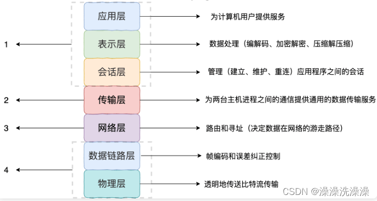

- 应用层（Application Layer）类似于 OSI 模型中的应用层，负责处理用户与网络应用程序之间的通信。它包括诸如 HTTP、FTP、SMTP 等协议，用于实现不同类型的网络服务和应用。
- 传输层（Transport Layer）：与 OSI 模型中的传输层相对应，提供端到端的数据传输服务。在 TCP/IP 模型中，主要有两个协议：TCP（传输控制协议）和 UDP（用户数据报协议），用于确保可靠的数据传输和简单的数据传输。
- 网络层（Internet Layer）：相当于 OSI 模型中的网络层，负责数据包的路由和转发。它使用 IP（Internet Protocol）协议来定义数据包的传输路径，并处理不同网络之间的通信。
- 网络接口层（Link Layer）：与 OSI 模型中的数据链路层和物理层相对应，负责管理网络硬件设备和物理媒介之间的通信。它包括以太网、Wi-Fi、蓝牙等各种物理层和数据链路层协议。

**应用层常见协议**

- HTTP（HyperText Transfer Protocol）：用于在客户端和服务器之间传输超文本数据，通常用于 Web 浏览器和 Web 服务器之间的通信。
- FTP（File Transfer Protocol）：用于在客户端和服务器之间传输文件，支持上传和下载文件的功能。
- SMTP（Simple Mail Transfer Protocol）：用于在邮件服务器之间传输电子邮件，负责发送邮件。
- POP3（Post Office Protocol version 3）：用于从邮件服务器上下载邮件到本地计算机，负责接收邮件。
- IMAP（Internet Message Access Protocol）：也是用于接收邮件的协议，与 POP3 类似，但提供了更丰富的功能，如在服务器上管理邮件等。
- DNS（Domain Name System）：用于将域名解析为对应的 IP 地址，从而实现域名和 IP 地址之间的映射。
- HTTPS（HyperText Transfer Protocol Secure）：是 HTTP 的安全版本，通过 SSL/TLS 加密传输数据，保证通信过程中的安全性。
- SSH（Secure Shell）：用于远程登录和执行命令，提供了加密的网络连接，保证了通信的安全性。
- SNMP（Simple Network Management Protocol）：用于网络设备之间的管理和监控，可以实现对网络设备的远程配置和监控。
- Telnet：用于远程登录和执行命令，类似于 SSH，但不提供加密功能，通信数据不安全。

**传输层常见协议**

- TCP（Transmission Control Protocol）：提供可靠的、面向连接的数据传输服务，确保数据的可靠性、顺序性和完整性。TCP适用于对数据传输质量要求较高的场景，如文件传输、网页浏览等。
- UDP（User Datagram Protocol）：提供无连接的数据传输服务，不保证数据的可靠性，也不保证数据的顺序性和完整性。UDP适用于实时性要求较高、对数据传输质量要求不那么严格的场景，如音视频传输、在线游戏等。

**网络层常见协议**

- IP（Internet Protocol）：是互联网中最基本的协议，用于在网络中传输数据包。IP协议定义了数据包的格式、寻址方式和路由选择等信息，是整个互联网的基础。
- ICMP（Internet Control Message Protocol）：用于在IP网络中传递控制消息和错误信息。ICMP通常用于网络设备之间的通信，如路由器和主机之间的通信，以及用于检测网络连通性和故障诊断。
- ARP（Address Resolution Protocol）：用于将IP地址映射为MAC地址（物理地址）。ARP协议在局域网内部使用，通过发送ARP请求获取目标设备的MAC地址，从而实现数据包的传输。
- RARP（Reverse Address Resolution Protocol）：与ARP相反，用于将MAC地址映射为IP地址。RARP协议通常用于无盘工作站等设备，可以根据MAC地址获取对应的IP地址。
- IPv6（Internet Protocol version 6）：是IP协议的下一代版本，用于解决IPv4地址空间不足的问题。IPv6采用128位地址长度，提供了更大的地址空间，支持更多的设备连接到互联网。

**网络接口层常见协议**

- 以太网协议（Ethernet）：是一种常见的局域网技术，使用MAC地址进行帧的传输和接收。
- 无线局域网协议（Wi-Fi）：用于无线局域网的数据传输，通常基于IEEE 802.11标准。
- 点对点协议（PPP）：用于建立点对点连接的协议，通常用于拨号连接和虚拟专用网（VPN）等场景。
- 数据链路层交换协议（DLC）：用于在数据链路层进行数据交换和管理的协议，如HDLC、SLIP和PPP等。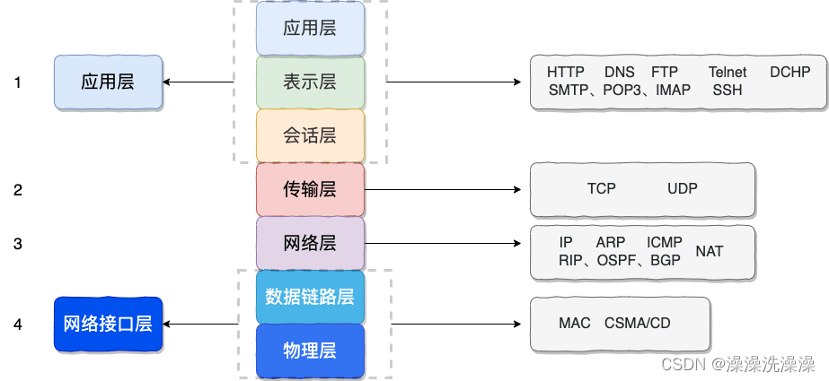

 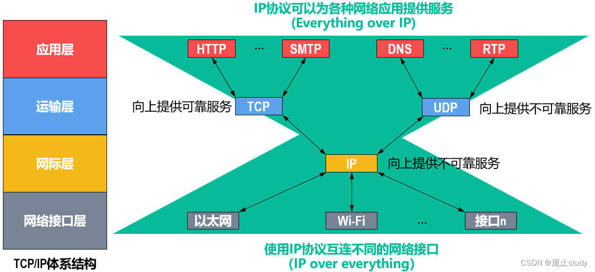

>为什么要叫做TCP/IP体系结构？
由于TCP/IP体系结构中包含有大量的协议，而IP协议和TCP协议是其中非常重要的两个协议，因此用TCP和IP这两个协议来表示整个协议大家族，常称为TCP/IP协议族。

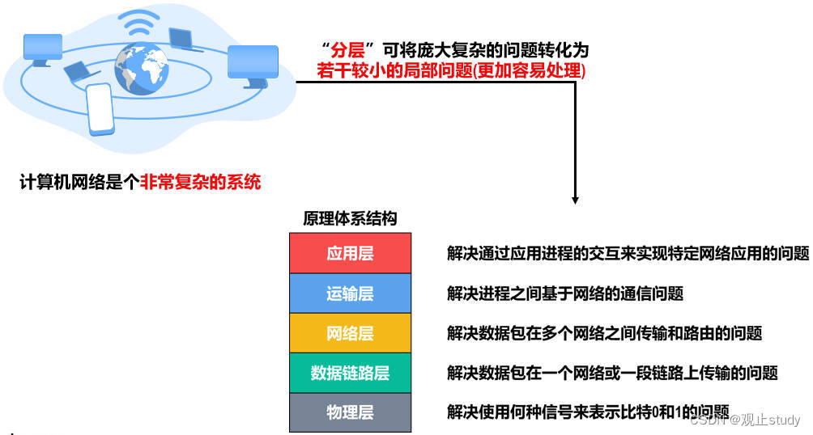

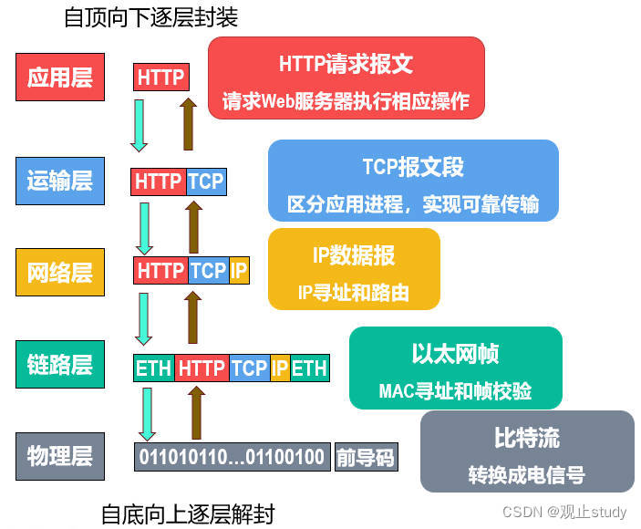

## 3.专用术语

计算机网络体系结构中有很多的专用术语，以下将其中**最具有代表性的三个**作为分类名称，它们分别是**实体、协议、服务**。这些专用术语来源于OSI的七层体系结构，但也适用于TCP/IP的四层体系结构和五层的原理体系结构。

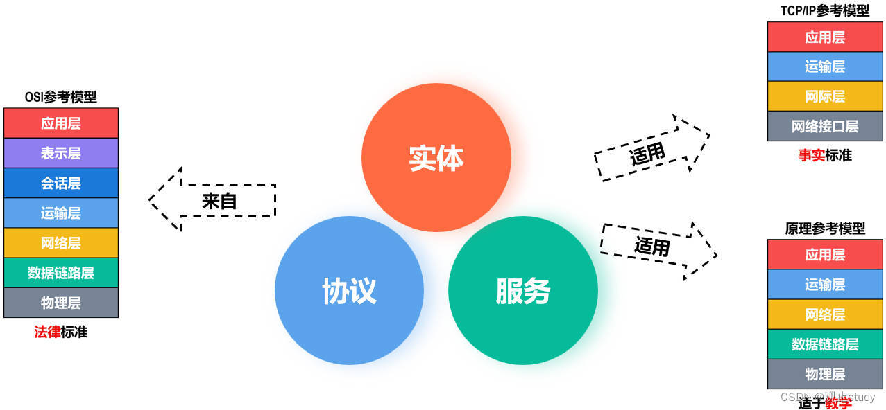

#### (1) 实体

- 实体是指**任何可发送或接收信息的硬件或软件进程**。
- 对等实体是指通信双方**相同层次中的实体**。

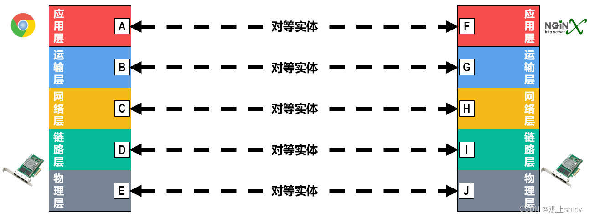

#### (2) 协议

协议是**控制两个对等实体在“水平方向” 进行“逻辑通信”的规则的集合**。

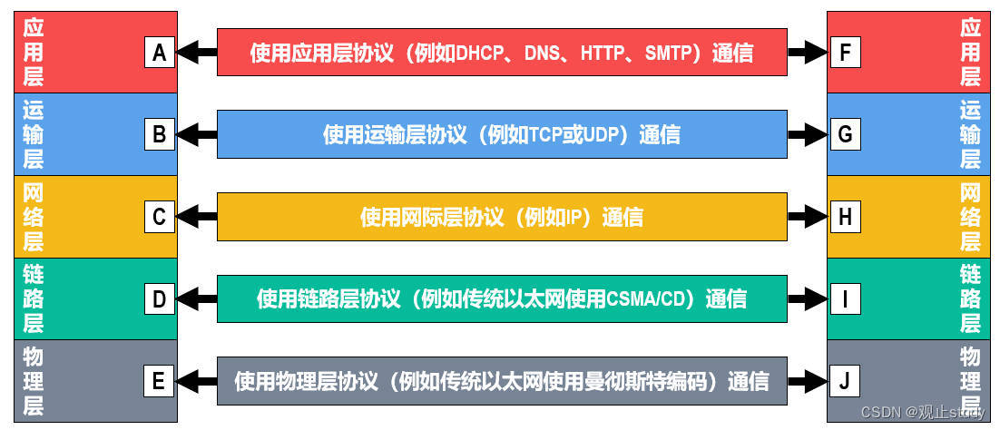

> 为什么叫逻辑通信呢？
>
> 这种通信其实并不存在，它只是我们假设出来的一种通信，这样做的目的是方便我们单独研究网络体系结构某一层时不用考虑其他层。

协议有三大要素：**语法、语义、同步**。

1）**语法用来定义通信双方所交换信息的格式**。例如下述IPv4数据报的首部格式，其中的小格子称为字段或域，数字表示字段的长度，单位为比特，语法就是定义了这些小格子的长度和先后顺序。

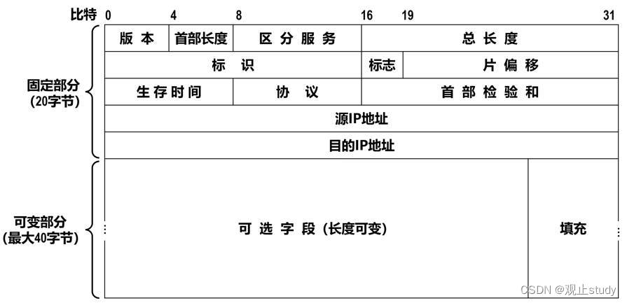

2）**语义用来定义通信双方所要完成的操作**。例如主机给Web服务器发送一个HTTP的GET请求报文，Web服务器收到请求报文后执行相应的操作，然后给主机发送HTTP响应报文，主机收到响应报文后，对其进行解析和渲染显示。

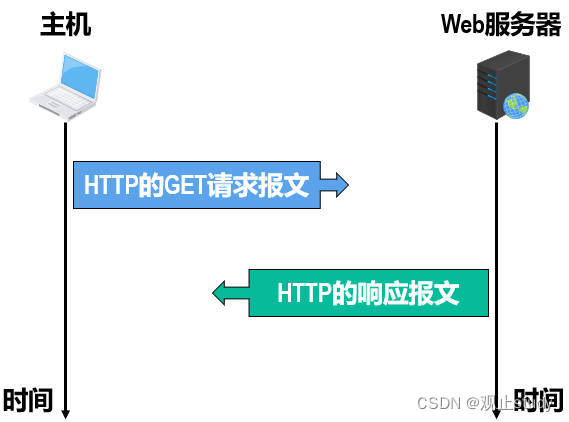

3）**同步用来定义通信双方的时序关系**。例如上述必须由主机首先发送HTTP的GET请求报文给Web服务器，Web服务器收到主机发来的GET请求报文后，才可能给主机发送响应的HTTP响应报文。

#### (3) 服务

在协议的控制下，两个对等实体在水平方向的逻辑通信使得**本层能够向上一层提供服务**。要实现本层协议，还**需要使用下面一层所提供的服务**。

**上层要使用下层所提供的服务，必须通过与下层交换一些命令，这些命令称为服务原语**。

在同一系统中**相邻两层的实体交换信息的逻辑接口**称为`服务访问点SAP`，它被**用于区分不同的服务类型**。帧的“类型”字段、IP数据报的“协议”字段，TCP报文段或UDP用户数据报的“端口号”字段都是SAP。

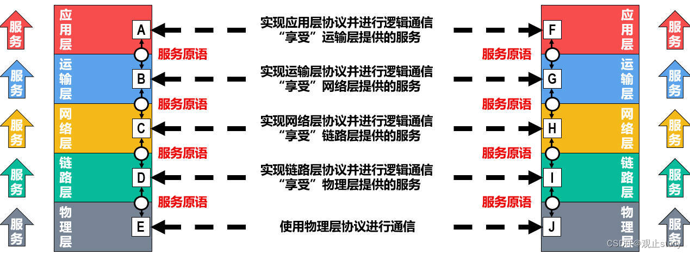

从上图可以看出，**协议是“水平”的，而服务是“垂直”的**。实体看得见下层提供的服务，但并不知道实现该服务的具体协议。**下层的协议对上层的实体是“透明”的**。

在计算机网络体系结构中，通信双方交互的数据包也有专门的术语：

- **对等层次之间**传送的数据包称为该层的**协议数据单元**（Protocol Data Unit，`PDU`）。
- **同一系统内层与层之间**交换的数据包称为**服务数据单元**（Service Data Unit，`SDU`）。

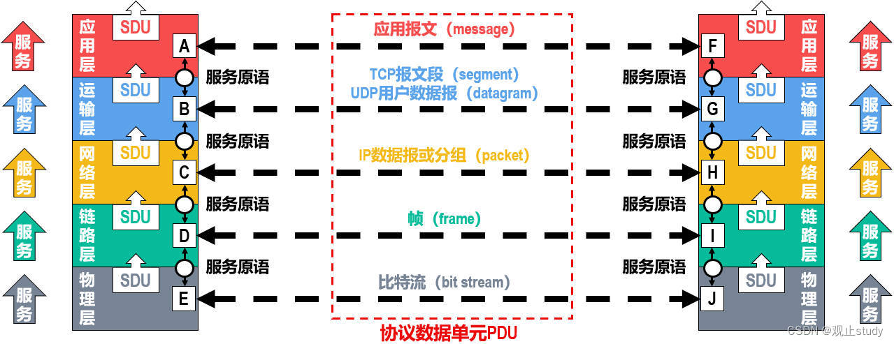
