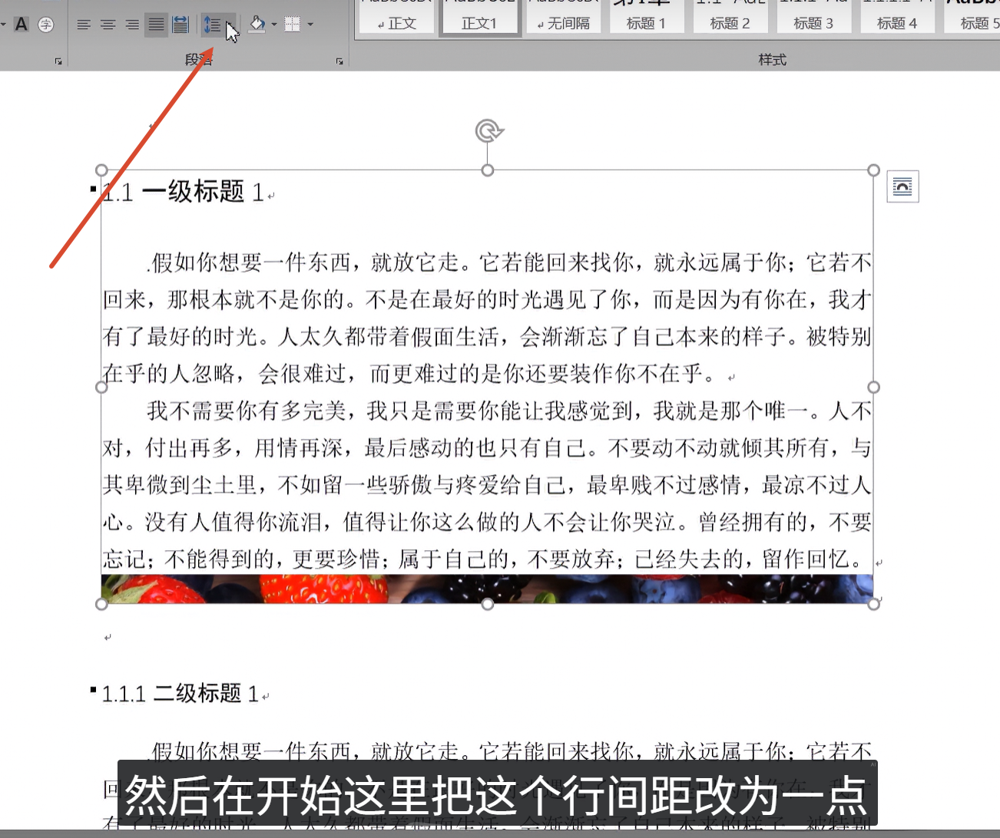
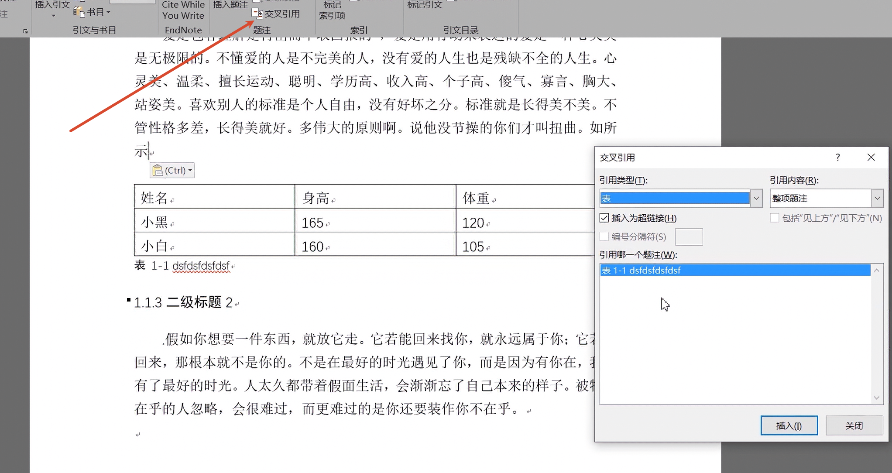
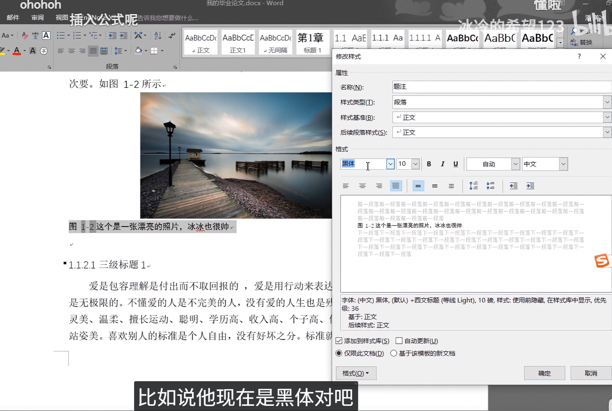
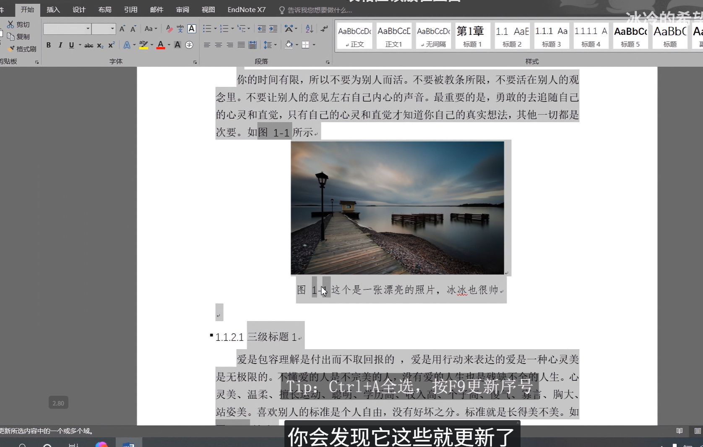
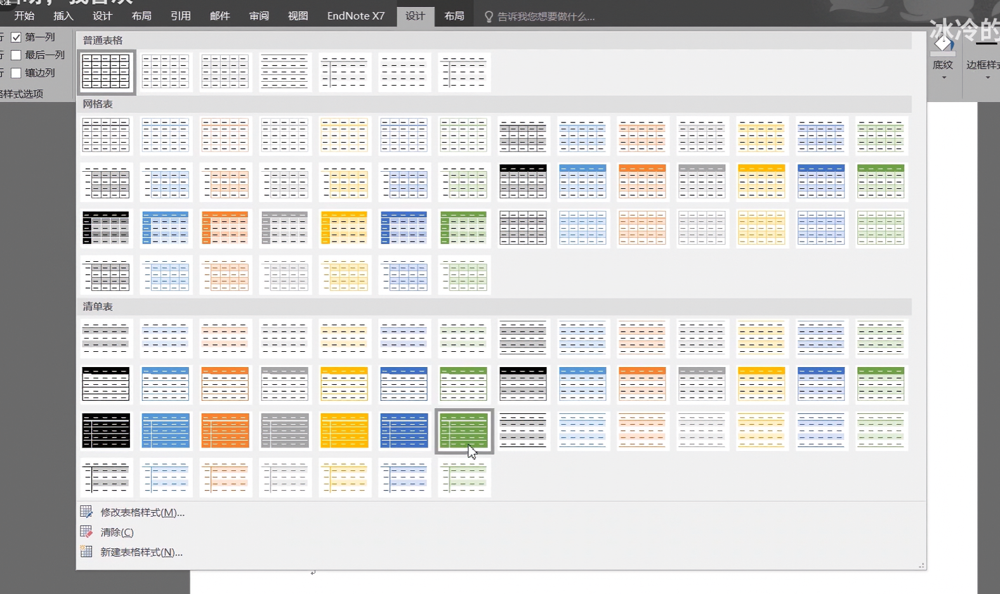
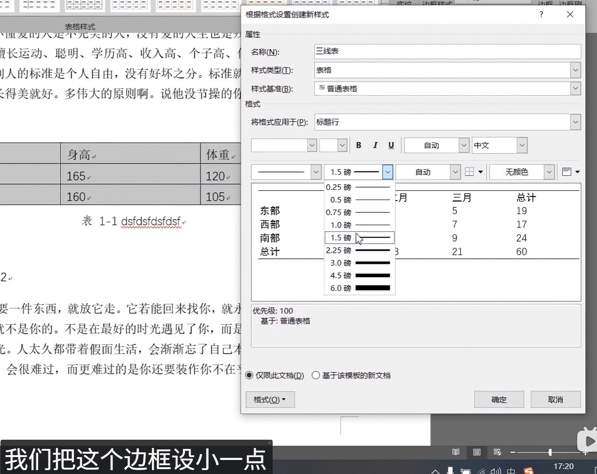

本文整理 Word 排版中的实用技巧，包括图片题注、交叉引用、三线表制作等。

<!-- more -->

## 1. 图片排版

### 1.1 粘贴图片显示不全

**问题**：粘贴图片后只显示一行，图片无法完整显示。

**解决方法**：

1. 选中图片所在段落
2. 右键 → 段落
3. 将行间距改为**单倍行距**或**固定值**（如 20 磅）

### 1.2 添加题注

给图片添加题注，方便引用和管理。

**操作步骤**：

1. 右键图片 → **插入题注**
2. 点击**新建标签**，输入"图"
3. 位置选择"所选项目下方"

**设置编号格式**：

- 点击**编号**按钮
- 勾选"包含章节号"
- 选择章节样式（如"标题 1"）
- 选择分隔符（如"-"或"."）

### 1.3 交叉引用

使用交叉引用，可以在图片增删后**自动更新编号**。

**操作步骤**：

1. 光标定位到引用位置
2. **引用** → **交叉引用**
3. 引用类型选择"图"
4. 选择要引用的题注

### 1.4 修改题注样式

修改题注的字体、字号、对齐方式。

**操作步骤**：

1. **开始** → **样式** 右下角展开
2. 找到"题注"样式，右键 → **修改**
3. 设置字体（如宋体、五号）
4. 设置对齐方式（如居中）

**段落居中设置**：

- 右键题注 → 段落
- 对齐方式选择"居中"

### 1.5 批量更新编号

当图片增删后，需要批量更新所有编号。

**操作步骤**：

1. **Ctrl + A** 全选文档
2. **F9** 更新域
3. 所有题注编号自动更新

## 2. 三线表制作

学术论文中常用的三线表样式。

### 2.1 新建表格样式

**操作步骤**：

1. **表格设计** → **新建表格样式**
2. 设置样式名称（如"三线表"）

3. 设置边框：
   - 顶线：1.5 磅，黑色
   - 中间线：0.5 磅，黑色
   - 底线：1.5 磅，黑色

4. 应用范围选择"整张表格"
5. 点击确定保存

### 2.2 应用样式

1. 选中表格
2. **表格设计** → 找到自定义的"三线表"样式
3. 点击应用

## 3. PDF 编辑

如果需要编辑 PDF 文件，可以使用 Adobe Acrobat。

**常用功能**：
- PDF 转 Word
- 合并/拆分 PDF
- 添加水印
- 表单填写

## 4. 总结

### 技巧速查表

| 技巧 | 操作 |
|------|------|
| 图片显示不全 | 段落 → 行间距改为单倍行距 |
| 添加题注 | 右键 → 插入题注 → 新建标签 |
| 自动编号 | 插入题注时勾选"包含章节号" |
| 交叉引用 | 引用 → 交叉引用 → 选择题注 |
| 批量更新 | Ctrl+A → F9 |
| 三线表 | 新建表格样式 → 设置顶线/底线 1.5 磅 |
| PDF 编辑 | 使用 Adobe Acrobat |

### 注意事项

- 题注样式修改后，所有题注会自动更新
- 交叉引用需要手动更新（F9）
- 三线表的中间线通常比顶底线细
- 建议在排版前先设置好样式，避免后期大量修改
